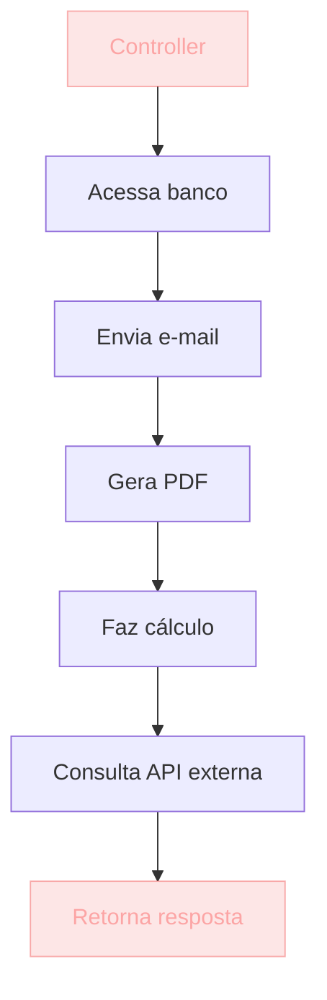
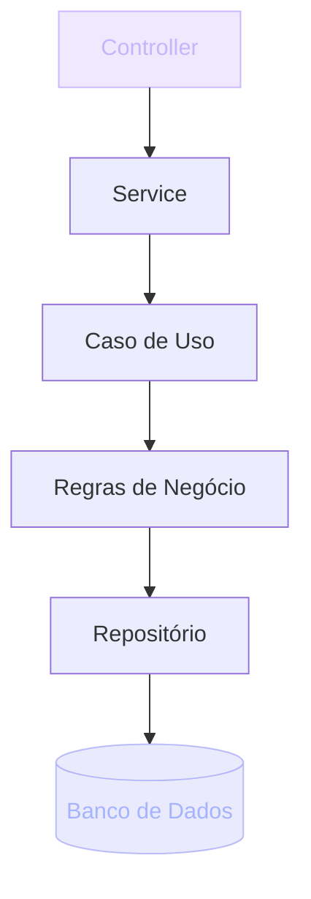

## O que é Arquitetura de Software

Imagine que alguém peça para você construir uma casa.

Você pode simplesmente começar levantando paredes.

Ou pode primeiro responder algumas perguntas:

- Quantos quartos ela terá?
- Quantas pessoas irão morar nela?
- O terreno suporta dois andares?
- Onde ficará a parte elétrica?
- Como será a hidráulica?
- Como essa casa poderá ser ampliada daqui a cinco anos?

Perceba que **antes de colocar um tijolo, alguém precisou pensar**.

Com software acontece exatamente a mesma coisa.

> [!NOTE]
> Escrever código é apenas uma pequena parte do desenvolvimento de um sistema. Antes do código, existem decisões que determinam se o projeto vai sobreviver aos próximos dois anos — ou se vai virar um pesadelo.

Muitas pessoas acreditam que programar é escrever código. Mas, na prática, antes disso precisamos responder perguntas muito mais importantes:

- Como esse sistema será organizado?
- Como as partes irão conversar entre si?
- Onde ficam as regras de negócio?
- Como evitar que uma alteração quebre todo o projeto?
- Como facilitar a manutenção daqui a dois anos?

É justamente para responder essas perguntas que existe a **Arquitetura de Software**.

> [!IMPORTANT]
> Arquitetura de Software é o processo de definir **como um sistema será organizado antes mesmo de sua implementação**. Ela descreve como os componentes serão divididos, como se comunicam, onde cada responsabilidade deve ficar, quais tecnologias fazem sentido e como o sistema poderá crescer sem virar um caos.

E, principalmente: arquitetura **não é um framework**, **não é uma biblioteca** e **não é uma pasta chamada `architecture`**. Arquitetura é um **conjunto de decisões**.

## Analogia: construindo uma casa

A analogia da casa não é à toa. Em software ela se aplica com precisão.

Imagine que você decidiu criar um sistema para uma clínica.

Sem arquitetura, o fluxo fica parecido com isto:

Tudo misturado. O controller acessa o banco, envia e-mail, gera PDF, faz cálculo e consulta uma API — tudo no mesmo lugar.

Agora imagine que o sistema cresça. Mais pessoas entram no time. Novas funcionalidades aparecem. Em pouco tempo ninguém entende mais o código. Cada alteração quebra outra funcionalidade.

O famoso:

> "Não mexe nisso que funciona."

> [!WARNING]
> Esse é um sistema **sem arquitetura**. O problema não é o tamanho — é a ausência de limites. Quando uma mudança toca dez arquivos que não deveriam estar conectados, o sistema deixou de ser maintível.

Agora veja outro cenário, com camadas e responsabilidades separadas:

Cada camada possui uma responsabilidade. Cada arquivo faz apenas uma coisa. Cada mudança fica previsível.

> [!TIP]
> É isso que a arquitetura proporciona: **previsibilidade**. Você sabe onde mexer e sabe o que cada mudança vai afetar.

## Arquitetura no código: antes e depois

A diferença entre um sistema com e sem arquitetura não é estética — é estrutural.

| Sem arquitetura | Com arquitetura |
| --- | --- |
| Tudo no controller | Camadas com responsabilidade única |
| Regra de negócio misturada com SQL | Regras isoladas do banco |
| Mudança quebra outras partes | Mudança fica contida na camada certa |
| "Não mexe nisso que funciona" | "Pode mexer, que o teste protege" |
| Difícil testar | Cada camada é testável isoladamente |
| Cresce virando caos | Cresce de forma previsível |

> [!IMPORTANT]
> A pergunta-chave de qualquer decisão arquitetural é: **"Se essa regra de negócio mudar, quantos arquivos eu preciso tocar?"**. Quanto menor o número, melhor a arquitetura.

## Por que aprender Arquitetura

Porque escrever código é relativamente fácil. O difícil é **manter esse código durante anos**.

Imagine estes cenários:

- Um sistema com 500 mil linhas de código.
- Dez desenvolvedores trabalhando ao mesmo tempo.
- Novas funcionalidades toda semana.
- Bugs sendo corrigidos diariamente.

Sem uma arquitetura bem definida, o projeto rapidamente se torna impossível de evoluir.

> [!CAUTION]
> Muitos iniciantes acreditam que arquitetura serve apenas para sistemas gigantes. Na verdade, ela ajuda **principalmente quem está aprendendo**. Quanto antes você aprender a organizar, menos você sofre para crescer.

Quando você entende arquitetura:

- aprende mais rápido;
- organiza melhor seu raciocínio;
- escreve código mais limpo;
- consegue encontrar erros com facilidade;
- entende projetos grandes sem medo.

Arquitetura é organização. E organização reduz complexidade.

## Arquitetura não é sinônimo de complexidade

Existe um mito de que arquitetura deixa tudo mais difícil.

Na verdade acontece exatamente o contrário.

> [!TIP]
> Uma boa arquitetura faz com que sistemas complexos **pareçam simples**. Ela divide grandes problemas em pequenos problemas — e pequenos problemas são muito mais fáceis de resolver.

Pense como um engenheiro:

| Programador pergunta | Engenheiro pergunta |
| --- | --- |
| "Como faço isso funcionar?" | "Como faço isso continuar funcionando daqui a cinco anos?" |

Essa pequena mudança de pensamento muda completamente a qualidade do software.

## Como a arquitetura aparece no mercado

Arquitetura não é teoria de curso. É decisão que empresas reais tomam todos os dias.

> [!reference]
> **Nubank** — começou como um monólito Python e foi migrando para microsserviços em Clojure só quando o escala exigiu. A arquitetura acompanhou o problema, não o contrário.

> [!reference]
> **Spotify** — cunhou o modelo de "squads" e "tribos", onde cada squad é dono de um pedaço do produto. A arquitetura organizacional espelha a arquitetura técnica: autonomia com limites claros.

> [!reference]
> **Netflix** — separa o que é crítico (billing, catálogo) do que é best-effort (recomendações, previews). Componentes críticos seguem arquitetura mais rígida; componentes exploratórios aceitam mais risco.

> [!curiosity]
> Em todas essas empresas, a função de um time de arquitetura **não é escolher stacks**. É **facilitar decisões de outros times**: padrões, templates, gateways, bibliotecas internas. Arquitetura é serviço, não ditadura.

## Erros comuns

> [!WARNING]
> **1. Confundir arquitetura com framework.**
> "Eu uso React, então minha arquitetura é React." Não. React é uma ferramenta. Arquitetura é **como você organiza** as peças — incluindo onde ficam as regras, como o estado flui e onde mora a lógica de negócio.

> [!WARNING]
> **2. Pular para microsserviços antes de saber camadas.**
> Quem não consegue organizar um monólito vai criar um sistema distribuído bagunçado. Distribuir o spaghetti não o resolve — apenas o espalha pela rede.

> [!WARNING]
> **3. Achar que arquitetura é só para sênior.**
> Quanto antes você começa a pensar em responsabilidades e limites, mais rápido amadurece. Esperar para "depois de sênior" é um ciclo vicioso: você não vira sênior sem ter pensado assim antes.

> [!WARNING]
> **4. Adicionar complexidade "para o futuro".**
> Abstração prematura custa caro. Se você ainda não tem dois casos concretos, não crie uma generalização. YAGNI (*You Aren't Gonna Need It*) também é arquitetura.

## Boas práticas

> [!success]
> **Comece simples.** Monólito modular resolve 90% dos casos reais. Microsserviço é opção futura, não padrão default.

> [!success]
> **Uma responsabilidade por arquivo.** Se um arquivo faz três coisas diferentes, ele tem três motivos para mudar — e três chances de quebrar.

> [!success]
> **Regras de negócio não conhecem o banco.** Sua lógica de domínio não deveria importar um driver de SQL. Se trocar de banco não deveria reescrever o domínio.

> [!success]
> **Decisões viram ADR.** *Architecture Decision Records* documentam o "por quê" de cada escolha. Sem ADR, "por que usamos X?" vira lenda corporativa.

> [!success]
> **Teste de arquitetura.** Tente trocar o banco por um mock. Se isso quebra mais que cinco linhas, sua arquitetura está acoplada demais.

## Resumo

O que você aprendeu neste módulo:

- **Arquitetura é decisão, não framework.** Antes do código, alguém precisa responder *como* o sistema será organizado.
- **Arquitetura reduz complexidade.** Ela divide grandes problemas em pequenos problemas resolvíveis.
- **Sem arquitetura, crescimento vira caos.** Mudanças quebram outras partes e o famoso "não mexe nisso que funciona" se instala.
- **Com arquitetura, mudança é previsível.** Cada camada tem uma responsabilidade e cada alteração fica contida.
- **Pense como engenheiro.** A pergunta não é "como faço funcionar?", mas "como faço continuar funcionando daqui a cinco anos?".
- **Arquitetura é habilidade, não decoreba.** Você aprende resolvendo problemas — não decorando nomes como MVC, Clean Architecture ou DDD.

> [!quote]
> "Código resolve o problema de hoje. Arquitetura resolve os problemas de amanhã."

## Como isso aparece nos projetos da UGP

Durante a Universidade Gratuita do Programador, você desenvolverá diversos projetos. Em cada um deles, as perguntas arquiteturais voltam:

- Onde essa regra de negócio deve ficar?
- Quem é responsável por validar esses dados?
- Essa lógica pertence ao Controller?
- Essa funcionalidade deveria conhecer o banco de dados?
- Como testar essa regra sem depender da interface?
- Como trocar o banco de dados sem reescrever tudo?

Você utilizará este conhecimento em:

> [!TIP]
> **Projeto 07 — SaaS de Notas.** Definir camadas (route → service → data), isolar regras de autenticação e separar o que é Supabase do que é domínio da aplicação.

> [!TIP]
> **Projeto 09 — LMS.** Replicar, em menor escala, a própria arquitetura da UGP: Next.js + Supabase + RLS + camada editorial.

> [!TIP]
> **Projeto 10 — Clone do Supabase.** Arquitetura distribuída de verdade: API gateway, serviços isolados, filas, persistência por serviço.

## Desafio

> [!IMPORTANT]
> Escolha um sistema que você usa todo dia (Spotify, iFood, GitHub, Nubank) e responda, por escrito:
>
> 1. **Como ele foi organizado?** Identifique ao menos três componentes distintos.
> 2. **Quais responsabilidades existem?** Tente nomeá-las (autenticação, catálogo, billing, recomendação...).
> 3. **Onde provavelmente ficam as regras de negócio?**
> 4. **Como ele pode crescer?** Liste uma decisão arquitetural que facilita isso.
> 5. **O que você faria diferente?** Defenda com um argumento, não com sentimento.

Não precisa acertar. O objetivo é treinar o olhar de engenheiro — olhar para qualquer sistema e enxergar as decisões escondidas por trás dele.

Quando você conseguir fazer isso, terá dado um passo importante para deixar de ser apenas alguém que escreve código e começar a pensar como um engenheiro de software.
