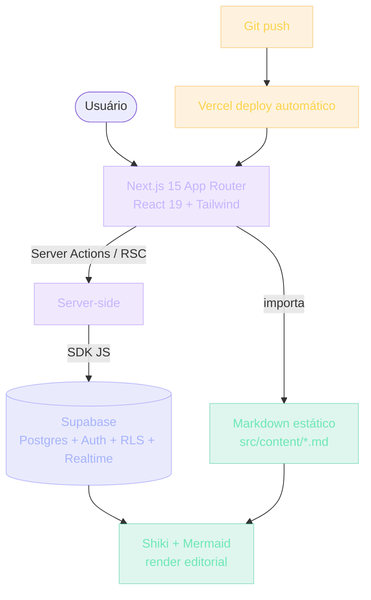

## Por que estudar a arquitetura da própria UGP

Sabe quando você entra num prédio e nunca pensou em como ele foi construído? Você só usa. Mas alguém, em algum momento, decidiu onde os conduítes iam passar, onde os pilares aguentariam mais peso, onde o sol bateria às 15h.

A UGP também tem arquitetura. **Você está dentro dela agora.**

> [!NOTE]
> Entender a arquitetura da plataforma que você usa não é curiosidade — é parte do aprendizado. Quando você entende como a UGP funciona por dentro, você está pronto para entender como qualquer software moderno funciona por dentro. As decisões são parecidas.

Este módulo coloca você do outro lado da tela: não mais como usuário, mas como alguém que consegue olhar para um sistema e enxergar as decisões que ele esconde.

## De PHP monolítico a BaaS: como plataformas de ensino evoluíram

Antigamente, uma plataforma de curso online era isso:

- Um servidor monolítico em PHP
- Um banco MySQL
- HTML renderizado no servidor
- Vídeos hospedados em servidor dedicado
- Usuários e progresso numa única tabela

Simples. Funcionava. Mas cada novo curso exigia desenvolvedor mexendo no código. Mudar um texto era ticket. Publicar um curso era deploy.

Depois veio a era dos LMS (Moodle, Canvas, Blackboard): sofisticados em features, mas lentos para manter. Ainda centralizados.

> [!IMPORTANT]
> Hoje uma plataforma moderna é **Frontend React/Next.js (SSR para SEO)** + **Backend BaaS como Supabase (auth, database, realtime, storage em um só lugar)** + **Conteúdo estático (markdown/JSON)** + **Deploy na Vercel/Netlify (push no Git, deploy automático)**.

A UGP escolheu a arquitetura moderna não por moda — porque é a **mesma arquitetura que você vai usar nos projetos**. Aprender a arquitetura da UGP é estudar o stack do Projeto 05 (Blog), 07 (SaaS de Notas) e 09 (LMS).

Você não está só usando a plataforma. Está estudando ela.

## Analogia: a cozinha de um restaurante

Imagine uma cozinha de restaurante:

- A **cozinha** é onde o food é preparado (backend, banco de dados)
- O **salão** é onde o cliente pede e recebe (frontend, interface)
- O **cardápio** é estático — você não imprime um novo cardápio a cada mudança de preço (conteúdo em arquivo)
- O **garçom** leva pedidos entre salão e cozinha (API)
- O **sistema de segurança** sabe quem pode entrar na cozinha (auth, RLS)

A UGP é exatamente assim:

| Peça da cozinha | Peça da UGP |
| --- | --- |
| Cozinha | Supabase (Postgres + Auth + RLS) |
| Salão | Next.js + Tailwind (interface) |
| Cardápio | Markdown em arquivos (este texto que você lê) |
| Garçom | Server Actions (funções que rodam no servidor, seguras) |
| Segurança | Supabase Auth + RLS (cada usuário só vê o que é seu) |

Cada peça tem um motivo de existir. Vamos olhar técnico.

## A arquitetura da UGP em um diagrama



O stack completo, em uma linha:

```
Frontend: Next.js 15 (App Router) + React 19 + Tailwind
Auth+DB:  Supabase (Postgres, RLS, Auth, Realtime)
Conteúdo: Markdown estático em src/content/*.md
Deploy:   Vercel (automático via Git)
```

## Por que cada peça do stack

Cada escolha tem um motivo — e um trade-off. Vamos peça por peça.

### Next.js 15 (e não Vite ou Remix)

Next.js é o framework de React mais usado em produção — por uma razão que importa para você:

- **App Router**: estrutura de pastas = rotas. Mais intuitivo que `react-router`
- **Server Components**: renderiza no servidor, manda menos JS ao cliente (mais rápido)
- **Server Actions**: você escreve código server-side sem criar API routes separadas
- **SSR/SSG**: SEO pronto — essencial para um blog ou conteúdo público
- **Imagens otimizadas**: `next/image` redimensiona sozinho

> [!TIP]
> **Trade-off**: Next.js é mais complexo que Vite. Mais arquivos de configuração, mais conceitos (Server vs Client Components). Para um botão isolado, é overkill. Para um produto, vale.

### Supabase (e não um backend próprio)

Você **poderia** construir um backend com Express + Postgres instalado à mão. Muita gente faz. Mas a UGP usa Supabase porque:

- **Auth pronto**: email, Google, GitHub OAuth sem você configurar SMTP
- **RLS (Row Level Security)**: o banco de dados sabe qual usuário pode ver qual linha. Você não precisa escrever middleware de permissão. O Postgres faz isso.
- **Realtime**: se você quer um chat, Supabase te dá websockets sem infra
- **SDKs**: em JS, você não escreve SQL — usa a client library
- **Studio**: interface visual para ver tabelas, rodar SQL, gerenciar usuários

> [!WARNING]
> **Trade-off**: você deixa seu banco na mão de um provedor. Se Supabase sair do ar (acontece), seu app sai também. Para um projeto pessoal é aceitável. Para um sistema crítico com 1 milhão de usuários, você poderia questionar.

### Conteúdo estático (e não um CMS)

Aqui está uma decisão que surpreende quem nunca pensou: **o conteúdo que você está lendo não está num banco de dados. Está num arquivo markdown** (`src/content/manifesto.md`).

- **Conteúdo muda pouco** — uma vez escrito, raramente atualizado. CMS seria overkill.
- **Versionamento** — todo change passa por Git. Você vê quem alterou, quando, por quê.
- **Sem latência** — não há fetch de banco para mostrar este texto.
- **Sem dependência** — se Supabase cair, este conteúdo ainda aparece.

> [!CAUTION]
> **Quando NÃO usar estático**: se seu conteúdo é dinâmico (preços que mudam, estoque, user-generated), aí vem do banco. O README da sua empresa é estático. O feed do Instagram é dinâmico.

### Tailwind

Tailwind é CSS utility-first. Em vez de criar classes como `.card`, você escreve `p-4 rounded-md border`. Estranho no início, mas com vantagens:

- **Sem arquivo CSS crescente** — cada componente tem seu estilo inline
- **Sem colisão de nomes** — nada de `.card` sendo sobrescrito em outro arquivo
- **Refactor fácil** — muda estilo direto no JSX, sem caçar arquivo CSS

> [!TIP]
> **Trade-off**: JSX fica mais verboso. Para designers que querem mexer em CSS sem ler JSX, é pior. Para devs, é mais rápido.

## Decisões reais: onde e como guardar "módulo concluído"

**Opção A**: em `localStorage` (navegador do usuário).
**Opção B**: em uma tabela `module_progress` no Postgres.

| Critério | localStorage | Tabela Postgres |
| --- | --- | --- |
| Troca de dispositivo | Perde tudo | Persiste |
| XP global | Não dá para calcular | Dá |
| Sync desktop/mobile | Impossível | Possível |
| Analytics | Sem backend | Pronto |
| Complexidade | Menor | Moderada |

A UGP escolheu B:

```sql
CREATE TABLE module_progress (
  id UUID PRIMARY KEY,
  created_by_id UUID REFERENCES profiles(id),
  module_id TEXT NOT NULL,
  completed BOOLEAN DEFAULT false,
  completed_at TIMESTAMPTZ
);

-- RLS: cada usuário só vê SUAS linhas
ALTER TABLE module_progress ENABLE ROW LEVEL SECURITY;
CREATE POLICY "user_sees_own" ON module_progress
  FOR SELECT USING (auth.uid() = created_by_id);
```

> [!IMPORTANT]
> A mágica é a última linha. Não é o frontend que decide o que mostrar. É o **banco** que recusa devolver dados de outro usuário. Mesmo se você hackeasse o frontend, o banco não entregaria.

### Como marcar concluído (com Server Action)

```ts
// Server Action — roda no servidor, segura
async function toggleModuleProgress(moduleId: string, completed: boolean) {
  const supabase = await createClient()
  const { data: { user } } = await supabase.auth.getUser()
  if (!user) throw new Error('Não autenticado')

  // Se já existe, atualiza. Se não, cria.
  return supabase.from('module_progress').upsert({
    module_id: moduleId,
    completed: completed,
    created_by_id: user.id
  })
}
```

Note três coisas:

1. **Server Action, não client**: o código roda no servidor. O browser nunca tem a chave do banco.
2. **Pega o user autenticado**: o `user.id` vem da sessão, não do input do usuário (alguém não pode fingir ser outro).
3. **Upsert**: idempotente. Não duplica linhas se clicar 2 vezes.

> [!SUCCESS]
> Cada uma dessas decisões é o tipo de coisa que separa código amador de código profissional.

## Caso real de mercado

Toda startup moderna usa uma variação deste stack:

- **Nuxt/Next + Vercel + Supabase/Firebase** — startups enxutas
- **Next + Node + Postgres na AWS** — startups com mais controle
- **Microsserviços + Kubernetes + gRPC** — Nubank, iFood, grandes

> [!REFERENCE]
> **Stripe docs** rodam em Next.js com Markdown versionado — same ideia da UGP: conteúdo técnico em arquivo, deploy via Git, render premium. A página que você lê de `stripe.com/docs/...` nasce de um `.md` num repo.

> [!REFERENCE]
> **Vercel** publica sua própria docs e a dashboard em Next.js + Postgres (via Vercel Postgres). A UGP espelha esse padrão: o mesmo stack que serve o produto serve a docs.

> [!CURIOSITY]
> A UGP escolheu o stack de startup enxuta, mas **te prepara para o terceiro**. Os conceitos são os mesmos: auth, banco, cache, API. O que muda é a complexidade da implantação.

## Erros comuns

### O que iniciantes fazem

> [!WARNING]
> **1. Acham que existe "stack certo".** Não existe. Existe stack certo para o problema. Para um blog, WordPress funciona melhor que Next.js. Para um SaaS, Next.js funciona melhor que WordPress. A pergunta nunca é "qual o melhor framework" — é "quais trade-offs eu aceito".

> [!WARNING]
> **2. Confundem frontend com tudo.** "Eu sou frontend, não mexo no banco." Se você trabalha com software que tem usuários, você precisa entender o banco — não para escrever SQL otimizado, mas para entender por que sua lista não carrega quando 1000 linhas são inseridas.

### O que intermediários fazem

> [!WARNING]
> **3. Super-architect.** Adicionam Redis, Kafka, microserviços num app com 100 usuários. Cada peça a mais é uma peça que pode quebrar. Cool tech não justifica complexidade. A UGP é um monolito com Supabase porque tem 1000 usuários, não 1 milhão.

> [!WARNING]
> **4. Não documentam trade-offs.** Escolhem Postgres "porque é melhor" sem explicar melhor para quê. Quando outro dev entra, vê a escolha mas não entend o porquê.

### O que seniores evitam

> [!WARNING]
> **5. Não adotam tecnologia sem questionar.** Antes de adicionar Supabase, um sênior pergunta: "E se eu precisar migrar? Quanto do código fica acoplado?" A resposta é sempre algum acoplamento. A questão é saber quanta, e aceitar conscientemente.

> [!WARNING]
> **6. Não confiam cegamente no BaaS.** Supabase é ótimo. Mas caiu já. Um sênior adiciona retry, fallback, ou ao menos monitora. "Funcionou até hoje" não é argumento técnico.

## Boas práticas

> [!SUCCESS]
> **Documente o porquê em ADRs.** ADR = Architecture Decision Record. Um markdown curto com Contexto, Decisão e Consequências. Isso é o que times maduros fazem.

> [!SUCCESS]
> **Mantenha o stack pequeno.** Cada nova dependência é uma nova superfície de bug. Antes de `npm install`, pergunte: "consigo fazer sem isso?"

> [!SUCCESS]
> **Atualize versões com cadência.** Next.js 14 → 15. React 18 → 19. Atualizar é dor (algo quebra). Não atualizar é dívida (versões antigas param de receber patches de segurança). Escolha sua dor.

> [!SUCCESS]
> **Monitore.** Sentry, Vercel Analytics, ou pelo menos `console.error` no server. Se seu app caiu e ninguém reclamou ainda, você ainda tem tempo.

> [!SUCCESS]
> **Teste de arquitetura.** Tente descrever em 3 frases por que cada peça do stack foi escolhida. Se você não consegue, você não entende sua própria arquitetura.

## Como escalar a UGP (sem reescrever)

Quando a UGP crescer, algumas decisões vão precisar mudar:

- **Conteúdo dinâmico** → sai de markdown e entra num CMS
- **Realtime para mais features** → talvez Socket.io dedicado em vez de Supabase Realtime
- **Search** → talvez Elasticsearch, porque `LIKE %texto%` em Postgres não escala

> [!TIP]
> Essas decisões serão ADRs futuras. **Nada é definitivo.** O ponto de um bom stack não é nunca mudar — é tornar a mudança controlada quando precisar.

Documentar bem:

- **README.md** na raiz: como rodar local, o que cada comando faz
- **ADR/**: pasta com decisões
- **Comentários no código**: por quê, não o quê (o quê o código já diz)

## Resumo

O que você aprendeu neste módulo:

- **Você está dentro do stack que vai usar.** Next.js 15 + Supabase + Markdown é a base do Blog, do SaaS e do LMS.
- **Cada peça tem um porquê e um trade-off.** Next.js = SEO + SSR; Supabase = auth + RLS; Markdown = zero latência; Vercel = deploy automático.
- **RLS defende no banco, não no frontend.** Mesmo hackeando o app, o Postgres recusa devolver dados de outro usuário.
- **Server Actions mantêm a chave do banco fora do browser.** O `user.id` vem da sessão, não do input.
- **Conteúdo estático vale quando muda pouco.** Dinâmico (preço, estoque, user-generated) vai pro banco.
- **Stack pequeno > stack "moderno".** Cool tech não justifica complexidade. YAGNI também é arquitetura.

> [!QUOTE]
> "Arquitetura não é sobre o que usar. É sobre por quê. Se você entende o porquê da UGP, você está pronto para ter seus próprios porquês."

## Como isso aparece nos projetos da UGP

Na Universidade Gratuita do Programador, você vai reconstruir versões menores desta arquitetura:

> [!TIP]
> **Projeto 05 — Blog.** Você escolhe Next.js vs Remix e documenta o trade-off em ADR. Conteúdo em markdown, deploy na Vercel.

> [!TIP]
> **Projeto 07 — SaaS de Notas.** Você implementa Supabase + RLS de verdade: cada nota só é visível para o dono, defendido no banco.

> [!TIP]
> **Projeto 09 — LMS.** Você replica, em menor escala, a própria arquitetura da UGP: Next.js + Supabase + RLS + camada editorial (markdown com Shiki e Mermaid).

> [!TIP]
> **Projeto 10 — Clone do Supabase.** Arquitetura distribuída de verdade: API gateway, serviços isolados, filas, persistência por serviço. Aqui o BaaS deixa de ser suficiente.

## Desafio

> [!IMPORTANT]
> Liste, em um markdown curto, as 4 peças centrais do stack da UGP (frontend, backend, conteúdo, deploy). Para cada uma:
>
> 1. **Qual peça foi escolhida?** (Next.js 15, Supabase, Markdown, Vercel)
> 2. **Qual problema ela resolve?**
> 3. **Qual o trade-off aceito?**
> 4. **Quando essa decisão deveria ser revista?**
>
> Salve este arquivo como `docs/adr/ugp-stack.md`. Se você não consegue completar o item 3, você não entendeu a decisão — volte ao módulo.

Quando conseguir responder essas quatro perguntas para cada peça, você terá dado o passo de "usuário" para "engenheiro que entende o próprio stack".

Próximo módulo: **Níveis** — onde você está, para onde vai, e como saber que chegou.