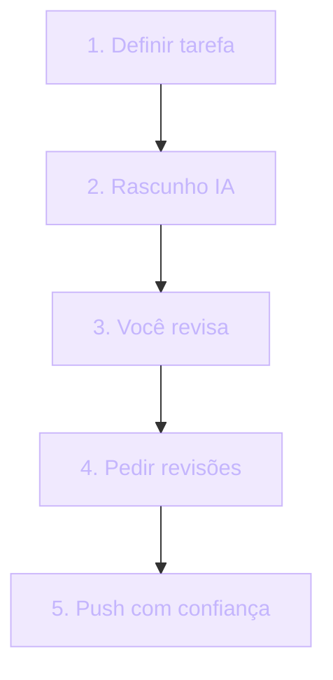

## Boas Práticas com IA

Se ["Como NÃO Fazer Vibe Coding"](/content/como-nao-fazer-vibe-coding) é o **antipadrão**, este módulo é o **padrão**.

Como usar IA de forma que produz valor, mantém responsabilidade técnica, e resulta em software profissional — não em protótipo encapotado de produção.

> [!IMPORTANT]
> Quando você termina este módulo, tem um workflow. Replicável. Defensável em entrevista. A divisão central é simples: **"geração" ≠ "qualidade"**. Somente validação garante qualidade.

## Um pouco de história

| Fase | Período | Como se usava IA |
| --- | --- | --- |
| Sem IA | até 2022 | Dev escrevia tudo. Stack Overflow para problemas específicos. Velocidade limitada pelo próprio conhecimento. |
| Copy-paste IA | ~2023 | IA gera. Você cola. Custo: baixo entendimento. |
| Workflow estruturado | 2024-presente | IA como júnior. Você é sênior que revisa. Workflow divide "geração" de "validação". |

> [!NOTE]
> A virada de 2023 para 2024 não foi tecnológica — foi metodológica. As empresas que mantiveram qualidade perceberam que o gargalo não era mais *gerar* código, e sim *garantir* que ele fosse confiável. workflow estruturado é a resposta a esse novo gargalo.

## Analogia: liderar um júnior inteligente

Imagine liderar uma equipe com um júnior inteligente e rápido.

**Vibe coding**: o júnior escreveu o sistema inteiro sem supervisão. Você deployou. Quando quebra, ninguém sabe por quê.

**Boas práticas com IA**:



A IA é o júnior. Você é o revisor sênior. O programa é o produto.

> [!TIP]
> Se você consegue responder "eu faria essa tarefa melhor sem a IA?", a resposta é: o feedback do revisor sênior continua mais valioso que a velocidade do júnior. Você não está substituindo o sênior — está escalando ele.

## O workflow de 7 passos

Sete passos. Replicável. Cada um com objetivo. Pular um é onde mora o bug.

### Passo 1 — Defina o problema (sem IA)

Antes de abrir qualquer IA, escreva em markdown:

- Qual problema estou resolvendo?
- Quais *constraints* (tipos, schema, performance)?
- Qual é o sucesso (funciona em X casos)?

Você clareia mentalmente antes de delegar.

> [!TIP]
> Se você não consegue escrever o problema em 3 frases, ainda não entendeu. E IA não consegue entender por você.

### Passo 2 — Esboce a solução (sem IA)

Rabisco em papel ou diagrama ASCII:

- Quais arquivos tocar?
- Quais funções criar?
- Quais dependências?

Mesmo o rabisco força reflexão. **IA reflete no código — você faz arquitetura.**

### Passo 3 — Prompt inicial

Use a estrutura de [Engenharia de Prompt](/content/engenharia-prompt). Inclua:

- Contexto do sistema
- Restrições técnicas
- Sucesso esperado
- Trade-offs explicitamente pedidos

### Passo 4 — Leia linha por linha

Não cole sem ler. Pergunte: "o que essa linha faz?" — explique a si mesmo. Se não sabe, pergunte à IA: "explique a linha X".

> [!CAUTION]
> Uma linha que você não consegue explicar é uma linha que você não consegue debugar. Erro tarde, em produção, é caro. Erro aqui, na revisão, é de graça.

### Passo 5 — Teste você mesmo

Não peça para IA testar. Você escreve (com IA pode ajudar) os testes. Você roda. Você vê os resultados. **IA não pode ser sua única QA.**

### Passo 6 — Refatore com estilo

Código IA tem estilo genérico. Ajuste para o seu padrão. Renomeie variáveis. Decomponha funções longas. Adicione JSDoc.

> [!IMPORTANT]
> É aqui que você assume autoria. Antes deste passo, o código é da IA. Depois dele, é seu.

### Passo 7 — Comite com transparência

A mensagem de commit pode incluir: `(co-authored with Cursor)`. Você mantém responsabilidade técnica, mas é honesto sobre a origem.

```text
feat: add note creation server action

- Supabase RLS ativa em `notes`
- Server Action com `revalidatePath`
- Tratamento de erro específico para rate-limit

(co-authored with Cursor)
```

## Erros comuns

O fluxo acima precisa atravessar 4 armadilhas comuns. Reconheça cada uma.

> [!WARNING]
> **Misturar "primeira versão" com "versão final".** A primeira versão da IA é rascunho. Trate como tal.

> [!WARNING]
> **Não documentar decisão.** Output de IA tem comentários *sketchy* ("// TODO"). Você não documenta por que escolheu X. Seis meses depois, novo dev pergunta — ninguém explica.

> [!WARNING]
> **Usar IA para designs.** IA não conhece seu usuário. UX da IA é a média genérica. Use para explorar opções, mas decida você.

> [!WARNING]
> **Sobre-dependência.** Você não consegue mais debugar sem IA. Sem internet, você trava. Mantenha prática manual regular.

## Quando IA é a ferramenta — e quando NÃO é

| Use IA | Não use IA |
| --- | --- |
| Boilerplate (CRUD básico) | Criptografia — use libs verificadas |
| Testes para código já escrito (com revisão) | Regras de negócio específicas — leia docs oficiais |
| Refactors mecânicos (rename em N arquivos) | Performance crítica — faça benchmarks |
| Explicações ("o que esse TypeError significa?") | Migração de dados — IA não conhece seu dataset |
| Brainstorm ("dadas alternativas para auth, qual trade-off?") | Decisão de UX — o usuário é seu, não da IA |

> [!IMPORTANT]
> A pergunta certa não é "IA consegue fazer isso?". É "IA consegue fazer isso melhor que eu, com o meu contexto?".

## Casos reais de mercado

### O custo de NÃO adotar boas práticas

Empresas sem cultura de engenharia têm devs em vibe coding. Curto prazo: ganha velocidade. Longo: dívida técnica altíssima.

> [!reference]
> **Stack Overflow 2024 Developer Survey** — 76% dos devs usam IA. Cerca de 50% admitem que o código chega a produção sem revisão sustentável. Frequência de bugs subiu 14% ano a ano em empresas que adotaram IA sem guidelines.

O dado não diz "IA é ruim". Diz: **IA sem workflow é ruim**.

### Quem adota — e como

> [!reference]
> **Vercel** — guidelines internos: "AI-generated code requires human review". Todo PR com componente de v0, código de Cursor ou resposta de chat passa por revisão humana antes do merge.

> [!reference]
> **Stripe** — co-author tag obrigatório para PRs com IA. Auditoria rigorosa — saber a origem do código é parte da compliance.

> [!reference]
> **GitHub Copilot Terms** — empresas usam commit-tagging opcional. Em times maduros vira opcional; em times regulados vira obrigatório.

> [!reference]
> **Cursor agent + GitHub agent + human review** — empresas avançadas combinam os três e reportam produtividade +3-10x. A propriedade central: **human review** continua obrigatório, sempre.

> [!curiosity]
> Em todas essas empresas, a regra nunca foi "proibir IA". Foi **auditar origem**. Quando você consegue rastrear que "esta linha foi gerada por IA e revisada por X pessoa", você ganha escala sem perder confiabilidade.

## Como escalar o workflow

Workflow de 7 passos em uma pessoa é fácil. Escalar para um time requer três peças de infraestrutura.

> [!TIP]
> **Templates em `prompts/`** — mantenha os prompts essenciais no repositório. Referencie: `"use o prompt/design pattern prompts/test-gen.md"`.

> [!TIP]
> **`CONTRIBUTING_AI.md`** — um documento no repositório: "como a IA deve ser usada nesse projeto". Define qual modelo, qual passo do workflow é obrigatório, qual tag co-author usar.

> [!TIP]
> **Auditabilidade** — qualquer PR com IA deve ser rastreável: qual prompt, qual modelo, qual revisão humana. Sem isso, "uso de IA" vira lenda corporativa — igual ao "por que usamos X?" sem ADR.

## Como testar se o workflow funcionou

Uma proposta simples, sem ferramenta:

> [!IMPORTANT]
> Você consegue explicar a uma outro dev o que o código IA-gerado faz? E por que escolheu essa abordagem de alternativas? **Se não, refaça.**

Se você não consegue defender o código em revisão por pares, ainda não é seu código — é um rascunho da IA com seu nome.

## Boas práticas

> [!success]
> **Termina com commits pequenos** — 2-3 arquivos por commit. Review fácil.

> [!success]
> **PR com co-author** — `(co-authored with Claude)`. Honestidade.

> [!success]
> **Inclua testes** — gerado por IA é rascunho; a versão final é sua.

> [!success]
> **Contexto no PR** — `"Esse código foi gerado inicialmente por IA, revisado linhas 30-80, refatorado para nosso padrão. Teste X cobre."`

> [!success]
> **Defina problema e esboça solução sem IA** — passos 1 e 2 do workflow. São os mais barateados — e os mais caros quando pulados.

## Resumo

O que você aprendeu neste módulo:

- **Workflow de 7 passos**: definir → esboçar → prompt inicial → ler linha a linha → testar você mesmo → refatorar com estilo → comitar com transparência.
- **Geração ≠ qualidade.** IA gera, você valida. Sempre.
- **Refatorar = assumir autoria.** Antes desse passo, o código é da IA. Depois, é seu.
- **Co-author tag é honestidade, não fraqueza.** Transparência vira auditoria vira escala.
- **Templates, `CONTRIBUTING_AI.md` e auditabilidade** são como o workflow escala para o time.
- **Teste final**: você consegue explicar o código em uma revisão por pares? Se não, refaça.

> [!quote]
> IA não é exceção — é tool. Boas práticas vs vibe coding é o mesmo debate que commit convencional vs "wip". **Engenharia é escolha.** Escolha a boa.

## Como aparece nos projetos da UGP

> [!TIP]
> **Engenharia de Prompt** ([/content/engenharia-prompt](/content/engenharia-prompt)) — extração valiosa com responsabilidade. O passo 3 do workflow.

> [!TIP]
> **Como NÃO Fazer Vibe Coding** ([/content/como-nao-fazer-vibe-coding](/content/como-nao-fazer-vibe-coding)) — o que evitar. O antipadrão espelho deste módulo.

> [!TIP]
> **Portfólio** — commits co-authored com IA contam contra você? Não — basta ser transparente.

> [!TIP]
> **TDD** — última barreira contra outputs errados. Testes validam que o prompt acertou.

> [!TIP]
> **Projetos 1 a 10** — use IA, mas atenda ao workflow aqui. O `CONTRIBUTING_AI.md` é parte do que você entrega.

## Desafio

> [!IMPORTANT]
> Escolha uma feature que você implementou com IA nos últimos 30 dias. Reescreva o histórico dela aplicando os 7 passos:
>
> 1. **Passos 1 e 2**: escreva o problema e o esboço da solução em markdown. Você ja tinha feito isso?
> 2. **Passo 3**: reconstitua o prompt inicial no formato [Engenharia de Prompt](/content/engenharia-prompt). Estava completo?
> 3. **Passo 4**: quais linhas do código você não consegue explicar? Liste-as e pergunte à IA.
> 4. **Passo 5**: existem testes seus? Se não, escreva agora.
> 5. **Passo 6**: refatore uma função longa do output para o seu padrão.
> 6. **Passo 7**: reescreva a mensagem de commit com tag co-author transparente.
>
> Se você encontrar um passo que *não* fez, você está olhando para a sua dívida técnica. Quem faz esse exercício honestamente vira engenheiro que escala IA sem virar dependência.