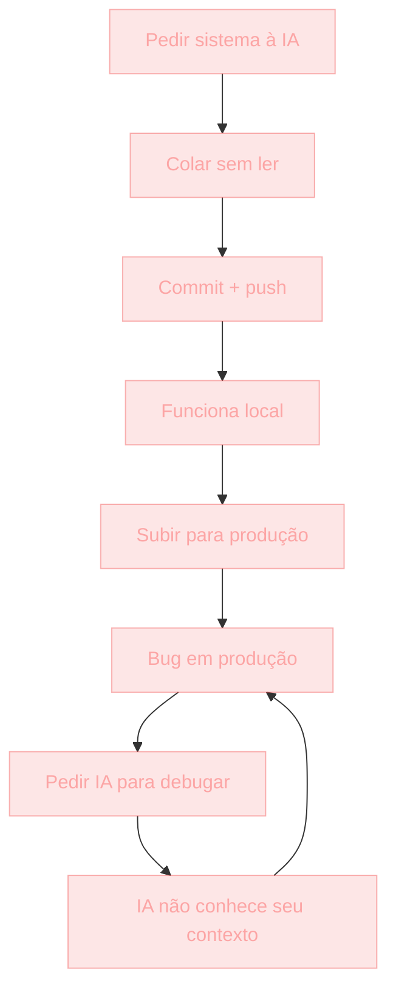

## O que é Vibe Coding

"Vibe coding" é um termo recente. Significa: programar no sentimento, sem entender. Pedir para IA gerar código, copiar, colar, "parece que funciona", seguir em frente.

O resultado é software que **parece funcionar**, mas **não é entendido** por ninguém — nem por você, autor aparente.

> [!NOTE]
> Empresas estão contratando gente com três meses de vibe coding. Esses devs não conseguem debugar o próprio código quando a IA não está disponível. Não explicam decisões técnicas. Não preveem consequências. O que parecia vantagem vira deficiência estrutural.

Este módulo é explícito sobre **o que NÃO fazer** com IA. Sim, é um guia negativo. Às vezes você aprende mais com o que evitar.

> [!IMPORTANT]
> Diferença crítica entre vibe coding e outros atalhos: o copy-paste antigo pelo menos te obrigava a **ler** o código. Vibe coding permite **não ler**. Substitui entendimento por fé. Essa substituição é o problema — não a IA em si.

## Contexto histórico do atalho

| Período | Prática | Custo |
| --- | --- | --- |
| ~2010 | Copy-paste de Stack Overflow | 80% das apps tinham CORS mal-explicado, mas código era pequeno |
| ~2015 | Tutoriais de YouTube ("siga a receita") | App "funcionava" até precisar mudar |
| 2024–presente | Vibe coding (IA gera 200 linhas, você não lê) | Substituiu leitura por fé |

A linha histórica mostra um padrão: cada geração de atalho **reduz o atrito de copiar** e **aumenta o custo de não entender**.

> [!TIP]
> Copy-paste antigo tinha um freio natural: o código era pequeno, você lia. Vibe coding removeu esse freio. Quem usa IA bem mantém o freio voluntariamente — lê cada linha antes de commitar.

## Analogia: o prédio sem planta

Imagine construir um prédio de escritórios de cinco andares.

Você pede para um robozão de IA: *"construa um prédio de escritórios de 5 andares"*. O robô faz. Você não leu as plantas. Não checou cálculo de carga. Não validou materiais.

O prédio fica de pé. Gente entra. Parece ótimo.

Em três anos, chove forte. Vazamentos. Eletricidade falha. Pessoas se machucam. Você é o engenheiro responsável. Olha o prédio e pensa: *"não sei por onde a canalização passa"*.

> [!WARNING]
> Isso é vibe coding em software. A diferença para construção civil é que, em software, o "prédio" despenca mais rápido — bugs aparecem em dias, não em anos. E quando aparecem, você é o único responsável por explicar um código que nunca leu.

## Os 5 antipadrões do vibe coding



O ciclo acima se retroalimenta. Cada volta aumenta a dívida técnica.

### 1. Colar e push

A IA gera o código. Você cola num arquivo. Não leu. Commitou. Pushou. Produção.

> [!CAUTION]
> Você enviou código **não validado**. A IA "sabe" parecer correta. Em software, não basta parecer — tem que ser correto também nos edge cases. O "parece funcionar" só protege o caminho feliz.

### 2. Não entender o código gerado

Você pushou algo que não entende. Quando um bug nesse código surgir, não vai saber debugar. Vai pedir à IA: *"debugue isso"*. A IA também não vai saber — não conhece seu contexto de produção.

> [!IMPORTANT]
> Regra: **nunca commita código que não consegue explicar linha por linha**. Se não explica, não é seu — é um empréstimo não assumido.

### 3. Pedir sistema inteiro de uma vez

*"Faça um sistema de notas completo com auth, permissions e realtime."* A IA cospe 5 arquivos de 200 linhas. Você cola os 5 sem testar entre eles. Erro: a variável de auth tinha que ser exportada em `file 3`, mas `file 4` não importou. A IA não sabia sua estrutura.

> [!TIP]
> Regra: **build incremental**. Peça uma peça. Teste. Peça a próxima. Cada peça pequena é validável; o sistema inteiro de uma vez não é.

### 4. Confundir "funciona" com "está certo"

A IA gera um `useEffect` que roda em loop infinito. A UI ainda funciona — só cai o FPS. Você não mede FPS. *"Looks fine."*

Em produção sob escala: memory leak. Crash. Mas a IA já "resolveu".

> [!PERFORMANCE]
> Regra: **funciona em local ≠ certo em produção**. Meça. Teste. O que parece fluido na sua máquina pode estar consumindo memória silenciosamente. Sem métricas, "funciona" é opinião.

### 5. Assumir que a IA sabe o seu sistema

A IA tem um modelo mental genérico. Não sabe que você tem `tenant_id` em todas as tabelas. Não sabe que seu campo `discount` é numérico entre 0 e 1. Não sabe das suas convenções internas.

> [!NOTE]
> Regra: **explique seu sistema em cada prompt**. Esse contexto é ouro. Sem ele, a IA gera código "genérico correto" — que está errado para o seu caso específico.

## Vibe coding vs Engenharia assistida por IA

| Vibe coding | Engenharia assistida por IA |
| --- | --- |
| Cola sem ler | Lê cada linha antes de commitar |
| Pede sistema inteiro | Build incremental, peça por peça |
| "Funciona" é critério | Funciona + testa + mede |
| IA decide sozinha | IA sugere, humano decide |
| Commits anônimos | Commits com `co-authored` |
| Sem ADR | Decisões viram ADR |
| Bug → pede IA novamente | Bug → debuga, entende, depois pede IA |

> [!IMPORTANT]
> A diferença não é usar IA ou não. É **assumir responsabilidade técnica** ou não. A IA é acelerador em ambos os casos — a questão é para onde ela te acelera.

## Caso real de mercado

> [!REFERENCE]
> **Sistemas financeiros** — erros custam dinheiro real. Vibe coding em billing, reconciliação ou cálculo de juros produz bugs que aparecem em auditoria — quando já existe cliente lesionado.

> [!REFERENCE]
> **Healthcare** — erros custam vidas. Software clínico, dosagem, integração com equipamentos: nenhum desses aceita "parece funcionar" como critério.

> [!REFERENCE]
> **Compliance (LGPD, audit)** — sistemas auditados exigem rastreabilidade. Código sem ADR, sem revisão, sem autor identificado não passa em auditoria.

> [!CURIOSITY]
> Empresas como Vercel e Supabase contratam diretamente via GitHub aberto. O histórico de commits é o currículo: convenções, revisões, traduções de decisão em ADR. Vibe coding não produz esse tipo de evidência.

## Quando vibe coding é aceitável

> [!TIP]
> Vibe coding é aceitável onde o **custo de bug é baixo**:
> - Protótipos descartáveis
> - Sua própria landing page
> - Provas de conceito (não para produção)
> - Hackathon (até certo ponto)

> [!CAUTION]
> Mesmo nos casos aceitáveis, **etiquete**: *"não é production-ready"*. Sem etiqueta, protótipo vira produção por acidente e ninguém sabe que precisa ser reescrito.

## Erros comuns

> [!WARNING]
> **1. Não ler o que colou.**
> A IA escreveu *"para produção, faça isso:"* com placeholder `TODO`. Você pushou. O `TODO` foi para produção. Solução: leia antes de commitar, sempre.

> [!WARNING]
> **2. Estilo "Copy Twitter".**
> *"Em 2 minutos, com IA, fiz esse app completo 😎"*. Funciona como demo. Não como software. Demo não sobrevive a usuário real.

> [!WARNING]
> **3. Vibe coding em produção crítica.**
> A mesma pessoa faz vibe coding no blog pessoal e no sistema de pagamentos. No blog: ok. Em pagamentos: desastre. Diferencie pelo custo do bug.

> [!WARNING]
> **4. Recusar IA por orgulho (sêniores).**
> Sêniores que recusam IA completamente também erram. Ferramenta bem usada é vantagem. Recusar IA = recusar Google. Ambas são ferramentas. Decisão consciente é diferente de medo.

## Boas práticas

> [!SUCCESS]
> **Leia cada linha do output da IA.** Se não entende uma linha, pergunte à IA o que ela faz. Entenda antes de seguir.

> [!SUCCESS]
> **Comente decisões.** *"Aqui usou X porque Y"* — você é responsável. O comentário documenta a intenção que a IA não tem.

> [!SUCCESS]
> **Teste com dados dobráveis.** Casos normais E edge cases. Dados dobráveis revelam bugs que o caminho feliz esconde.

> [!SUCCESS]
> **Refatore outputs.** Raramente o código da IA está no seu estilo. Ajuste para o padrão do projeto — é você quem mora no código.

> [!SUCCESS]
> **Atribua.** Commits com `co-authored with Claude/Cursor/...`. Transparência é profissional e diferencia engenheiro de "operador de colar".

> [!SUCCESS]
> **Equipe política clara.** Códigos gerados por IA passam por review normal. Checklist: *foi testado? possui edge cases? olhei TODAS as linhas?*

> [!SUCCESS]
> **Documente em ADR.** Decisão, contexto, como foi gerado, como foi revisado. Isso é honestidade técnica:

```md
# ADR 005: Auth no SaaS
Decisão: Supabase Auth.
Como foi escrito: prompt gerado em Cursor para primeiro rascunho.
Revisado por humano. Ajustado para 5 arquivos. Testado em 2 cenários.
```

## Resumo

O que você aprendeu neste módulo:

- **Vibe coding é atalho com dívida.** Substituir entendimento por fé gera software que ninguém consegue manter — nem o autor.
- **O copy-paste antigo exigia leitura.** Vibe coding removeu esse freio. Cabe a você mantê-lo voluntariamente.
- **Os 5 antipadrões**: colar e push; não entender o gerado; pedir sistema inteiro; confundir "funciona" com "certo"; assumir que a IA conhece seu sistema.
- **Funciona em local ≠ certo em produção.** Sem métricas, "funciona" é opinião.
- **IA é acelerador em qualquer cenário.** A questão é se ela te acelera para a entrega ou para a dívida.
- **A diferença é responsabilidade técnica.** Você assume, ou não assume. Não existe meio-termo silencioso.

> [!QUOTE]
> "IA é acelerador. Vibe coding é atalho com dívida. Velocidade é vantagem. Dívida qualquer um produz. A diferença é: você assume responsabilidade técnica ou não?"

## Como isso aparece nos projetos da UGP

Durante a UGP você vai usar IA em todos os projetos. O ponto não é evitar IA — é usar com engenharia:

- Você lê cada bloco gerado antes de commitar?
- Sabe explicar por que aquela linha existe?
- Testa com edge cases ou só com o caminho feliz?
- Commits são transparentes sobre participação de IA?

> [!TIP]
> **Engenharia de Prompt** — extraia valor da IA sem abrir mão da responsabilidade técnica.

> [!TIP]
> **Boas Práticas com IA** — workflow de uso responsável, com checklist de revisão.

> [!TIP]
> **GitHub** — seus commits transparentes sobre uso de IA viram portfólio profissional.

> [!TIP]
> **TDD** — testes são a barreira entre vibe e engenharia. Código sem teste é fé; código com teste é intenção verificada.

## Desafio

> [!IMPORTANT]
> Pegue um código que você gerou com IA nas últimas duas semanas e responda, por escrito:
>
> 1. **Linha por linha**: você consegue explicar cada uma? Se não, marque quais não sabe.
> 2. **Edge cases**: quais você testou? Quais ignorou?
> 3. **Decisões**: por que usou essa abordagem e não outra? Qual foi o trade-off?
> 4. **Responsabilidade**: se esse código causar um bug em produção amanhã, você consegue debugar sem a IA?
> 5. **Próximo passo**: escolha UMA linha que não entende e aprenda o que ela faz — sem perguntar à IA primeiro.

Não precisa acertar tudo. O objetivo é instalar o hábito de **assumir o código que você commita**. Quando isso viver rotina, você deixou de ser um operador de IA e virou um engenheiro que usa IA.
