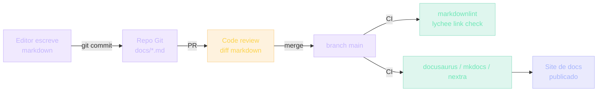

## Documentação morre quando vive fora do Git

Documentação quase sempre morre. Em empresas, docs vivem num Google Doc esquecido, num site interno sem dono, num PDF desatualizado. Devs escrevem docs apesar dos processos — não por causa deles.

> [!NOTE]
> Mas existe uma ideia que mudou isso em times maduros: **tratar documentação como código**. Mesmas regras. Mesma revisão. Mesmo versionamento. Isso é "Docs as Code". Não é uma ferramenta — é uma **postura**. E mudou como times excelentes trabalham.

Quando você termina este módulo, entende por que documentar é parte do seu trabalho — não uma atividade extra. E como fazer isso sem virar burocracia.

## Uma breve história da documentação

> [!REFERENCE]
> **Anos 90-2000 — Word por email.** Você escrevia o manual do sistema em Word, mandava por email. Versões se multiplicavam: `manual_v1.doc`, `manual_v2_FINAL.doc`, `manual_v2_FINAL_REAL.doc`. Ninguém sabia qual era a verdade.

> [!REFERENCE]
> **Anos 2000-2010 — Wiki interna.** Confluence, Notion, wikis internas. Melhor — todos editam o mesmo. Mas edição sem ordem: ninguém revisava. Histórico de mudanças sem commit message. Docs desatualizados sem saber quem mudou.

> [!REFERENCE]
> **Markdown + Git (~2010-presente).** Times de engenharia perceberam: código tem tudo que docs precisam. Versionamento (`git blame` me diz quem escreveu e quando). Revisão (`git diff` em PR). Distribuído (todo mundo tem cópia offline). Markdown é simples o suficiente para não-devs escreverem.

Daí emergiu o movimento "Docs as Code": GitHub README, ADRs (Architecture Decision Records), RFCs, design docs — tudo em markdown, tudo versionado.

## Analogia: contrato de aluguel

**Modelo Word**: alguém redige. Manda por email. Inquilino edita. Manda de volta. Email perdido. Versões divergentes. No dia da assinatura, ninguém sabe qual é a última.

**Modelo Git**: o contrato vive num lugar só. Toda mudança tem nome e motivo. Inquilino e proprietário veem o histórico. Se alguém rebateu do nada (mudou prazo de 30 para 60 dias), você vê exatamente quando e quem.

> [!IMPORTANT]
> Documentação de software precisa disso. Decisões técnicas são discutíveis — você precisa poder voltar 6 meses atrás e ver por que algo foi escolhido. Quem escolheu. Em que contexto.

## Por que Markdown (e não Word/HTML)

Markdown é texto puro com convenções mínimas:

```markdown
# Título
## Subtítulo

Parágrafo normal.

- lista
- com itens

[link](https://...)
`código inline`

\`\`\`js
bloco de código
\`\`\`
```

| Critério | Markdown | Word/HTML |
| --- | --- | --- |
| Leitura sem ferramenta | Sim, no notepad | Não |
| Diff limpo | Sim, é texto | Word é binário opaco |
| Portável | GitHub, Notion, VS Code, Obsidian | Limitado |
| Lock-in proprietário | Zero | Alto |

> [!TIP]
> Markdown venceu porque é **simples o suficiente para devs e não-devs**. Um PM consegue escrever; um engenheiro consegue renderizar. Word e HTML não cruzam essa fronteira com a mesma facilidade.

## Onde cada tipo de doc vive

A estrutura típica de um projeto que leva docs a sério:

```text
projeto/
├── README.md              # primeira coisa que devs leem
├── CONTRIBUTING.md        # como contribuir
├── docs/
│   ├── architecture/      # descrição da arquitetura
│   │   └── overview.md
│   ├── adr/               # Architecture Decision Records
│   │   ├── 001-postgres-vs-mongo.md
│   │   └── 002-no-orm.md
│   ├── api/               # documentação de endpoints
│   │   └── auth.md
│   └── runbooks/          # playbooks para incidentes
│       └── db-down.md
└── .github/
    └── PULL_REQUEST_TEMPLATE.md
```

> [!TIP]
> Esta estrutura **esta** é a da UGP. Você está olhando para um exemplo vivo de Docs as Code enquanto lê.

## ADR — Architecture Decision Record

ADR é o tipo mais importante de Docs as Code. Um arquivo curto (1 página) que documenta uma decisão técnica:

```markdown
# ADR 007: Usar Supabase em vez de Firebase

## Contexto
Precisamos de auth + banco + realtime. Time é pequeno.

## Decisão
Supabase.

## Consequências
- ✓: Postgres acesso direto, mais flexível que Firestore
- ✓: Open source, podemos migrar self-host
- ✗: Acoplamento ao provedor
- ✗: Latência maior que Firebase em algumas regiões

## Status
Aceito em 2024-03-15
```

> [!IMPORTANT]
> Por que importa? Em 6 meses, quando alguém perguntar "por que Supabase?", sem ADR, você lembra errado. Com ADR, você aponta o arquivo.

## Pipeline de docs as code



> [!INFO]
> Mesma pipeline de código: edita → commit → PR → review → CI → deploy. Documentação tratada como produto.

## Regra de ouro: doc-code juntos

Regra de ouro: **mudar código sem mudar doc é bug**. Em PRs maduros:

```text
feat: adiciona endpoint /api/export

- Adiciona endpoint
- Atualiza docs/api/export.md
```

Se a PR mexe em código sem mexer em doc, reviewer bloqueia.

> [!CAUTION]
> Não por burocracia — porque **doc desatualizada é pior que nenhuma**. O leitor confia e é traído. Documentação inexistente pelo menos avisa: "isto não existe, descubra por outro caminho".

## Exemplo 1: README de projeto UGP

**README pobre:**

```markdown
# Meu Projeto
Projeto feito em React.
```

**README excelente:**

```markdown
# Dashboard de Vendas

Visualiza métricas de vendas com gráficos, filtros por período e export CSV.

## Tech
- Next.js 15 + Tailwind
- Recharts (gráficos)
- MSW (mock de API em desenvolvimento)

## Como rodar
\`\`\`bash
git clone ...
npm install
npm run db:seed
npm run dev
\`\`\`

## Estrutura
- app/(auth) — autenticação
- app/(dashboard) — páginas internas
- lib/supabase — clients

## Decisões
Ver docs/adr/ para decisões arquiteturais.
```

## Exemplo 2: ADR de decisão difícil

Você decide entre REST e GraphQL:

```markdown
# ADR 003: REST em vez de GraphQL

## Contexto
Backstage interno precisa expor API para mobile, web e bots.

## Decisão
REST com OpenAPI.

## Consequências
- ✓: bibliotecas de cliente disponíveis em qualquer stack
- ✓: cache HTTP emerge natural
- ✗: over-fetching em mobile (precisa múltiplos endpoints)
- ✗: cliente precisa lidar com composição

## Alternativas consideradas
- GraphQL: ótimo para mobile, mas adiciona complexidade de servidor
- gRPC: ótimo interno, mas mobile/web precisam de REST gateway
```

## Exemplo 3: Runbook (incident playbook)

Quando o Postgres cai:

```markdown
# Runbook: Postgres offline

## Sintomas
- Healthcheck falha
- 500 em /api/*

## Diagnóstico
1. Verifique Supabase Status page (status.supabase.com)
2. Se apenas seu projeto: check Supabase Dashboard

## Mitigação
- Se região caiu: redirecione para região backup (configurar no Vercel)
- reads: componente mostra cached data
- writes: enfileira em Redis (se configurado)
```

> [!WARNING]
> Runbook não é "memória de reunião". É um playbook **testado** em simulação de incidente. Se Nunca foi rodado, é ficção.

## Caso real de mercado

> [!REFERENCE]
> **Google** — design docs são parte de promoção de engenheiro. Você não sobe de nível sem histórico de design docs bem feitos.

> [!REFERENCE]
> **Stripe** — toda feature grande começa com design doc review. As docs públicas do Stripe são a referência da indústria; nascem em markdown nos repos internos.

> [!REFERENCE]
> **Spotify** — ADRs são parte do onboarding de novo engenheiro. Você lê as decisões dos times antigos antes de mudá-las.

> [!REFERENCE]
> **GitHub** — RFCs públicos para mudanças grandes (ex: mudanças no Actions). Decisão de produto acontece em markdown versionado.

> [!CURIOSITY]
> Nubank, Thoughtworks, Resend, Vercel, Supabase — todas têm `docs/` markdown em seus repositórios. Olhe os repositórios open source delas: você vai ver pasta `docs/`, ADRs, RFCs, contributing guides. É o padrão de facto.

## Erros comuns

### Iniciantes

> [!WARNING]
> **1. Não documentam "porque é pessoal".** "Meu projeto, eu sei o que fiz." Em 3 meses você não lembra. Inclusive.

> [!WARNING]
> **2. README só tem "Como rodar".** Falta tudo: o que é, decisões, estrutura. Setup é só parte. README é porta de entrada — mostre o essencial.

### Intermediários

> [!WARNING]
> **3. Documentam em excesso (sem estrutura).** Escrevem um README de 500 linhas. Esse README vira documentação morta — ninguém mantém. Foque em pequenas, atualizáveis.

> [!WARNING]
> **4. Conflitam doc viva com morta.** Mantêm Wiki no Notion **e** Git ao mesmo tempo. Um morre e ninguém sabe qual é a fonte. Escolha UM.

### Seniores

> [!CAUTION]
> **5. Não exigem doc em PRs cedo demais.** Docs exigidas só quando o time cresce → backlog enorme de "migrar docs para README". Comece exigindo pouco. Cresça.

> [!CAUTION]
> **6. Confundem "documentação" com "memória de reunião".** Notas de reunião em `docs.md` viram lixo. ADRs são **decisões tomadas**, não discussões.

## Boas práticas

### Como fazer

> [!SUCCESS]
> **README: 50 linhas máx.** Setup + estrutura + pointer para `docs/`. Mais que isso, ninguém mantém.

> [!SUCCESS]
> **ADR: 1 página máx.** Contexto → decisão → consequências → status. É um snapshot, não um ensaio.

> [!SUCCESS]
> **Runbooks: testados.** Simule um incident com o runbook ao lado. Se você travar, o runbook travaria em produção.

### Como manter

> [!SUCCESS]
> **Auditoria trimestral.** Liste 10 docs. Verifique se ainda refletem realidade. Delete os que viraram lixo — doc morta é pior que nenhuma.

> [!SUCCESS]
> **Link em PR.** Se PR muda arquitetura, link para a ADR atualizada. Se não existe, é a deixa para criá-la.

### Como escalar

> [!SUCCESS]
> **Gerador de docs**: docusaurus, mkdocs, nextra assumem `markdown/` e geram um site. Stripe, Vercel e Supabase fazem exatamente isso.

> [!SUCCESS]
> **Linter de markdown**: `markdownlint` no CI. Garante headings, listas e code blocks consistentes.

> [!SUCCESS]
> **Links verificados**: `lychee` no CI checa links quebrados a cada PR.

### Como testar docs

> [!TIP]
> Pergunte a 2 devs: "implemente isso usando só README e `docs/`". Se travam, as docs estão ruins. Teste de usabilidade não é só para UI.

## Resumo

O que você aprendeu neste módulo:

- **Documentação morre quando vive fora do Git.** Vivo dentro dele, ela tem `git blame`, review, diff — tudo que código tem.
- **Markdown vence Word** por ser leve, portável, versionável, sem lock-in.
- **ADR é o tipo mais importante de doc.** Contexto, Decisão, Consequências, Status — 1 página.
- **Mudar código sem mudar doc é bug.** Reviewer bloqueia PR que mexe em código sem mexer em doc.
- **README ≠ "como rodar"**. É porta de entrada: problema, stack, estrutura, decisões.
- **Doc morta é pior que nenhuma.** Delete o que não usa. Auditoria trimestral.

> [!QUOTE]
> "Documentação é código. Código sem explicação é binário — funciona, mas ninguém mantém. Inclusive você."

## Como isso aparece nos projetos da UGP

Durante a UGP, você pratica Docs as Code em cada projeto:

> [!TIP]
> **Projeto 05 — Blog MDX.** Você constrói um sistema de docs as code literalmente: markdown versionado, render premium, deploy via Git.

> [!TIP]
> **Projeto 07 — SaaS de Notas.** README + ADR são requisitos de aprovação. Sem ADR, não há provaque você entendeu as decisões.

> [!TIP]
> **Projeto 09 — LMS.** Documentação técnica como critério do projeto. Você replica o padrão `docs/adr/` + runbook de incidentes.

> [!TIP]
> **Todos os projetos da UGP.** Cada um precisa README + CONTRIBUTING. Você aprende o fluxo mesmo trabalhando sozinho.

## Desafio

> [!IMPORTANT]
> Pegue a última decisão técnica não-trivial que você tomou em qualquer projeto (escolha de framework, biblioteca, padrão). Escreva um ADR:
>
> 1. **Contexto** — qual problema você tentava resolver?
> 2. **Decisão** — o que você escolheu, em uma frase.
> 3. **Consequências** — liste 2 prós (✓) e 2 contras (✗).
> 4. **Alternativas consideradas** — pelo menos uma outra opção que você descartou.
> 5. **Status** — Aceito em `<data de hoje>`.
>
> Salve como `docs/adr/001-<sua-decisão>.md` em qualquer repo seu. Push. Esse é seu primeiro ADR. Quando o próximo dev perguntar "por que?", em vez de depender da memória, você aponta o arquivo.

Próximo módulo: **TDD** — onde RED → GREEN → REFACTOR vira disciplina, não religião.