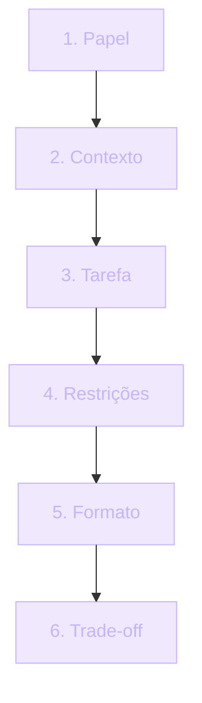

## Engenharia de Prompt

"Engenharia de Prompt" virou termo de merchandising. Mas o conceito é real e útil: **a qualidade da resposta da IA depende da qualidade da sua pergunta**.

Compare os dois prompts abaixo.

```text
Faça um botão.
```

```text
Crie um botão React 19 com TypeScript, usando Tailwind no estilo shadcn/ui,
sem side effects, com loading state, e explique os trade-offs de usar
useState vs useReducer.
```

A diferença entre "faça um botão" e o prompt acima é a diferença entre **código genérico** e **código que se encaixa no seu projeto**.

> [!IMPORTANT]
> Este módulo te ensina a estruturar prompts que produzem respostas úteis. Sem misticismo. Com prática.

## Um pouco de história

| Fase | Período | Característica |
| --- | --- | --- |
| Tentativa e erro | 2020-2022 | "Faça X". IA respondia algo — às vezes bom, às vezes pobre. Sem método. |
| Pós-ChatGPT | 2023 | Apareceram padrões: *few-shot*, *chain-of-thought*, *role prompt*. Pesquisadores começaram a formalizar o que funciona. |
| Hoje | 2024-presente | Engenharia de prompt é commodity. Claude e GPT-4 respondem bem mesmo com prompt vago — mas em **casos críticos**, técnica de prompt ainda diferencia. |

> [!NOTE]
> Não se iluda com a comodidade atual. Para um componente React simples, qualquer prompt funciona. Para uma Server Action com RLS, erros tratados e tipagem estrita — a forma do prompt decide se você refaz o código em 5 minutos ou em 2 horas.

## Analogia: delegar para um estagiário inteligente

IA é um estagiário inteligente **sem contexto do seu projeto**. Você dá contexto → resultado melhora.

```text
Vago:       "Faça um blog."
Melhor:     "Crie um blog com Next.js 15 App Router usando Server Components
            por padrão. Posts em MDX em `content/`. Liste posts na home.
            Cada post em /posts/[slug]. Header com nome do site no canto
            esquerdo."
Excelente:  o prompt acima + "Explique por que você escolheu SSG vs SSR.
            Identifique trade-offs."
```

> [!TIP]
> Cada camada de detalhe elimina uma decisão da IA e devolve a você. O prompt *excelente* ainda pede que a IA explicita os trade-offs — porque é aí que mora o aprendizado.

## Anatomia e templates de um prompt excelente

Seis partes. Não precisa usar todas todo prompt — mas quando a tarefa é crítica, use as seis.



1. **Papel** — "Você é um engenheiro de software sênior especializado em Next.js."
2. **Contexto** — "Estou construindo um SaaS multi-tenant em Next.js 15 + Supabase. Tenho tabelas `notes` e `users`. RLS está ativo."
3. **Tarefa** — "Escreva uma Server Action que crie uma nota privada para o usuário autenticado."
4. **Restrições** — "Use TypeScript estrito. Não use ORMs. Direto com supabase-js. Trate erros."
5. **Formato** — "Responda com código em bloco único. Em seguida, 1 parágrafo explicando."
6. **Trade-off** — "Liste 2 alternativas e por que não escolheu elas."

> [!IMPORTANT]
> A ordem importa. Papel e contexto **antes** da tarefa. A IA constrói a "persona" antes de processar o pedido — e a resposta reflete essa persona.

## Técnicas que funcionam

### Few-shot: mostre exemplos

Mostre pares input → output para a IA generalizar o padrão.

```text
Input: `olá`      → Output: `Olá! Como posso ajudar?`
Input: `tchau`    → Output: `Até breve!`
Input: `como vai` → Output: ?
```

> [!TIP]
> Use poucos exemplos (2 a 5). Mais que isso polui o contexto e a IA começa a copiar padrões específicos em vez de abstrair a regra.

### Chain-of-thought: peça para pensar antes

```text
Antes de responder, liste passo a passo seu raciocínio.
```

Útil para problemas de lógica. A IA mostra a cadeia, **você valida**, detecta premissas erradas. Cadeia errada → conclusão errada, mesmo que pareça confiança.

### Iteração: raramente o primeiro output é o final

```text
[Prompt 1]  "Implemente X."
[Resposta R1]
[Prompt 2]  "Agora considere Y. Reescreva considerando Y."
[Resposta R2]
[Prompt 3]  "Faça um code review rigoroso na sua própria resposta R2."
```

Excelência vem em 2-3 iterações. Tratar o primeiro output como final é o erro do iniciante.

> [!SUCCESS]
> Sempre que a IA gerar algo, pergunte: **"O que você faria diferente se fosse um code review rigoroso?"** A IA encontra problemas no próprio output.

### Templates reais

#### Prompt para código

```markdown
Contexto: Estou construindo [projeto]. Stack [X, Y, Z].
Tarefa: Implemente [feature] em [arquivo].

Restrições:
- TypeScript estrito
- Sem dependências extras
- Lidando com estes erros: [lista]
- Devolver testável e idempotente

Formato:
- Código em bloco único
- Após o código, explique 3 decisões que tomou
- Após explicações, liste 2 alternativas que você considerou e por que não escolheu

Pense passo a passo antes de responder.
```

#### Prompt para debugging

```markdown
Estou com erro:
[stack trace completo]

Código do arquivo:
[código]

Tentativas que já fiz:
- X
- Y

Hipóteses que tenho:
- A
- B

Análise: liste as possíveis causas prováveis, da mais provável para a
menos provável. Para cada uma, explique como verificar.
```

> [!TIP]
> Estrutura "tentativas + hipóteses" é o que separa prompt de debugging de chorar por socorro. A IA entende que você já pensou sobre o problema e respeita esse contexto.

## Prompt ruim vs Prompt bom

| Prompt ruim | Prompt bom |
| --- | --- |
| "Como faço um app?" | "Crie um app de tarefas em Next.js 15 com auth via Supabase. Liste a estrutura de pastas primeiro." |
| "Faça o login" | "Server Action de login com `supabase-js`, sem cliente HTTP, tratando erro de credenciais inválidas. Responda só com código." |
| "Bota um botão bonito" | "Botão React em Tailwind estilo shadcn/ui com variants via `cva` (default, outline, ghost). Liste props com TypeScript." |
| "Tá dando erro" | [Stack trace + código + tentativas + hipóteses — veja template acima] |

## Quando prompt é crítico

A IA comercial responde até "faça um botão". Mas prompt cuidadoso ainda diferencia em:

> [!IMPORTANT]
> - Descrição técnica de comportamento de API
> - Documento de contrato entre serviços
> - Decision records (ADRs)
> - Debugging complexo (forneça **todo** o contexto)

Nesses cenários, prompt vago = entregar bugs escondidos com aparência de confiança.

## Casos reais de mercado

> [!reference]
> **Vercel v0** — prompts viram componentes React. A UX estruturada do v0 força papel/contexto/tarefa/restrições — porque a Vercel sabe que isso melhora a taxa de conversão do output ser utilizável.

> [!reference]
> **Cursor agent / Composer** — prompts viram edit + commit em múltiplos arquivos. Reuso de história de chat como "context stack" é padrão.

> [!reference]
> **Replit AI / Aider** — interfaces de terminal onde prompt estruturado vira diff revisável. Mesma regra: contexto antes de pedido.

> [!reference]
> **OpenAI Cookbook / Anthropic Guide** — guias oficiais da OpenAI e da Anthropic formalizam técnicas: few-shot, chain-of-thought, role prompt, RAG. Ler os dois vale 10x mais que decorar dicas de blogueiro.

> [!curiosity]
> "GPT" no nome do ChatGPT significa *Generative Pre-trained Transformer*. "Claude" é só nome de pessoa — não acrônimo. Já "few-shot" vem do jargão de ML clássico: "quantos exemplos precisa para aprender esta tarefa".

## Erros comuns

> [!WARNING]
> **1. Não dar contexto.** "Como faço um app?" → IA responde com clichê. Sem contexto, IA não sabe o nível nem o stack.

> [!WARNING]
> **2. Admitir código sem ler.** Colar diretamente do output. "Funcionar uma vez" ≠ "funcionar sempre". IA não garantiu nada — **você garante ao validar**.

> [!WARNING]
> **3. Pedir tudo num prompt gigante.** 1000 tokens de pedido. IA esquece do início. Quebre em partes: **primeiro design → depois code → depois testes**.

> [!WARNING]
> **4. Não pedir críticas.** Sempre que IA gera algo, pergunte: "O que você faria diferente se fosse um code review rigoroso?" A IA encontra problemas no próprio output.

## Boas práticas

> [!success]
> **Role prompt** ajuda em especialidades: "atue como especialista X". Dá referência à IA antes da tarefa.

> [!success]
> **Context stack** more em mensagens encadeadas, não num prompt gigante. Reflita: "essa informação é da tarefa ou de mensagens anteriores?"

> [!success]
> **Peça alternativas**: "mostre 2 formas de fazer isso com prós/contras". Cria espaço de decisão — não uma resposta canônica.

> [!success]
> **Salve templates**: prompts excelentes que funcionaram, recicle. Mantenha um `prompts/` no repositório.

> [!success]
> **Reaproveite a conversa**: a história de chat é mantida na sessão. Referencie mensagens passadas em vez de reescrever tudo.

## Resumo

O que você aprendeu neste módulo:

- **Prompt é seu código.** Pobre prompt, pobre resultado. Excelente prompt transforma a velocidade — mas não substitui validação humana.
- **6 partes do prompt**: papel, contexto, tarefa, restrições, formato, pedido de trade-offs. Use as seis em tarefas críticas.
- **Few-shot**: mostre exemplos input → output. IA generaliza o padrão.
- **Chain-of-thought**: peça para pensar antes de concluir. Permite validar premissas.
- **Iteração**: raramente o primeiro output é final. Excelência vem em 2-3 rodadas.
- **Context stack more em mensagens, não em prompt gigante.** Quebre grandes pedidos em design → code → testes.

> [!quote]
> O prompt é seu código. Pobre prompt, pobre resultado — e prompt excelente não substitui validação humana.

## Como aparece nos projetos da UGP

> [!TIP]
> **Boas Práticas com IA** ([/content/boas-praticas-ia](/content/boas-praticas-ia)) — o workflow de 7 passos do qual os prompts fazem parte.

> [!TIP]
> **Como NÃO Fazer Vibe Coding** — antipadrões de prompt que você deve reconhecer antes de errar.

> [!TIP]
> **TDD** — para gerar testes com IA de forma controlada. Prompt gera código; teste valida.

> [!TIP]
> **Projetos IA 1 e 2** — pratique prompts em integração LLM real, com custo e RAG no meio.

## Desafio

> [!IMPORTANT]
> Pegue um prompt que você já usou esta semana e ficou "mais ou menos". Reescreva-o aplicando as 6 partes (papel → contexto → tarefa → restrições → formato → trade-off). Rode os dois, lado a lado, com o mesmo modelo. Responda:
>
> 1. **O que mudou na resposta?** Liste 3 diferenças concretas.
> 2. **Qual parte do prompt novo você usou few-shot ou chain-of-thought?** Justifique.
> 3. **Que 2 alternativas a IA listou no pedido de trade-off?** Você teria pensado nelas sozinho?
> 4. **Quantas iterações foram necessárias até o output final?** Compare com o prompt antigo.
>
> Quando você consegue explicar por que o novo prompt é melhor, você deixou de *usar* IA e passou a *operá-la*. É essa diferença que vira senioridade em entrevista.