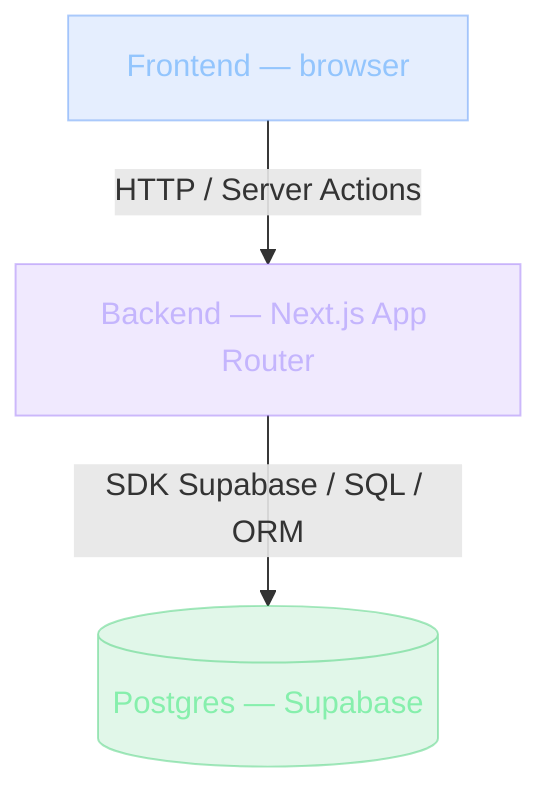
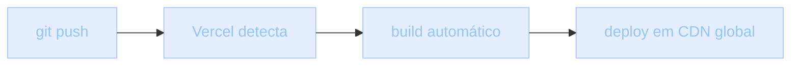

## O que é Fullstack moderno

"Fullstack" virou palavra de moda. O mercado pede "dev fullstack" como se fosse uma coisa única. Mas o que é, afinal?

**Fullstack** significa: capacidade de construir software que envolve frontend, backend e infraestrutura — entendendo o suficiente de cada camada para tomar decisões.

Não é "saber tudo". Não é "dominar tudo". É ter fluência para navegar todo o stack, identificar problemas em qualquer parte, e escolher tecnologias com consciência.

> [!NOTE]
> "Fullstack" não descreve o que você *sabe*. Descreve a sua capacidade de *decidir* em qualquer camada do produto. Quem entende só frontend delega decisões de backend; quem entende só backend chuta o frontend. Fullstack é ter vocabulário para escrever qualquer parte e dialogar com qualquer especialista.

Quando você termina este módulo, entende as peças que compõem um stack moderno, **por que cada uma existe**, e como se conectam.

## Contexto histórico: como o stack evoluiu

O "fullstack" de hoje não é o de dez anos atrás. Cada era respondeu a um problema da anterior.

### Fullstack era simples — 1995 a 2010

LAMP: **L**inux, **A**pache, **M**ySQL, **P**HP. Tudo num server. Você escrevia PHP que gerava HTML, conversava com MySQL, e pronto. Deploy? Manda via FTP para o servidor.

Simples. Mas limitado — depois que a app crescia, PHP virava spaghetti, MySQL virava gargalo, Apache não lidava com concorrência.

### Separação de camadas — 2010 a 2018

A aplicação vira duas:

- **Frontend**: SPA (single-page application) — React, Vue, Angular.
- **Backend**: API REST — Node/Express, Django, Rails.

Frontend roda no browser. Backend roda no servidor. Conversam por JSON.

| Vantagens | Desvantagens |
| --- | --- |
| Times separados de front e back | Codebase duplicado (types) |
| Frontend rápido no client | SEO difícil (SPA não renderiza no servidor) |
| Frontend pode trocar sem tocar backend | Infra mais complexa |

### Era BaaS — 2018 até hoje

Firebase, Supabase, Appwrite. Em vez de você criar backend, usa plataforma: auth, banco, storage, realtime — tudo pronto. Frontend fala direto com o SDK do BaaS.

> [!INFO]
> A UGP usa Supabase. O Projeto 07 (SaaS de Notas) é um exemplo.

### Meta-frameworks — 2020 até hoje

Next.js, Remix, Nuxt, SvelteKit. Misturam as eras: você escreve frontend e backend no mesmo código. Server components, server actions. Deploy em Vercel/Netlify.

"Fullstack" agora significa: você constrói produto end-to-end com poucos arquivos, e o framework decide onde cada código roda.

## Analogia: o restaurante e suas cozinhas

Imagine um restaurante.

- **LAMP**: uma só pessoa cozinha e atende. Funciona se o restaurante é pequeno.
- **Separação SPA + API**: cozinha (backend) e salão (frontend). O garçom (HTTP) leva os pratos. Para pratos complexos, ótimo. Mas há muito trabalho de coordenação.
- **BaaS**: você terceiriza a cozinha para uma central culinária (Supabase). Você só monta o prato e atende. Se precisar de receita muito custom, a central não serve.
- **Meta-framework (Next.js)**: você tem salão e cozinha no mesmo edifício, com a cozinha (server) visível do salão (client). O garçom não precisa sair do edifício. Eficiente.

Cada modelo funciona para casos diferentes.

> [!TIP]
> Não existe stack "superior". Existe stack que resolve o problema do tamanho correto. Escolher meta-framework quando você precisa de microsserviços é tão errado quanto escolher microsserviços para um MVP de 50 usuários.

## As camadas de um stack moderno

Um stack fullstack moderno se organiza em camadas que conversam por formas bem definidas:



Cada camada conversa com a de baixo por uma forma definida:

- **Frontend → Backend**: `fetch`, Server Actions, ou links.
- **Backend → DB**: SDK Supabase, ou SQL direto (raro), ou via ORM (Drizzle, Prisma).
- **DB → Frontend**: nunca direto. Sempre via backend. **Exceto** com RLS no Supabase — o próprio DB valida as permissões.

| Camada | Responsabilidade | Não deveria |
| --- | --- | --- |
| Frontend | Renderizar UI, capturar input do usuário | Acessar o banco diretamente |
| Backend | Orquestrar regras, validar, falar com serviços | Conhecer detalhes de DOM/CSS |
| Database | Persistir, garantir integridade (ACID), autorizar (RLS) | Conter regras de apresentação |

> [!IMPORTANT]
> A pergunta "isso roda onde?" é a pergunta mais subestimada do fullstack moderno. Quem não sabe a resposta acaba importando `fs` no client, libs de DOM no server — e quebra em produção, não no editor.

## Frontend, Backend e Database hoje

### Frontend moderno

- **React 19** com Server Components: alguns componentes rodam no servidor (sem JS no client), outros rodam no browser.
- **Tailwind**: estilos utility-first.
- **shadcn/ui**: componentes copiáveis baseados em Radix UI.
- **TanStack Query**: cache de dados no client (não obrigatório com RSC, mas útil para mutações).

### Backend moderno (Next.js)

Três modos:

- **Server Components**: rodam no servidor, não mandam JS ao browser. Bom para conteúdo, listas, dados autenticados.
- **Server Actions**: funções chamadas do form/button, rodam no servidor. Bom para mutações (criar user, salvar nota).
- **Route Handlers** (`app/api/foo/route.ts`): HTTP endpoints tradicionais. Bom para webhooks, APIs externas.

### Database moderno

Postgres é dominante hoje. Por quê?

- **ACID**: transações garantidas.
- **RLS**: row-level security, multi-tenant sem mudar a app.
- **JSONB**: documentos como JSON, mas em SQL. Híbrido.
- **Open source**: rodável local, escalável em cloud (Supabase, Neon, Aurora).

## Auth e Deploy modernos

### Auth moderno

- **BaaS Auth (Supabase, Auth0, Clerk)**: login social (Google, GitHub), email/senha, magic link. Pronto.
- **Sessões (cookies)**: clássico, seguro se bem feito.
- **JWT stateless**: escala sem server de sessão. Trade-off: revogação difícil.

> [!INFO]
> A UGP usa Supabase Auth — você usa no Projeto 07.

### Deploy moderno

- **Vercel/Netlify**: Git push → detecta → build → CDN. Zero config.
- **Docker**: total controle. Você gerencia. Para apps com requisitos específicos.
- **Self-host em VPS**: máximo controle. Para sistemas comerciais sem cloud.

Escolha por contexto. Para 90% dos projetos pessoais: Vercel.



## Exemplos: do pequeno ao grande

Cada tamanho de projeto pede um stack diferente. Errar o tamanho é o erro mais comum de quem começa.

### Exemplo pequeno — To-Do (Júnior 1)

```
Frontend: React puro (Vite)
Backend:  nenhum (localStorage)
Database: nenhum (localStorage)
Deploy:   Vercel
```

Stack: cerca de 5 dependências. Funciona. Limites: dados não sincronizam entre dispositivos.

### Exemplo médio — Blog Pessoal (Júnior 3)

```
Frontend: Next.js + Tailwind
Backend:  Next.js SSG (gera HTML estático)
Database: nenhum (markdown em arquivos)
Deploy:   Vercel
```

Stack: Next + Tailwind + 2 libs. Site rápido, SEO pronto, sem servidor para manter. Sem DB.

### Exemplo grande — SaaS de Notas (Pleno 1)

```
Frontend: Next.js App Router + Tailwind
Backend:  Server Actions + Route Handlers
Database: Supabase (Postgres + RLS)
Auth:     Supabase Auth (Google + email)
Realtime: Supabase Realtime (notas sincronizam)
Deploy:   Vercel
CI:       GitHub Actions (lint, typecheck, test)
```

Stack: 20+ dependências. Complexidade média. Capacidades: multi-user, auth, realtime, deploy automatizado.

### Exemplo muito grande — LMS como Khan Academy

```
Frontend: micro-frontends em React
Backend:  8 microsserviços (progress, certificates, video, billing...)
Database: Postgres + Redis (cache) + ElasticSearch (busca)
Auth:     SSO interno + Google
Realtime: Kafka para eventos
Infra:    Kubernetes em AWS
```

Stack: centenas de dependências. Time de platform engineering mantém a infra. Você, como dev, foca na sua feature.

### Padrão: escolher por etapa

| Etapa | Stack |
| --- | --- |
| Protótipo | Vite + localStorage |
| MVP | Next.js + Supabase (Auth + DB) |
| Crescimento | Refatorar para módulos claros, adicionar CI |
| Escala | Extrair microsserviços quando necessário, não antes |

> [!IMPORTANT]
> A migração de etapa deve ser **puxada pela dor**, não empurrada pela hype. Se Postgres resolve 10 mil usuários, adicionar Redis "para ser rápido" é gastar complexidade sem ganho.

## Caso real de mercado

O stack moderno não é invenção de curso. Toda startup de produto usa uma variação dele.

> [!REFERENCE]
> **Vercel** — construiu e roda o próprio site com Next.js em produção, inteiro em Server Components. A empresa que mantém o framework também é sua cliente mais exigente.

> [!REFERENCE]
> **Cal.com** — open source de agendamento. Stack: Next + Prisma + Postgres. Excelente para estudar porque você lê o código inteiro no GitHub.

> [!REFERENCE]
> **Resend** — API de e-mail para devs. Stack: Remix + Postgres. Mostra que Next.js não é a única opção de meta-framework viável.

> [!REFERENCE]
> **Linear** — SaaS de issues. Stack: Next/Mobile + backend em Node. Referência de UX dev-first construída sobre stack moderno.

> [!CURIOSITY]
> Stripe, Linear, Vercel, Resend, Notion, Cal.com — todos os stacks se parecem: Next.js + Postgres + Auth provider (Supabase, WorkOS, interno). Quando todo mundo escolhe parecido, existe um motivo: esse stack cobre o problema certo com a complexidade certa.

## Erros comuns

> [!WARNING]
> **1. "Fullstack = tudo, tudo agora".**
> Quer montar stack de startup avaliada em 1 bi em projeto de portfólio. Perde-se em configuração. Comece com 1 frontend. Adicione backend quando precisar. Adicione DB quando persistência fizer sentido.

> [!WARNING]
> **2. Confundir frontend com tudo.**
> "Eu só faço frontend, então não sei backend." Fullstack moderno é RSC em Next.js — o dev de frontend **precisa** entender server components para usar bem a ferramenta.

> [!WARNING]
> **3. Adicionar Redis/Kafka/etc sem necessitar.**
> "Cache com Redis? Vai ser mais rápido." Para quê? Seus 100 usuários não precisam. O próprio Postgres faz cache das queries. Adicione infra só quando a medida demonstrar necessidade.

> [!WARNING]
> **4. Não entender onde o código roda.**
> "Isso roda no servidor ou no client?" Sem essa clareza, RSC vira bagunça. Você instala libs de DOM no server, quebra. Você importa `fs` no client, quebra. Regra: se usa `"use client"`, roda no browser. Sem isso, server.

> [!WARNING]
> **5. Não pensar em multi-tenant desde o início.**
> SaaS de 1 empresa vira SaaS de N empresas. Você modelou o schema pensando em "user". Agora precisa de `tenant_id` em cada tabela. Refatorar é caro. Mesmo com 1 tenant, modele com `tenant_id` desde cedo.

> [!WARNING]
> **6. Não planejar a migração de BaaS.**
> Sair do Supabase para self-host sem interface de buffer deixa o código inteiro acoplado ao SDK do vendor. Planeje pontos de abstração antes de precisar deles.

## Boas práticas

> [!SUCCESS]
> **Defina camadas.** UI, lógica, dados. Cada uma com responsabilidade. A pergunta "isso mora onde?" sempre tem resposta curta.

> [!SUCCESS]
> **Tipagem ponta a ponta.** TypeScript compartilhado entre frontend e backend evita drift de tipos. O mesmo `type Nota` roda nos dois lados.

> [!SUCCESS]
> **Env vars no lugar certo.** Server tem CAS, público tem `NEXT_PUBLIC_*`. Nunca exponha secrets no client — variáveis de servidor não vazam para o bundle.

> [!SUCCESS]
> **Logs estruturados.** Não `console.log("foi")`, mas `logger.info({ user_id, action })` para poder filtrar depois.

> [!SUCCESS]
> **Health endpoint.** `/api/health` checa DB e dependências. Auto-scalers usam; monitors usam; você usa.

> [!SUCCESS]
> **Observabilidade real.** Sentry (errors), Posthog (analytics), OpenTelemetry (tracing). Não enxergar produção é operar no escuro.

> [!SUCCESS]
> **CI obrigatório.** lint, typecheck e testes no PR. Sem verde, sem merge.

> [!SUCCESS]
> **Documente com diagrama.** OpenAPI para APIs públicas. README com setup de 1 clone → rodar. Diagrama de arquitetura em Mermaid.

## Resumo

O que você aprendeu neste módulo:

- **Fullstack é "o suficiente de tudo para decidir".** Não é saber tudo — é ter fluência para navegar e decidir em qualquer camada.
- **O stack evoluiu por eras.** LAMP → SPA+API → BaaS → meta-frameworks. Cada era responde a uma dor da anterior.
- **As camadas conversam por formas definidas.** Frontend→Backend via HTTP/Server Actions; Backend→DB via SDK/ORM; DB nunca vai direto ao client (exceto via RLS).
- **Postgres dominou.** ACID, RLS, JSONB e open source fizeram dele o banco default do stack moderno.
- **Escolha por etapa.** Protótipo → MVP → Crescimento → Escala. Não antecipe complexidade que a etapa seguinte exige.
- **A pergunta-chave é "isso roda onde?".** Sem essa clareza, RSC, Server Actions e o próprio Next viram bagunça.

> [!QUOTE]
> "Fullstack não é 'tudo'. É 'o suficiente de tudo para decidir'. Você não precisa ser sênior em 50 tecnologias — precisa ser capaz de ler qualquer uma e tomar decisões. Isso é fluência fullstack."

## Como isso aparece nos projetos da UGP

Durante a Universidade Gratuita do Programador, o stack fullstack aparece em escala crescente:

> [!TIP]
> **Projetos 01 a 04 — Frontend puro.** Stacks pequenos, foco em UI e lógica de cliente.

> [!TIP]
> **Projeto 05 — Blog Pessoal.** Next.js + SSG. Primeiro fullstack leve: você escreve conteúdo em markdown e o framework gera o site.

> [!TIP]
> **Projeto 07 — SaaS de Notas.** Next.js + Supabase (Auth + Postgres + RLS). Stack completo, multi-user, realtime. Aqui você junta todas as camadas.

> [!TIP]
> **Projeto 09 — LMS.** Fullstack + testes + CI. Stack profissional com cobertura obrigatória. Reproduz, em menor escala, a própria arquitetura da UGP.

> [!TIP]
> **Projeto 10 — Clone do Supabase.** Microsserviços. Stack distribuído de verdade: API gateway, serviços isolados, filas, persistência por serviço.

## Desafio

> [!IMPORTANT]
> Escolha um produto que você usa todo dia (Notion, Linear, Cal.com, Resend) e destructure o stack dele por escrito:
>
> 1. **Frontend.** É SPA puro, meta-framework ou mobile? Como ele lida com renderização (SSR/SSG/client)?
> 2. **Backend.** Onde ficam as regras? Server Actions, route handlers, microsserviços?
> 3. **Database.** Postgres? Outro? Há cache (Redis) ou busca (ElasticSearch)? Por quê?
> 4. **Auth.** Como login funciona — social, magic link, SSO?
> 5. **Deploy.** Onde ele provavelmente roda? Vercel, AWS, próprio datacenter?
> 6. **O que você faria diferente?** Defenda com um argumento de etapa/tamanho, não com gosto pessoal.

Não precisa acertar. O objetivo é treinar o olhar fullstack — olhar para qualquer produto e enxergar as camadas e as decisões que o sustentam.