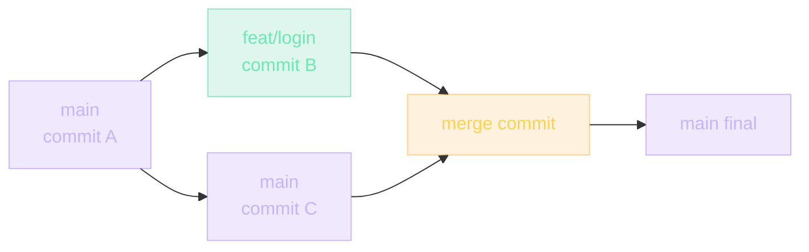
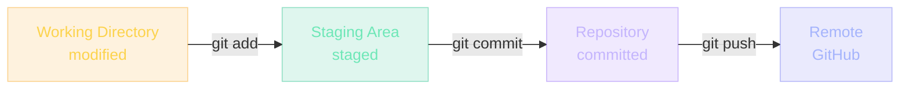
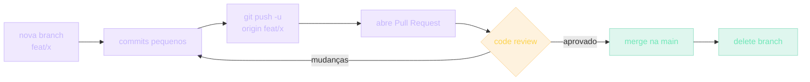

## Git: a ferramenta mais usada — e a menos compreendida

Git é a ferramenta mais usada por desenvolvedores no mundo. E a **menos compreendida**.

Todo dev usa. Poucos entendem. A maioria decora 5 comandos: `add`, `commit`, `push`, `pull`, `status`. Quando algo dá errado — merge conflict, branch divergente, commit no lugar errado — entra em pânico, apaga a pasta, clona de novo.

> [!NOTE]
> Este módulo te faz entender **o que o Git realmente é**, não só como usá-lo. Quando você entende, merge conflict deixa de ser terror e vira conversa. Branch abandonada deixa de ser mistério e vira arqueologia. Você ganha controle.

GitHub, em cima do Git, é onde o código vive em colaboração. Pull requests, code review, issues, Actions — todo fluxo de trabalho moderno passa por aqui.

## Antes do Git: do CVS ao GitHub (1986-2008)

Vamos voltar no tempo. Como times trabalhavam juntos antes do Git?

> [!REFERENCE]
> **CVS (1986)** — uma das primeiras ferramentas. Tracking line-by-line, mas travava em conflitos. Lento. Centralizado — se o servidor caía, ninguém trabalhava.

> [!REFERENCE]
> **SVN (2000)** — melhorou o CVS. Ainda centralizado. Branching era tão difícil que times evitavam fazer branches, trabalhando todos no `trunk`, quebrando-se mutuamente.

> [!REFERENCE]
> **BitKeeper (2002)** — distribuído. Rápido. O kernel Linux usou. Mas era proprietário. Em 2005, o dono revogou a licença grátis para a comunidade open source. Linus Torvalds ficou sem ferramenta.

### Linus escreve o Git em 10 dias

Em 10 dias, Linus Torvalds escreveu o Git. Os objetivos:

- **Distribuído**: cada clone é um repositório completo. Sem servidor, você ainda commita, brancha, vê histórico.
- **Rápido**: projetado para lidar com o kernel Linux (milhões de arquivos).
- **Intencionalmente duro** no início — mas os conceitos eram certos.

> [!CURIOSITY]
> Linus disse: *"I'm an egotistical bastard, and all my software is named after me. So, first I called it Linux. Now I called it Git."* (Git, em inglês britânico, significa pessoa desagradável.)

### GitHub (2008)

Git era poderoso, mas duro. GitHub chegou em 2008 com uma ideia: colocar uma interface web no Git. Pull requests, forks, code review. Hoje é onde a maioria dos projetos open source vivem.

## Analogia: um livro escrito por várias pessoas

**Modelo centralizado (SVN)**: há um manuscrito único na editora. Cada autor pega o manuscrito (somente ele), faz mudanças, devolve. Outros esperam. Se 2 autores pegam ao mesmo tempo, um sobrescreve o outro.

**Modelo Git**: cada autor tem uma **cópia completa** do livro em casa. Você escreve no seu, sem esperar ninguém. Quando quer compartilhar, manda um "diff" — só as páginas que mudaram — para a editora. A editora integra. Todo mundo pode ler as mudanças afterwards.

> [!TIP]
> Em Git, você ainda pode ter **versões paralelas** (branches). Escreve uma nova versão do Capítulo 5 sem mexer na versão publicada. Quando a nova estiver boa, você integra (`merge`).

## O que é um commit, um branch e um merge

### Commit

Um commit é **uma foto do seu código em um momento**. Não guarda os arquivos inteiros de novo — só o que mudou desde a última foto.

Cada commit tem:

- Um ID único (hash SHA-1, ex: `a1b2c3d`)
- Uma mensagem ("Adicionei login with Google")
- Autor e timestamp
- Referência ao commit anterior

> [!INFO]
> Isso forma uma **cadeia**: `commit 3 → commit 2 → commit 1`. Você pode voltar a qualquer ponto.

### Branch

Um branch é **um ponteiro para um commit**. Criar `feat/login` diz "quero trabalhar a partir deste commit, mas em paralelo". Você commita, o ponteiro anda. Outros branches não mudam.

### Merge

Quando você une 2 branches, Git tenta automaticamente: se você mexeu em `arquivoA` e o outro branch mexeu em `arquivoB`, Git une os dois. Se ambos mexeram na mesma linha do `arquivoC`, Git diz "conflito — você decide".



## Os 3 estados do Git

Todo arquivo em Git está em um de 3 estados:



1. **Working Directory**: você mexe nos arquivos. Ainda não disse ao Git que quer guardá-los.
2. **Staging Area**: você disse "quero incluir esses na próxima foto". Mas ainda não tirou a foto.
3. **Repository**: você commitou. A foto foi tirada. Está no histórico.

## Comandos essenciais — e por quê

```bash
git status          # O que mudou? O que está staged?
git add arquivo.js  # Move de working → staging
git commit -m "msg" # Tira a foto: staging → repository
git push            # Manda seus commits para o servidor (GitHub)
git pull            # Traz commits do servidor e une com os seus
git log --oneline   # Vê histórico curto
git branch          # Lista branches
git checkout -b X   # Cria e muda para branch X
git merge X         # Traz branch X para dentro da branch atual
```

> [!TIP]
> Não decore — entenda o fluxo entre os 3 estados. Cada comando **move** arquivos de um estado para outro. Saber de onde para onde é mais útil que decorar a sintaxe.

## Conventional Commits

Padrão de mensagem que GitHub e ferramentas entendem:

```text
feat: adiciona login com Google
fix: corrige cálculo de XP duplicado
docs: atualiza README
refactor: extrai função de cálculo
test: cobre edge case de birthday
chore: bumpa versão do Next
```

> [!IMPORTANT]
> Por quê? Sem padrão, histórico vira lixo: "wip", "fix", "mais fix". Com padrão, ferramentas geram **CHANGELOG automático**, **versionamento semântico** e **release notes**.

## Workflow: GitHub Flow (o mais usado)



1. Crie branch: `git checkout -b feat/login-google`
2. Faça commits pequenos, com mensagens claras
3. PUSH para GitHub: `git push -u origin feat/login-google`
4. Abra um Pull Request no GitHub
5. Code review (alguém revisa)
6. Merge na `main`
7. Delete o branch

> [!CAUTION]
> Branches longos (1 mês) = muitos conflitos. Branches curtos (1-3 dias) = fácil integrar. **Mantenha branches curtos.**

## Exemplos: situações reais de todo dia

### Exemplo 1: você está em feature e a `main` andou

Você está em `feat/carrinho`, há 3 dias. A `main` recebeu 5 commits do João. Você precisa puxar essas mudanças antes de abrir PR:

```bash
git checkout main
git pull origin main           # atualiza sua main local
git checkout feat/carrinho
git merge main                 # une main no carrinho
# Possible conflitos. Resolva. Commit.
git push
```

### Exemplo 2: você commitou no lugar errado

Mexeu em `main` direto, sem branch. **Ainda não pushou.**

```bash
git checkout -b feat/carrinho  # cria branch a partir daqui
git checkout main
git reset --hard HEAD~1        # main volta 1 commit (não pushado ainda!)
git checkout feat/carrinho
```

> [!WARNING]
> `git reset --hard` em commits já pushados é destrutivo. Use **apenas** em commits locais que ninguém mais tem.

### Exemplo 3: conflito de merge

```text
Auto-merging carrinho.ts
CONFLICT (content): Merge conflict in carrinho.ts
```

Abra `carrinho.ts`:

```ts
function checkout() {
<<<<<<< HEAD
  const total = calcularComTaxa();
=======
  const total = calcularComDesconto();
>>>>>>> main
}
```

Escolha uma das versões (ou uma 3ª combinada). Remova os marcadores `<<<<<<<`, `=======`, `>>>>>>>`. Salve.

```bash
git add carrinho.ts
git commit  # sem -m, abre editor. Salva a msg default.
```

> [!TIP]
> Conflito é chance de pensar. Git fez o melhor automático. Você decide onde ele errou. É conversa, não bicho-papão.

## Caso real de mercado

Em **todas** as empresas. Sem exceção. Se a empresa usa software, ela usa Git/GitHub.

> [!REFERENCE]
> **Linux kernel** — onde nasceu. 15+ mil contribuidores, milhares de branches por release. Sem Git, o kernel não seria mantível.

> [!REFERENCE]
> **GitHub próprio** — usa GitHub Actions para buildar o GitHub. Cão que morde o próprio rabo, no bom sentido.

> [!REFERENCE]
> **Microsoft** — migrou todo o Windows do SourceDepot (SVN interno) para Git em 2017, depois de criar o GVFS (Hoje VFS for Git) para suportar o tamanho do repo. Hoje roda no GitHub Enterprise.

> [!REFERENCE]
> **Stripe** — GitHub Flow + conventional commits. **Nubank** — Git Flow adaptado, code review obrigatório. **Google** — Trunk-based com feature flags em sistemas internos próprios.

## Erros comuns

### O que iniciantes fazem

> [!WARNING]
> **1. Commitam "wip".** "Work in progress" não é mensagem. Ninguém sabe o que mudou. Você mesmo, daqui 3 meses, não vai saber. Use Conventional Commits: `feat: adiciona botão de checkout`.

> [!WARNING]
> **2. Tudo num commit gigante.** "feat: adiciona carrinho, login, payment, e mudanças no Profile" — 5 features num commit. Code review impossível. Reverter impossível. Pequenos e frequentes. Um conceito por commit.

> [!WARNING]
> **3. Puxam direto da `main` de outras pessoas.** Nunca mexa em `main` direto. Crie branch.

> [!WARNING]
> **4. Têm medo de conflito.** Conflito é chance de pensar. Git fez o melhor automático. Você decide onde ele errou.

### O que intermediários fazem

> [!WARNING]
> **5. Rebase sem entender.** `git rebase` reescreve histórico. Útil para limpar commits antes de PR. Destrutivo se já pushou e outras pessoas estão no branch. Regra: rebase **apenas no seu próprio branch não merged**.

> [!WARNING]
> **6. Force push sem pensar.** `git push --force` sobrescreve histórico remoto. Se alguém pushou no meio, você apagou trabalho dele. Use `--force-with-lease` (Git verifica se ninguém mexeu).

### O que seniores evitam

> [!CAUTION]
> **7. Não commitam segredos.** `API_KEY=sk-xxx` no `.env` commitado? Já era. Histórico Git é permanente — mesmo apagando, alguém pode achar. Use `.gitignore`. Use variáveis de ambiente. Nunca commite segredo.

> [!CAUTION]
> **8. Não mergem sem entender.** Botão verde "Merge" no GitHub é fácil. Mas você leu o diff? Rodou os tests? Reviewer responsável é parte do engenheiro.

## Boas práticas

### Como fazer

> [!SUCCESS]
> **Commits pequenos** — um conceito por commit. **Mensagens claras** — Conventional Commits. **Branches curtos** — 1-3 dias, máximo 1 semana. **PR com descrição** — o que muda, por quê, como testar. **`.gitignore` completo** — `node_modules/`, `.env*`, `dist/`, `.next/`.

### Como manter

> [!SUCCESS]
> **`git pull` diário** da `main`, evita drift grande. **Histórico limpo** com rebase (no seu branch) antes de PR. **Tags para releases** — `git tag v1.0.0` marca ponto estável.

### Como escalar

> [!SUCCESS]
> **Equipação**: branches com prefixo do dono — `feat/joao/login`. **Branch protection** na `main` — ninguém pusha direto, só via PR. **CI obrigatório** — PR só merge se tests passarem.

### Como documentar

> [!SUCCESS]
> **README.md** com onboarding guide e setup. **CONTRIBUTING.md** com workflow de PR. **CHANGELOG.md** gerado de conventional commits.

## Teste seu conhecimento sem Google

1. Como desfazer o último commit **sem perder as mudanças**?
   <details><summary>Resposta</summary>`git reset --soft HEAD~1`</details>
2. Como ver diff entre 2 branches?
   <details><summary>Resposta</summary>`git diff main..feat/x`</details>
3. Como salvar mudanças sem commit, trocar de branch, e voltar?
   <details><summary>Resposta</summary>`git stash`, trabalhe, `git stash pop`</details>

## Como isso aparece nos projetos da UGP

Depois deste módulo, você sabe Git como ferramenta. Próximos passos dentro da UGP:

> [!TIP]
> **Todos os projetos da UGP ficam no GitHub.** Cada um com README explicando o problema, a arquitetura, como rodar. Conventional Commits. PR mesmo que sozinho (você aprende o fluxo). Tags para versões finais.

> [!TIP]
> **Projeto 05 — Blog Pessoal.** Publicado via **GitHub Pages**. Seu portfólio técnico começa aqui.

> [!TIP]
> **Projeto 09 — LMS.** Você configura **GitHub Actions** para CI: lint, typecheck, deploy automático a cada PR merge.

> [!TIP]
> **Open Source.** Todo projeto da UGP tem README, CONTRIBUTING. Você publica no GitHub — é onde recrutadores vão olhar.

## Desafio

> [!IMPORTANT]
> Faça um repo público chamado `meu-diario-git`. Siga estes passos:
>
> 1. **Crie 2 branches** a partir da `main`: `feat/semana-1` e `feat/semana-2`.
> 2. **Escreva 3 commits** em cada, usando Conventional Commits puro (feat, fix, docs, refactor, test, chore).
> 3. **Provoque um conflito de merge** de propósito: edite a mesma linha em ambas as branches. Resolva.
> 4. **Abra um Pull Request** — mesmo que sozinho — com descrição: o que muda, por quê, como testar.
> 5. **Faça merge e delete as branches** (`git push origin :feat/semana-1` apaga remota).
> 6. **Crie uma tag** `v0.1.0` para marcar o primeiro release.

Se você completar esses 6 passos semconsultar o tutorial — só a documentação oficial do `git` — você parou de decorar e passou a **entender**.