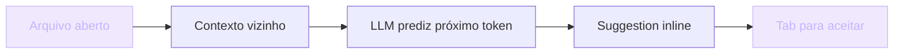

## IA Aplicada para Devs

Inteligência Artificial virou hype. Todo mundo fala. Pouca gente entende o que ela é, no nível prático, para quem desenvolve software.

A boa notícia: você não precisa entender matemática de redes neurais. Precisa entender **onde a IA resolve problemas, onde ela cria problemas, e como integrá-la sem virar dependência**.

> [!IMPORTANT]
> IA não é mágica. É uma nova camada no seu stack que **prediz** texto com base em padrões (LLMs), **reconhece** padrões em dados (ML clássico) e **gera** código, imagem e áudio (modelos generativos). Quando você termina este módulo, sabe diferenciar IA aplicada (útil) de IA como buzzword (ruído).

## Analogia: três bibliotecários

Imagine pedir para um bibliotecário organizar a entrada de novos livros.

**IA clássica** segue regras fixas: "cada livro novo vai por tema alfabético". Repetitivo, mas funciona — e funciona sempre igual.

**ML clássico** aprende com mil livros já categorizados e passa a *predizer* a categoria dos próximos. Erra 5% das vezes. Bom para classificação (spam, fraude, churn).

**LLM** leu TODA a Wikipedia. Você pergunta qualquer coisa — responde como um humano. Às vezes **inventa**. Não sabe distinguir o que sabe do que apenas parece saber.

> [!TIP]
> Regra prática: para tarefas **estruturadas** (validar CPF, calcular preço), use código. Para tarefas **fuzzy** (resumir, traduzir, sugerir), IA pode ajudar. Misturar as duas é o erro mais caro do iniciante.

## Um pouco de história (em 4 eras)

| Era | Período | Como funciona | Limitação |
| --- | --- | --- | --- |
| IA clássica | 1950-2010 | Regras explícitas: "Se X então Y" | Você escreve as regras, IA segue |
| ML clássico | 2010-2017 | Algoritmos aprendem com dados (random forests, SVMs, redes pequenas) | Bom para classificação, fraco para linguagem |
| Deep Learning | 2012-presente | Redes profundas: CNNs para imagem, RNNs para sequência | Escalam com dados, custam caro para treinar |
| LLMs | 2020-presente | GPT, Claude, Llama — bilhões de parâmetros, predizem próximo token | Surpreendentemente úteis. **Alucinam.** Custo de inferência significativo |

> [!NOTE]
> 2017 foi o ano divisor de águas: os **Transformers** chegaram. Tudo o que você usa hoje (ChatGPT, Claude, Copilot) descende daquele paper. Não decore o paper — entenda que ele mudou a escala.

## Tipos de IA aplicada ao desenvolvimento

Existem cinco grandes categorias. Cada uma serve para uma coisa diferente — e errar a categoria é o erro mais caro.

### 1. Completion de código

Ferramentas: **GitHub Copilot**, **Cursor**, **Codeium**. Lê o contexto do seu arquivo + arquivos abertos e prediz o que viria a seguir.

> [!SUCCESS]
> **Use para**: boilerplate, padrões repetidos (logs, testes simples, CRUD).
> **Não use para**: código crítico, algoritmos novos, segurança.

### 2. Chat assistente

**Claude**, **ChatGPT**. Conversação: você pergunta, ele responde.

> [!SUCCESS]
> **Use para**: explicar conceito, debugar (colar erro + código), brainstorm de arquitetura.
> **Não use para**: problema que você ainda não entende (a IA não vai adivinhar), nem código de produção crítico sem revisão.

### 3. Geração de testes e docs

Aplica o LLM ao seu código e gera testes, comentários ou docs.

> [!WARNING]
> Use como **rascunho**. Sempre revise. Nunca publique docs gerados automaticamente sem revisão — alucinações em docs viram bugs escondidos para a próxima pessoa desenvolvedora.

### 4. RAG (Retrieval-Augmented Generation)

Combina LLM com uma base de conhecimento. Você pergunta "como funciona X em nossa codebase?" e a IA busca documentos/code via *embedding* antes de responder.

> [!TIP]
> Perfeito para **onboarding**, documentação interna e suporte. A diferença entre RAG e chat puro é que aqui a IA responde a partir do seu código — não da memória genérica do modelo.

### 5. Agentes

LLM com *tools*: chama APIs, executa código, itera. Cursor agent, Aider.

> [!SUCCESS]
> **Use para**: refactors mecânicos em larga escala.

> [!CAUTION]
> **Não use para**: code review autônomo. Você ainda precisa revisar.

## Com IA vs Sem IA

A diferença não é só velocidade — é o tipo de tarefa onde a IA realmente paga o custo.

| Sem IA | Com IA (bem usada) |
| --- | --- |
| Boilerplate escrito à mão | Boilerplate gerado e revisado em segundos |
| Stack Overflow para cada erro | Cola o stack trace, recebe 3 hipóteses |
| Doc escrita do zero | Rascunho gerado, refinado por você |
| Refactor de 200 arquivos manual | Agent executa, você valida o diff |
| Arquitetura só na sua cabeça | Brainstorm com IA elenca trade-offs |

> [!IMPORTANT]
> Repare: em **todas** as colunas da direita, você **valida**. A IA acelera a geração; a qualidade continua sendo sua.

## Casos reais de mercado

> [!reference]
> **GitHub Copilot** — em todos os editores. Estudos internos da GitHub reportam ganho de produtividade real em tarefas repetitivas; em código crítico, o ganho é marginal.

> [!reference]
> **Cursor** — IDE IA-native que integra chat, completion e agent no mesmo editor. O agente edita múltiplos arquivos e abre PRs.

> [!reference]
> **Vercel v0** — prompts viram componentes React prontos. Útil para protótipos; ainda precisa de revisão humana para composição em produção.

> [!reference]
> **Devin / CodeRabbit** — agentes autônomos e code review com IA. Pago para acelerar revisão, não substitui aprovação humana em código crítico.

> [!curiosity]
> Todas essas ferramentas compartilham a mesma base: um LLM (GPT-4o, Claude 3.5, etc.) na frente de um prompt estruturado. Diferença está no *contexto que injetam* — arquivos abertos, repositório inteiro, embeddings da codebase.

## Quando NÃO usar IA

> [!CAUTION]
> **Criptografia** — use libs verificadas (bcrypt, argon2, libsodium). IA não inventa primitivas criptográficas; copiar "AES caseiro" da IA é vetar a própria auditoria.

> [!CAUTION]
> **Validação legal/fiscal** — alíquotas variam por município. IA não conhece a tabela atual do ISS de Blumenau. Consulte a fonte.

> [!CAUTION]
> **Performance crítica** — otimização requer profiling, não opinião de LLM. "Isso é otimizado" sem benchmark não é resposta.

## Erros comuns

> [!WARNING]
> **1. Confiança cega.** IA gera código, você cola sem ler. Funciona aparentemente. Em produção, buga. **Sempre leia o output.**

> [!WARNING]
> **2. Contexto ausente.** Pergunta vaga: "faça uma função para calcular frete". A IA adivinha contas — e ignora CEP, peso, dimensões. Contexto é 80% do prompt útil.

> [!WARNING]
> **3. IA para tudo.** Tarefa trivial pode custar mais em tempo de prompt do que escrevendo. IA é ferramenta, não default.

> [!WARNING]
> **4. Esquecer trade-offs.** IA gera versão A. Você aplica. Não para em: "será que B é melhor?" **Peça alternativas.**

## Boas práticas

> [!success]
> **Verifique tudo**: código, docs e fatos. IA gera, você valida.

> [!success]
> **Cite IA em commits** quando ela autorou: `feat: login com Google (co-authored with Cursor)`. Transparência é senioridade.

> [!success]
> **Defina contexto rico**: "this JS function receives... returns... here's the file context:". Mostre onde mora a IA.

> [!success]
> **Peça trade-offs**: "Forneça 2 alternativas com prós e contras." Nunca aceite a primeira resposta como a final.

## Resumo

O que você aprendeu neste módulo:

- **IA é uma camada, não mágica.** LLMs predizem tokens; ML clássico classifica; modelos generativos geram.
- **5 tipos de uso**: completion, chat, geração de testes/docs, RAG e agentes. Cada um serve para uma tarefa diferente.
- **Tarefas estruturadas → código. Tarefas fuzzy → IA.** Confundir as duas é o erro mais caro.
- **Contexto é 80% do prompt útil.** Sem contexto, IA adivinha — e adivinhação não é engenharia.
- **Você valida, sempre.** IA acelera geração; qualidade continua sendo responsabilidade humana.
- **Transparência = senioridade.** Cite co-autoria, peça alternativas, documente decisões.

> [!quote]
> IA é ferramenta. Não é mestre. Não é atalho. A IA gera; **você valida**.

## Como aparece nos projetos da UGP

Durante a UGP você vai usar IA em diferentes momentos da sua jornada. Conheça onde cada técnica se encaixa:

> [!TIP]
> **Engenharia de Prompt** ([/content/engenharia-prompt](/content/engenharia-prompt)) — como estruturar prompts para extrair valor da IA sem ruído.

> [!TIP]
> **Como NÃO Fazer Vibe Coding** — os antipadrões deste módulo, sem retoque. Aprenda o que evitar antes de errar.

> [!TIP]
> **Boas Práticas com IA** ([/content/boas-praticas-ia](/content/boas-praticas-ia)) — o workflow defensável que governa o uso de IA em produção.

> [!TIP]
> **Projetos IA 1 e 2** — prátique IA em projetos reais: integração com LLM, RAG, custo controlado e prompt behavioral.

## Desafio

> [!IMPORTANT]
> Escolha uma tarefa de código que você fez esta semana (uma feature, um bug fix, uma doc). Responda, por escrito:
>
> 1. **Qual das 5 categorias de IA se encaixava?** Justifique com a natureza da tarefa.
> 2. **Onde IA teria ajudado?** Aponte a parte fuzzy.
> 3. **Onde IA teria atrapalhado?** Aponte a parte estruturada, crítica ou de domínio.
> 4. **Qual contexto você teria passado?** Escreva o prompt inicial que você usaria.
> 5. **Quais trade-offs você pediria à IA?** Liste 2 alternativas que valeriam a pena comparar.

O objetivo é treinar o olhar de engenheiro — classificar a tarefa antes de abrir a IA. Quando você consegue fazer isso, a IA deixa de ser mágica e vira stack.