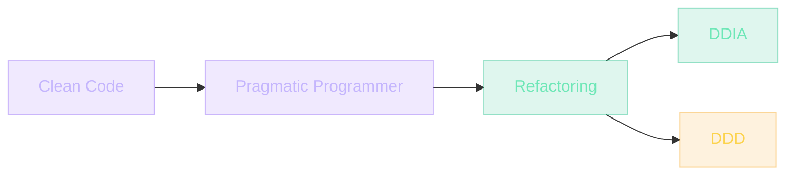

## Por que livros ainda importam

Livros técnicos parecem coisa dos anos 90 — quando tudo mudava devagar. Hoje, tutoriais de YouTube passam mais rápido, certo?

Errado. **Tutoriais te ajudam a fazer; livros te ajudam a pensar.**

Frameworks mudam. React nasceu em 2013, hoje é #1, em 2030 pode nem existir. O conhecimento que permanece é outro: como pensar sobre software, como tomar decisões de design, como julgar prós e contras. Esse conhecimento é difícil de achar em vídeos de 10 minutos.

> [!IMPORTANT]
> Este módulo lista 5 livros essenciais que todo engenheiro de software deveria ler — e por quê. Não é uma wishlist infinita. É um caminho com começo, meio e fim.

## O lugar dos livros na engenharia

Engenharia de software tem ~50 anos. Outras engenharias têm muito mais: civil (5000 anos), mecânica (séculos), elétrica (150 anos).

Livros de software que duram são recentes — mas já existem. Os melhores exemplificam princípios que sobreviveram a ondas técnicas.

> [!NOTE]
> **Clean Code** (2008) ainda é relevante porque trata de **não-framework**: clareza, nomenclatura, funções pequenas. Vale para Java, Python, JS. Jeff Weiner disse que conhecimento sobre software difícil de achar em outro lugar: escolher abstração requer combinar insights de outros que escolheram abstração antes.

## Analogia: aprender culinária só com vídeos

Imagine aprender culinária só com vídeos.

"Receita de strogonoff, 5 minutos, siga e pronto."

Funciona. Mas você nunca entende por qual razão cebola antes do alho. Ou por qual razão cada receita é diferente.

Agora imagine ler "On Food and Cooking" de Harold McGee. Demora mais. Mas o conhecimento é **transferível** — não apenas strogonoff, você entende qualquer receita.

> [!TIP]
> Em software é igual. **Vídeo = receita. Livro = entendimento.** Vídeo te faz construir hoje; livro te faz decidir amanhã.

## Os 5 livros essenciais

Visão geral antes do detalhe:

| # | Livro | Autor | Ano | Nível | Tema central |
| --- | --- | --- | --- | --- | --- |
| 1 | Clean Code | Robert C. Martin | 2008 | Júnior 2-3 | Legibilidade, funções pequenas |
| 2 | The Pragmatic Programmer | Andy Hunt & Dave Thomas | 1999 (20th ann. 2019) | Júnior 3 / Pleno 1 | Mentalidade de engenheiro |
| 3 | Refactoring | Martin Fowler | 1999 (2ª ed. 2018) | Pleno 1 | Code smells e refactorings nomeados |
| 4 | Designing Data-Intensive Applications | Martin Kleppmann | 2017 | Pleno 2-3 | Trade-offs de armazenamento em escala |
| 5 | Domain-Driven Design | Eric Evans | 2003 | Pleno 2-3 / Sênior | Domínio primeiro, bounded contexts |

### 1. Clean Code — Robert C. Martin (2008)

**Por quê**: ensina nomenclatura, funções pequenas, separação de responsabilidades. Fundação de legibilidade de código.

> [!IMPORTANT]
> **Lição principal**: código é lido 10x mais que escrito. Otimize para leitura.

**Pontos para destacar**:

- Nome de variável deve responder "o quê", não "como".
- Função deve fazer UMA coisa.
- Comentários são falhas — bom código não precisa de muitos.

> [!CAUTION]
> **Cuidado**: alguns exemplos em Java parecem datados. Conceitos transcendem sintaxe. **Quando ler**: Júnior 2-3.

### 2. The Pragmatic Programmer — Andy Hunt & Dave Thomas (1999, 20th Anniversary 2019)

**Por quê**: ensina mentalidade de engenheiro. Não um framework — patterns de pensamento.

> [!IMPORTANT]
> **Lição principal**: você é responsável por seu trabalho. Não tenha "medo de quebrar". Mas seja curado.

**Pontos para destacar**:

- DRY (Don't Repeat Yourself) — não só código, mas conhecimento.
- "Tracer bullets" vs "sarcastic defense" — abordagens de prototipagem.
- "Rubber ducking": explique o problema para um pato de borracha. Várias vezes você vê sua própria burrice.
- "Law of Demeter" — fale com seus amigos diretos, não com amigos de amigos.

**Quando ler**: Júnior 3 / Pleno 1.

### 3. Refactoring — Martin Fowler (1999, 2ª ed. 2018)

**Por quê**: refatoração é parte do trabalho. Sem abordagem sistemática, vira caos.

> [!IMPORTANT]
> **Lição principal**: código vivo precisa mudar. Quando mudar, preservar comportamento. Para preservar, testar antes e depois.

**Pontos para destacar**:

- Code smells (sinais de ruim): função longa, classe grande, divergent change etc.
- Refactorings nomeados: "Extract Function", "Move Method", "Replace Conditional with Polymorphism".
- Refactor tem passos pequenos, irrevogáveis.

**Quando ler**: Pleno 1.

### 4. Designing Data-Intensive Applications — Martin Kleppmann (2017)

**Por quê**: você precisa entender onde os dados vivem, e o que isso significa em escala.

> [!IMPORTANT]
> **Lição principal**: armazenamentos não têm "escolha certa". Têm "escolha com trade-offs". SQL vs NoSQL, ACID vs eventualmente consistente, replication vs sharding — todos válidos para casos diferentes.

**Pontos para destacar**:

- Replicação: master-slave, multi-leader, leaderless.
- Transações: isolation levels e o que significam.
- Stream processing: log como inverso de tabelas.
- Compatibility: backward/forward evolution.

**Quando ler**: Pleno 2-3.

### 5. Domain-Driven Design — Eric Evans (2003)

**Por quê**: software existe para resolver problemas de negócio. Negócio tem linguagem própria (ubiquitous language). Software deve refletir.

> [!IMPORTANT]
> **Lição principal**: seus usuários (*domain experts*) são especialistas do domínio. Escute-os. Modele o domínio em código primeiro; todo o resto é detalhe técnico.

**Pontos para destacar**:

- Bounded Contexts (fronteiras de modelo).
- Aggregates (consistência transacional).
- Repositories (abstrações de persistência).

> [!CAUTION]
> **Cuidado**: livro difícil. Leia quando estiver em Pleno 2 com projetos complexos. **Quando ler**: Pleno 2/3, Sênior.

### Outros (wishlist)

> [!NOTE]
> - **Refactoring UI** — Adam Wathan & Steve Schoger: design para devs que não são designers. Excelente.
> - **Testing JavaScript Applications** — Lucas da Costa: prático. Útil em Júnior 3/Pleno 2.
> - **Software Engineering at Google** — trio de 3 autores. Excelente sobre processos em escala.

## Como aplicar um livro — passo a passo

Você leu Clean Code. E agora?

> [!TIP]
> 1. **Identifique 1 padrão** que você usa no trabalho/projetos que o livro contradiz. (Exemplo: função de 80 linhas que faz três coisas.)
> 2. **Refatore 1 função** com o livro ao lado. Veja a coisa.
> 3. **Se gostou, aplique em mais funções.**
> 4. **Se não**: escreva por quê — em ADR ou em README. Não pode ser "não gosto" sem argumento.

> [!CAUTION]
> Ler não é assistir vídeo. "Li" é um nível raso. **"Apliquei" é prova.**

### Cronograma realista

> [!NOTE]
> - 1 livro a cada 3 meses, 30 min/dia.
> - Em 2 anos: 8 livros. Praticamente você cobre os essenciais.
> - Em 4 anos: você é a pessoa no time que cita autores — não por kenobi, por ter lido.

## Caso real de mercado: empresas que investem em livros

Empresas com cultura de engenharia tratam livros como ferramenta de trabalho, não decoração.

> [!REFERENCE]
> **Stripe** — mantém clubes do livro entre funcionários. Discussões em horário pago.

> [!REFERENCE]
> **Google** — bibliotecas virtuais em escritórios. Acesso livre a livros técnicos.

> [!REFERENCE]
> **Thoughtworks** — envia livros para funcionários como parte do desenvolvimento pessoal.

### Quando usar o que aprendeu

- Para evoluir soft skills (praticamente em todos os momentos).
- Em entrevistas: citar princípios de Fowler, Beck ou Evans transforma "pleno" em "engenheiro".
- Em promoções internas: fundamentar ADR com bibliografia de referência.

## Erros comuns de leitor

### O que iniciantes fazem

> [!WARNING]
> **1. Não terminam livros.**
> Compram, leem 30 páginas, encaram outros. Reclamam: "já é datado." Não é datado. Conceito permanece. Adote hábito: 30 min diários. Em 6 meses você termina Clean Code.

> [!WARNING]
> **2. Só leem blogs.**
> Tutoriais e Medium são ótimos para "como faço X". Mas não substituem livros. Blog não consegue se alongar em trade-offs.

### O que intermediários fazem

> [!WARNING]
> **1. Pulam para "avançado" sem base.**
> Tentam ler "Designing Data-Intensive Applications" sem ter lido Clean Code. Resultado: entendem nada. Base primeiro.

> [!WARNING]
> **2. Colecionam não-aplicados.**
> Têm 30 livros na lista de "leia em 2024". Nenhum lido. Aplique 1 capítulo.

### O que seniores evitam

> [!WARNING]
> **1. Citam mas não vivem.**
> "Código deve ser SOLID" — mas o próprio código não é. **Livros são espelhos.**

## Boas práticas de leitura

### Como ler

> [!SUCCESS]
> **Ativamente:** sublinhe, anote. Sem isso, leitura = consumo visual.

> [!SUCCESS]
> **Com contexto:** leia perto do projeto que aplicará. Conceito é ancorado por código real.

> [!SUCCESS]
> **Com discussão:** fofoque com colega, ou escreva review no LinkedIn.

### Como manter

> [!TIP]
> 1 livro a cada 3-6 meses, cadência sustentável. Releia: Clean Code depois de 3 anos de prática é outro livro. Você é outro leitor.

### Como escalar

> [!TIP]
> Convide um amigo para buddy read. Discussão força concluir. Para cada livro, escreva um resumo de 1 página em markdown.

### Como testar se você aprendeu

> [!IMPORTANT]
> Você terminou um livro? Responda:
> 1. Liste 3 conceitos que aprendeu.
> 2. 1 caso onde você aplicaria.
> 3. 1 caso onde você NÃO aplicaria (limites).
>
> Sem isso, leitura permanece abstrata.

## Resumo

O que você aprendeu neste módulo:

- **Vídeo = receita; livro = entendimento.** Frameworks mudam; princípios de decisão permanecem.
- **5 livros formam um caminho.** Clean Code → Pragmatic Programmer → Refactoring → DDIA → DDD.
- **Cada livro tem nível ideal.** Pular DDD sem Clean Code gera frustração e dívida.
- **Ler sem aplicar é entretenimento.** Aplique 1 padrão por livro, no mínimo.
- **1 livro a cada 3 meses = 8 em 2 anos.** Cadência sustentável cobre os essenciais.
- **Empresas de elite tratam livros como ferramenta.** Stripe, Google e Thoughtwords investem em leitura.

> [!QUOTE]
> "Livros não são um gesto vago para 'fique melhor'. Eles são ferramenta: te dão 20 anos de outras pessoas, digeridos em 200 páginas. Pular esse atalho é questão de orgulho. Respeite seu tempo."

## Como isso aparece nos projetos da UGP

Cada livro encontra solo fértil em um projeto da UGP.

> [!TIP]
> **Clean Code** — todos os projetos da UGP exigem legibilidade. Funções pequenas, nomes claros, sem comentários desnecessários. Comece pelo Projeto 01.

> [!TIP]
> **Pragmatic Programmer** — mentalidade aplicada em cada projeto da UGP: DRY, Law of Demeter, rubber ducking. Use no Projeto 05 (Blog Pessoal) quando escolher uma stack e for a fundo.

> [!TIP]
> **Refactoring** — Projeto 06 → refatore o Projeto 03 com novos padrões. Aplique "Extract Function" e "Move Method" em código que você já escreveu.

> [!TIP]
> **DDIA** — Projeto 10 (Clone do Supabase) exige entender trade-offs de replicação, sharding e consistência. Sem DDIA, você escolhe storage por intuição.

> [!TIP]
> **DDD** — Projeto 09 (LMS) tem domínio complexo (cursos, alunos, certificados, progressão). Aplique bounded contexts e ubiquitous language.

## Desafio

> [!IMPORTANT]
> Escolha um dos 5 livros (ou comece por Clean Code, se ainda não leu) e execute:
>
> 1. **Compre ou pegue emprestado esta semana.** Sem isso, nada acontece.
> 2. **Reserve 30 min/dia na agenda.** Mesmo horário, todo dia. Hábito > motivação.
> 3. **Sublinhe e anote em markdown.** Não é leitura passiva.
> 4. **Ao terminar um capítulo, identifique 1 padrão no seu código que ele contradiz.**
> 5. **Refatore 1 função com o livro ao lado.** Escreva o que mudou e por quê.
> 6. **Ao terminar o livro, escreva um resumo de 1 página.** 3 conceitos, 1 caso de aplicação, 1 limite.

Se em 3 meses você não aplicou nenhum conceito, o livro falhou — ou você falhou. Descubra qual. Refaça.
