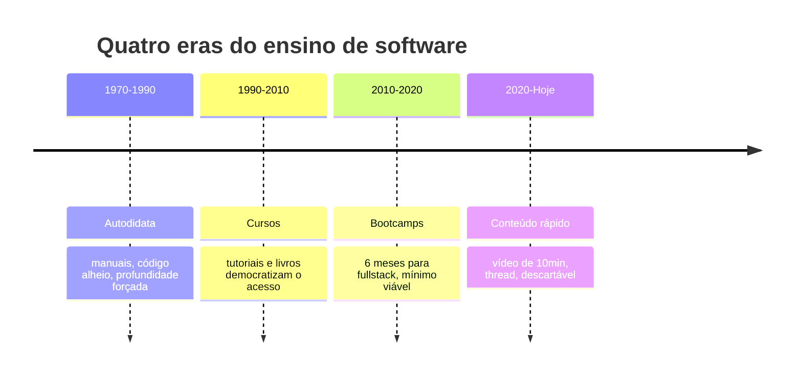

## O problema silencioso da educação de software

Existe um problema que quase ninguém fala abertamente.

A maioria dos cursos, bootcamps e tutoriais ensina **sintaxe**. Ensinam como declarar uma variável, como fazer um loop, como criar um componente React. Isso é importante — ninguém escreve um livro sem antes conhecer o alfabeto. Mas sintaxe é o alfabeto. Engenharia é a capacidade de escrever o livro.

A diferença entre alguém que sabe programar e alguém que é engenheiro de software não está na linguagem que domina. Está na capacidade de **tomar decisões técnicas defensáveis**, **prever consequências**, **escolher trade-offs conscientemente** e **assumir responsabilidade técnica** sobre o que constrói.

A UGP — Universidade Gratuita do Programador — existe para resolver exatamente isso.

> [!IMPORTANT]
> Cursos ensinam sintaxe. Projetos ensinam engenharia. Esta frase não é slogan — é a tese central de todo o material que você vai ler daqui para frente.

## Por que esse assunto existe

Toda profissão tem um caminho de aprendizado.

Na medicina, você não começa operando. Você observa, depois pratica em cadáveres, depois em animais, depois em pacientes com supervisão, e só então opera sozinho. Na engenharia civil, você não constrói uma ponte no primeiro dia de faculdade — aprende física, materiais, cálculo estrutural, para que a ponte não caia.

Na engenharia de software, curiosamente, é comum alguém aprender a fazer um botão em React e ser jogado num time para construir um sistema financeiro. Sem base. Sem mentoria. Sem entender trade-offs.

> [!NOTE]
> A UGP propõe um caminho diferente: **aprender construindo projetos corporativos reais, com conteúdo profundo sustentando cada decisão**.

### Quem precisa disso

- O adolescente que descobriu que gosta de programar e não sabe por onde começar
- O universitário que sente que a faculdade não o prepara para o mercado real
- O profissional migrando de carreira que precisa de um caminho estruturado
- O desenvolvedor que já sabe programar mas sente que falta engenharia
- O sênior que quer consolidar fundamentos e mentorear melhor

Se você está em qualquer um desses grupos, a UGP foi escrita para você.

## Analogia: aprender a cozinhar

Imagine que você quer aprender a cozinhar.

**O curso tradicional** de programação equivaleria a te ensinar: "isso é uma faca", "isso é uma panela", "isso é fogo". Você decora a função de cada utensílio. Sabe nomear tudo. Mas não sabe fazer um omelete.

**O bootcamp** te ensinaria: "segue essa receita de omelete. Agora essa de lasanha. Pronto, você é cozinheiro." Você faz, mas não entende — se a lasanha queimar, você não sabe por quê. Se o omelete solar, você não sabe corrigir.

**O conteúdo rápido** te ensinaria: "5 truques para um omelete perfeito!" Você pratica os 5 truques mas não entende o que faz o omelete ser bom ou ruim.

> [!TIP]
> A UGP faz diferente. Ensina **por que** cozinhar é transformar comida com calor, por que ovos coagulam a certa temperatura, como escolher a panela certa, receitas que você **entende** — não decora. O que fazer quando dá errado. Trade-offs: tempo vs. textura, simplicidade vs. sofisticação. No final, você não segue receitas. **Você escreve receitas.**

Isso é a diferença entre programador e engenheiro.

## Como chegamos aqui — quatro eras do ensino de software

Para entender por que a UGP é necessária, precisamos entender como chegamos aqui.



### A era do autodidata (1970-1990)

Nos primórdios da computação, não havia courses. Você lia manuais, lia código de outros, e tentava. O aprendizado era lento, doloroso, mas **profundo** — porque você não tinha escolha a não ser entender o que estava acontecendo debaixo do capô.

> [!INFO]
> Programadores dessa geração frequentemente tinham base sólida porque **nenhum atalho existia**. Se não entendesse como a memória funcionava, seu programa crashava e você não sabia por quê.

### A era dos cursos (1990-2010)

Com a popularização da internet, surgiram tutoriais, livros e courses. Isso democratizou o acesso — algo maravilhoso. Mas introduziu um problema: **a maioria começou a ensinar o "como" sem ensinar o "porquê"**.

Tutoriais mostravam você copiando código linha por linha. Funcionava? Sim. Você entendia? Não. Mas funcionava, e isso era suficiente para sentir progresso.

> [!CAUTION]
> "Funciona" não significa "está correto". E quando "funciona mas está incorreto" chega em produção, as consequências são reais.

### A era dos bootcamps (2010-2020)

Bootcamps aceleraram o processo. Em 6 meses, você saía "desenvolvedor fullstack". Isso produziu muitos profissionais capazes rapidamente — mas também produziu muita gente que sabia o **mínimo viável** para passar em uma entrevista.

O resultado: desenvolvedores que conseguiam o emprego, mas travavam quando precisavam:

- Tomar uma decisão arquitetural sem tutorial
- Debugar um problema que não estava no Stack Overflow
- Entender por que algo que "funcionava" em desenvolvimento quebrava em produção
- Explicar tecnicamente uma escolha para o time

### A era do conteúdo rápido (2020-presente)

Hoje vivemos a era do vídeo de 10 minutos, do thread de Twitter, do "5 dicas para...". Conteúdo desenfreado, raso, descartável.

Isso não é ruim por si só — é eficiente para descobrir se algo existe. Mas é péssimo para **domínio**.

> [!WARNING]
> Domínio exige profundidade. Profundidade exige tempo. Tempo é o que o conteúdo rápido se recusa a dar.

### Onde a UGP se posiciona

A UGP é um retorno à profundidade — mas com acesso democratizado. É a combinação que faltou:

| Era | O que a UGP herda |
| --- | --- |
| Autodidata | **Profundidade** — entender o porquê |
| Cursos | **Acesso** — gratuito, online |
| Bootcamps | **Estrutura** — caminho claro |
| Mundo real | **Prática** — projetos que simulam empresas |

## Os três pilares da UGP

A UGP tem três pilares que sustentam todo o aprendizado. Entenda cada um.

### Pilar 1 — Conteúdo denso e explicativo

Cada módulo que você lê aqui segue uma estrutura rigorosa:

- **Por que isso existe** (não "como usar")
- **Como funcionava antes** (contexto histórico)
- **Analogia antes de código** (intuição)
- **Técnico depois** (profundidade)
- **Erros que iniciantes, intermediários e seniores cometem** (realismo)
- **Onde isso aparece em empresas** (conexão com realidade)

> [!NOTE]
> Isso significa que você não vai ler "como criar uma rota em Next.js". Você vai ler "por que routing existe, qual problema resolve, como evoluiu, quando usar cada estratégia, e quais trade-offs cada uma traz". Se você só quer o "como", existem 1000 vídeos no YouTube. Se você quer **entender**, isso é o lugar.

### Pilar 2 — Projetos corporativos reais

Os 10 projetos da UGP não são "todo list" ou "calculadora". São sistemas que existem em empresas reais:

- Um **SaaS de notas com auth e RLS** — você aprende segurança real
- Um **dashboard de vendas** — você aprende visualização de dados
- Um **CMS** — você aprende gestão de conteúdo e permissões
- Um **LMS (plataforma de courses)** — você aprende progressão e testes
- Um **clone minimal do Supabase** — você aprende o que é um BaaS por dentro

> [!TIP]
> Quando você termina, você tem não só código — tem **experiência equivalente a meses de trabalho**.

### Pilar 3 — Progressão por níveis

A UGP tem 8 níveis, do "Extremo Iniciante" ao "Sênior". Cada nível define:

- **O que você conhece** (conhecimento atual)
- **O que ainda te limita** (limitação honesta)
- **Como saber que dominou** (métrica de saída)
- **O que precisa dominar** (checklist de avanço)

> [!IMPORTANT]
> Isso te dá um caminho — não vago como "vire um desenvolvedor fullstack", mas concreto: "se você consegue X, Y e Z, você está pronto para o nível seguinte". A progressão é **gamificada sem ser infantil**: XP, níveis, projetos desbloqueados. Mas o XP não é concessão — é reflexo de que você realmente construiu.

## Exemplo concreto: implementar autenticação

Para ilustrar a diferença entre aprender por aqui vs. aprender por tutorial, vejamos um caso real.

### O que um tutorial de 10 minutos faria

```text
1. npm install next-auth
2. Crie [...nextauth]/route.ts
3. Cole esse código
4. Adicione GOOGLE_CLIENT_ID no .env
5. Pronto! Use useSession()
```

Você faz. Funciona. Boa sorte para debugar quando o token expira em produção.

### O que a UGP faz

Primeiro, te explica **por que** autenticação existe. O que é HTTP stateless (não guarda quem você é entre requests). Por que isso é um problema — como a web sabia que você é você?

Depois, te mostra as estratégias que existem:

| Estratégia | Característica |
| --- | --- |
| Sessões no servidor | Cookies, server-side, estado guardado |
| Tokens JWT | Stateless, escalável, mas com trade-offs |
| OAuth | Delegar identidade a um terceiro |

Cada uma com prós e contras. Trade-offs. Depois, te mostra como Supabase Auth resolve: combina JWT com RLS no banco — você entende não só como, mas por quê.

Depois te faz construir o Projeto 07 (SaaS de Notas com Auth). Você implementa. Quebra. Conserta. Entende.

> [!SUCCESS]
> No final, se um entrevistador perguntar "por que você usou JWT e não sessões?", você não responde "porque o tutorial mandou". Você responde com trade-offs.

## Erros comuns

### O que iniciantes fazem

> [!WARNING]
> **1. Pulam a teoria para chegar no código rápido.**
> A ansiedade de "eu quero logo programar" faz você pular parágrafos que explicam o porquê. Isso funciona por 2 semanas. Depois, quando algo quebra e você não entende — você volta ao início. Reserve tempo para ler. **Código sem entendimento é dívida técnica.**

> [!WARNING]
> **2. Acham que seguir um tutorial = aprender.**
> Seguir é reconhecer. Aprender é reproduzir sem o tutorial. Se você seguiu um tutorial de React e fez um app, tente refazer sem olhar. Você vai descobrir o quanto realmente aprendeu.

> [!WARNING]
> **3. Não documentam o que aprendem.**
> Anotar é parte do aprendizado. Se você leu sobre X e não consegue explicar X em 3 frases para um amigo, você não aprendeu X — você leu sobre X.

### O que intermediários fazem

> [!WARNING]
> **1. Trocam de tecnologia a cada 2 meses.**
> A cultura do "novo framework" faz você pular de Angular para Vue para React para Svelte sem dominar nenhum. Parar em uma escolha não é fraqueza — é maturidade. O Projeto 05 da UGP (Blog Pessoal) te força a escolher e ir a fundo. Lute contra o impulso de trocar.

> [!WARNING]
> **2. Não escrevem testes.**
> "Testes são para depois." Não. Testes são parte do código. O Projeto 09 (LMS) te obriga a ter cobertura de testes. Se você não testar, você não construiu profissionalmente.

> [!WARNING]
> **3. Acham que sabem porque funcionou.**
> "Funcionou e eu não sei por quê" é um sinal de alerta, não de sucesso. Se algo funcionou "por acidente", investigue. Pode funcionar agora e quebrar com novos dados.

### O que seniores evitam

> [!WARNING]
> **1. Não decidem sem documentar o porquê.**
> Toda decisão técnica é registrada em uma ADR (Architecture Decision Record). Se ninguém sabe por que a equipe usou Postgres em vez de Mongo, a próxima pessoa a tocar o código vai questionar — ou pior, trocar sem entender.

> [!WARNING]
> **2. Não confiam apenas em "funciona".**
> "Funciona" é o segundo retrogravado. O primeiro é "entendo por quê funciona e por quê pode parar".

> [!WARNING]
> **3. Não pulam o teste de hipóteses.**
> Antes de reescrever um sistema, um sênior valida: o problema é arquitetura ou implementação? Às vezes a arquitetura está certa e a implementação que está ruim. Trocar arquitetura para resolver bug de implementação é um erro caro.

## Boas práticas

### Como usar a UGP

> [!SUCCESS]
> **Leia na ordem.** Os módulos foram sequenciados. "Manifesto" te prepara para "Arquitetura da UGP", que te prepara para "Níveis", que te prepara para "GitHub" e assim por diante. Pular pode funcionar, mas você perde conexões.

> [!SUCCESS]
> **Não pule o "Porquê".** Cada módulo começa com a pergunta "por que isso existe". É a parte mais importante. As pessoas pulam para o código porque parece "prático". Mas o prático sem o porquê é frágil.

> [!SUCCESS]
> **Faça os projetos em paralelo.** Depois de ler "GitHub", faça o Projeto 01. Aplique. Quebre. Volte a ler. **A teoria sem prática é entretenimento intelectual. A prática sem teoria é repetição cega.**

> [!SUCCESS]
> **Anote nos seus próprios termos.** Não precisa ser elaborado. Após cada módulo, escreva em 5 frases o que você entende. Se não conseguir, releia. Se ainda não conseguir, procure ajuda.

> [!SUCCESS]
> **Devagar é mais rápido.** Você leu um módulo em 20 minutos e não entendeu nada? Releia em 1h. Ainda não? Em 1 dia. Demora mais agora, mas você não vai precisar reler daqui a 6 meses. Conteúdo lido rápido é conteúdo esquecido rápido.

### Como manter e escalar

> [!TIP]
> **Releia módulos antigos quando avançar.** Quando você chegar ao nível Pleno 2, releia o módulo de GitHub. Você vai ver coisas que não viu na primeira leitura — porque seu nível mudou. O conteúdo mudou na sua cabeça, não no texto.

> [!TIP]
> **Refatore projetos antigos com conhecimento novo.** O Projeto 01 (Todo List) vai parecer trivial quando você estiver no nível Pleno 1. Refatore com novos padrões. Isso consolida.

> [!TIP]
> **Mentoreie alguém.** A melhor forma de consolidar é ensinar. Se um amigo começou na UGP, ajude-o. Explicar força você a organizar o conhecimento.

> [!TIP]
> **Contribua para open source.** Cada módulo te ensina algo que existe em projetos open source. Aplicar em projeto real (mesmo com PR pequeno) testa seu conhecimento fora da UGP.

> [!TIP]
> **Escreva sobre o que aprendeu.** Você não precisa ser influencer. Mas escrever um README ou um post no LinkedIn sobre o que você entendeu é exercício pedagógico. Você descobre lacunas quando explica.

## Caso real de mercado

Toda empresa que constrói software sério tem, em algum nível, o que a UGP ensina.

> [!REFERENCE]
> **Git/GitHub** — nenhuma empresa moderna trabalha sem isso. Stripe, GitHub, Nubank, Spotify: todas têm fluxo de PR obrigatório.

> [!REFERENCE]
> **Documentação como código** — times maduros têm ADRs, READMEs, docs versionados. Google publica seu próprio livro "Software Engineering at Google" sobre processos em escala.

> [!REFERENCE]
> **Testes** — empresas como Nubank, Stripe e GitHub têm cobertura obrigatória. Sem teste, merge não passa.

> [!REFERENCE]
> **Arquitetura de decisão técnica** — todo time sênior documenta trade-offs. Quem não documenta, repele engenheiros bons.

> [!REFERENCE]
> **Carreira estruturada** — empresas com trilhas de carreira técnicas (Google L3-L7, Spotify, Thoughtworks) têm níveis como os da UGP.

### Empresas que tratam software como engenharia

Stripe. GitHub. Shopify. Nubank. Thoughtworks. Spotify. Netflix. Todas têm uma coisa em comum — **tratam software como engenharia, não como montagem de peças**.

> [!CAUTION]
> Se você constrói um botão para um portfólio pessoal, pode pular tudo. Se você constrói um sistema de pagamentos, todo princípio que a UGP ensina é **existencial**. Sistemas críticos, com custo de bug alto, que precisam durar anos e mudam de mãos — são onde a diferença entre programador e engenheiro aparece.

## Resumo

O que você aprendeu neste manifesto:

- **Sintaxe é o alfabeto; engenharia é escrever o livro.** A diferença não está na linguagem, mas em decidir, prever trade-offs e assumir responsabilidade.
- **Quatro eras nos trouxeram até aqui.** Autodidata (profundidade), cursos (acesso), bootcamps (estrutura), conteúdo rápido (descartável). A UGP herda o melhor de cada uma.
- **Três pilares sustentam a UGP.** Conteúdo denso, projetos corporativos reais e progressão por níveis.
- **Tutorial ensina "como"; UGP ensina "por quê".** A diferença aparece quando algo quebra em produção.
- **Erros têm padrão por nível.** Iniciante pula teoria; intermediário troca stack; sênior não documenta decisão.
- **O manifesto é para reler, não decorar.** Volte aqui quando estiver perdido ou motivado a desistir.

> [!QUOTE]
> "A diferença entre você e mais um milhão de programadores que só sabem sintaxe é o porquê."

## Como isso aparece nos projetos da UGP

Cada projeto da UGP aplica a tese central — aprender construindo, com teoria sustentando cada decisão.

> [!TIP]
> **Projeto 07 — SaaS de Notas.** Você implementa autenticação real com Supabase Auth e RLS. Aqui a diferença entre "tutorial de login" e "entender JWT + cookies + stateless" fica óbvia.

> [!TIP]
> **Projeto 09 — LMS.** Plataforma de courses com progressão e testes. Aqui a progressão por níveis da UGP vira código — você constrói o mesmo modelo que está seguindo.

> [!TIP]
> **Projeto 10 — Clone do Supabase.** Arquitetura distribuída de verdade. Aqui todo trade-off que o manifesto defende é existencial — sem ADRs e sem entendimento, o projeto não sai do papel.

## Desafio

> [!IMPORTANT]
> Escolha um tutorial que você seguiu recentemente (de React, de login, de API, qualquer um) e responda, por escrito:
>
> 1. **Qual era o "como" que ele ensinou?** Resuma em 3 frases.
> 2. **Quais perguntas "por quê" ele não respondeu?** Liste ao menos 3.
> 3. **O que aconteceria se algo quebrasse em produção?** Descreva um cenário realista.
> 4. **Como você defenderia tecnicamente a escolha feita?** Argumente com trade-offs, não com "o tutorial mandou".
> 5. **Qual próximo passo da UGP preenche essa lacuna?** Aponte um módulo ou projeto.

Não precisa acertar. O objetivo é treinar o olhar de engenheiro — enxergar as decisões que um tutorial esconde. Quando você conseguir fazer isso com qualquer vídeo de 10 minutos, terá entendido a tese central da UGP.

Bem-vindo.
