## Onde você está na jornada

Em qualquer profissão séria, existe uma jornada. Na medicina, você não passa de estudante a cirurgião num dia. Há degraus: estagiário, residente, plantonista, especialista, cirurgião chefe. Cada degrau tem critérios. Cada degrau redefine o que você pode fazer sozinho.

Em software, curiosamente, muita gente não tem clareza de onde está. "Sou júnior", dizem alguns — mas o que isso significa? "Sou pleno", dizem outros — mas pleno em quê? Em React? Em arquitetura? Em comunicação?

> [!IMPORTANT]
> A UGP propõe uma estrutura de **8 níveis**, do Extremo Iniciante ao Sênior. Cada nível é definido por: **o que você conhece**, **o que ainda te limita**, **como saber que dominou** (métrica de saída) e **o que precisa dominar** (checklist de avanço). Você vai sair daqui sabendo exatamente onde está e o que falta para o próximo.

## Como o mercado define níveis

Tradicionalmente, o mercado usa "anos de experiência" como proxy para nível:

- 0-2 anos = Júnior
- 3-5 anos = Pleno
- 5+ anos = Sênior

Isso não é totalmente errado, mas **não é confiável**. Tem gente com 5 anos que aprendeu numa empresa boa e é sênior. Tem gente com 10 anos na mesma empresa, fazendo a mesma coisa, que não passou de júnior competencial.

> [!NOTE]
> Empresas com cultura de engenharia forte (Stripe, Thoughtworks, Spotify) definem níveis por **competências observáveis**, não por tempo. Em vez de "5 anos de experiência", elas dizem: "Você consegue decompor um problema grande em 3 menores e implementar sozinho? Defender uma decisão técnica para um time cético? Mentorear alguém identificando o que ele precisa aprender?". Isso é mais justo e mais preciso. A UGP usa esse modelo.

### Por que 8 níveis e não 3

"Júnior, Pleno, Sênior" é pouco granular dentro de cada nível. Dentro do "Júnior", tem muita diferença entre quem acabou de sair do bootcamp vs. quem já constrói features sozinho. Por isso a UGP subdivide:

```mermaid
flowchart LR
    L0[Extremo Iniciante] --> L1[Júnior 1]
    L1 --> L2[Júnior 2]
    L2 --> L3[Júnior 3]
    L3 --> L4[Pleno 1]
    L4 --> L5[Pleno 2]
    L5 --> L6[Pleno 3]
    L6 --> L7[Sênior]
    classDef start fill:#6366f122,stroke:#6366f166,color:#a5b4fc
    classDef junior fill:#8b5cf622,stroke:#8b5cf666,color:#c4b5fd
    classDef pleno fill:#10b98122,stroke:#10b98166,color:#6ee7b7
    classDef senior fill:#f59e0b22,stroke:#f59e0b66,color:#fcd34d
    class L0 start
    class L1,L2,L3 junior
    class L4,L5,L6 pleno
    class L7 senior
```

Você sempre sabe exatamente em qual degrau está, não num range vago.

## Analogia: aprender uma língua estrangeira

Imagine aprender uma língua estrangeira.

| Nível UGP | Equivalente na língua |
| --- | --- |
| Extremo Iniciante | Você não sabe dizer "olá". Mas sente o alfabeto |
| Júnior 1 | Você pede comida. Travou, mas se vira |
| Júnior 2 | Conversas curtas. Comete erros, mas se faz entender |
| Júnior 3 | Conversa fluido sobre assuntos familiares |
| Pleno 1 | Lê um livro técnico no original. Anota vocabulário |
| Pleno 2 | Escreve um texto claro, sem soar como estrangeiro |
| Pleno 3 | Entende ironia, humor, sutilezas culturais |
| Sênior | Argumenta jurídico ou faz apresentação em conferência |

> [!TIP]
> A transição não é "num ano você vira X". É quando você dominou **métricas de saída**. Se você consegue conversar em inglês fluido, você é Júnior 3, mesmo que tenha 3 meses aprendendo. Se não consegue, mesmo com 5 anos, você ainda é Júnior 2. A UGP funciona assim — mas para software.

## Os 8 níveis em detalhe

### Extremo Iniciante (0 XP)

**Conhecimento**: Sabe ligar o computador. Curioso sobre programação.

**Limitação**: Nunca escreveu uma linha de código.

**Métrica de saída**: Consegue instalar Node.js e Git, sem travar.

> [!NOTE]
> **Checklist de avanço**:
> - [ ] Instalar Node.js e verificar com `node -v`
> - [ ] Criar conta no GitHub
> - [ ] Clonar um repositório e abrir no VS Code
> - [ ] Rodar `npm install` e `npm run dev` em um projeto

### Júnior 1 (100 XP)

**Conhecimento**: HTML, CSS básico, JavaScript inicial. Sintaxe de variáveis, funções, loops.

**Limitação**: Trava em bugs simples. Não sabe depurar.

**Métrica de saída**: Constrói uma página estática com formulário que funciona.

> [!NOTE]
> **Checklist de avanço**:
> - [ ] Entender box model e flexbox no CSS
> - [ ] Manipular DOM com JavaScript puro
> - [ ] Fazer fetch de uma API pública (ex: github API)
> - [ ] Entender o que é assíncrono (promises, async/await)

**Projetos UGP**: Projeto 01 (Todo List), Projeto 02 (Carrinho de Compras)

### Júnior 2 (300 XP)

**Conhecimento**: JavaScript intermediário, ES6+, consumo de APIs REST.

**Limitação**: Código procedural, sem separação de responsabilidades.

**Métrica de saída**: Constrói um CRUD completo em React.

> [!NOTE]
> **Checklist de avanço**:
> - [ ] Dominar array methods (map, filter, reduce)
> - [ ] Entender promises e async/await na prática
> - [ ] Usar localStorage e sessionStorage
> - [ ] Implementar loading e error states em UI

**Projetos UGP**: Projeto 03 (Dashboard de Vendas), Projeto 04 (Kanban)

### Júnior 3 (600 XP)

**Conhecimento**: React completo, componentização, hooks, rotas, estado global leve.

**Limitação**: Não testa o código. CSS ainda bagunçado em componentes grandes.

**Métrica de saída**: Constrói um dashboard com gráficos e dados dinâmicos.

> [!NOTE]
> **Checklist de avanço**:
> - [ ] Dominar hooks (useState, useEffect, useMemo, useReducer)
> - [ ] Integrar bibliotecas (recharts, framer-motion)
> - [ ] Implementar responsividade real (mobile-first)
> - [ ] Entender Server vs Client Components (Next.js)

**Projetos UGP**: Projeto 05 (Blog Pessoal MDX), Projeto 06 (App de Treinos PWA)

### Pleno 1 (1000 XP)

**Conhecimento**: Arquitetura de software, padrões, separação de camadas, backend com Node.

**Limitação**: Ainda não escreve testes automatizados consistentemente.

**Métrica de saída**: Constrói um app fullstack com auth e banco de dados.

> [!IMPORTANT]
> **Checklist de avanço**:
> - [ ] Criar API REST com Express ou Next API routes
> - [ ] Modelar tabelas no PostgreSQL
> - [ ] Implementar autenticação JWT ou Supabase Auth
> - [ ] Entender RLS (Row Level Security)

**Projetos UGP**: Projeto 07 (SaaS de Notas), Projeto 08 (CMS)

### Pleno 2 (1600 XP)

**Conhecimento**: TDD, testes E2E, CI/CD, docs-as-code, observabilidade básica.

**Limitação**: Ainda trata deploy como evento traumático.

**Métrica de saída**: Faz deploy automatizado com pipeline de testes passando.

> [!IMPORTANT]
> **Checklist de avanço**:
> - [ ] Escrever testes unitários com Vitest/Jest
> - [ ] Escrever testes E2E com Playwright
> - [ ] Configurar pipeline no GitHub Actions
> - [ ] Escrever documentação técnica (ADR, README)

**Projetos UGP**: Projeto 09 (LMS)

### Pleno 3 (2400 XP)

**Conhecimento**: Microsserviços, mensageria, design de sistema em escala.

**Limitação**: Sistemas distribuídos ainda são território parcialmente desconhecido.

**Métrica de saída**: Desenha a arquitetura de um sistema em escala.

> [!IMPORTANT]
> **Checklist de avanço**:
> - [ ] Entender filas e workers (Redis, RabbitMQ)
> - [ ] Modelar para multi-tenancy
> - [ ] Aplicar patterns de resiliência (circuit breaker, retry)
> - [ ] Ler logs distribuídos e traçar requests

### Sênior (3500 XP)

**Conhecimento**: Engenharia de elite — arquitetura, decisões defensáveis, mentoria.

**Limitação**: Limites são narrativos — dependem do contexto e do domínio.

**Métrica de saída**: Lidera tecnicamente um produto do zero ao escalável.

> [!SUCCESS]
> **Checklist de avanço**:
> - [ ] Defender decisões técnicas com trade-offs claros
> - [ ] Mentorar devs mais juniores
> - [ ] Desenhar e revisar arquiteturas end-to-end
> - [ ] Comunicar com non-tech stakeholders (PM, designers, sales)

## Casos reais: três perfis, três níveis

### Cenário 1: Maria, 22, recém-saída de bootcamp

Maria fez um bootcamp de 6 meses. Sabe React, construiu 3 projetos. Não sabe Postgres. Nunca deployou sozinha. Não escreve testes.

> [!NOTE]
> **Nível**: Júnior 2 (constrói em React, mas sem arquitetura nem backend). Para avançar para Júnior 3: dominar responsividade mobile-first e integrar bibliotecas (Projetos 03 e 04). Para Pleno 1 eventualmente: aprender backend (Projeto 07).

### Cenário 2: João, 30, migrando de carreira

João era contador. Aprendeu Python em 1 ano. Constrói scripts de automação. Já mexe com pandas, regex, web scraping. Mas não constrói UI.

> [!NOTE]
> **Nível**: Júnior 3 na parte de dados, mas Júnior 1 em frontend/web. A UGP respeita que conhecimento é assimétrico. João não precisa recomeçar — ele pula os módulos de JS básico. Mas precisa construir os projetos da UGP para pegar arquitetura web.

### Cenário 3: Ana, 35, dev há 8 anos

Ana trabalha com Java/Spring em banco. Sabe arquitetura, escreve testes. Mas nunca usou React ou Supabase.

> [!NOTE]
> **Nível**: Pleno 2 em backend/arquitetura, Júnior 2 em frontend moderno. Ana usa a UGP para preencher lacunas. Ela não precisa ler sobre TDD — já domina. Mas Projeto 07 (SaaS) é novo para ela porque envolve Supabase + Next.js.

## Caso real de mercado: como empresas mapeiam níveis

Empresas com trilhas de carreira técnicas usam níveis como esses. A tabela do Google é um exemplo clássico:

| Google | UGP equivalente |
| --- | --- |
| L3 (entry) | Júnior 1-2 |
| L4 (mid) | Júnior 3 / Pleno 1 |
| L5 (senior) | Pleno 2-3 |
| L6 (staff) | Sênior |
| L7 (senior staff) | Sênior+ |

> [!REFERENCE]
> A diferença: Google paga muito para validar. A UGP te dá o mesmo framework — grátis — para auto-validar. Não é equivalente a um crachá L5 no LinkedIn, mas é o mesmo modelo mental.

### Por que isso importa em entrevistas

Entrevistadores experientes detectam nível em 30 minutos. Eles perguntam:

- "Por que escolheu Postgres?" (trade-offs → Pleno+)
- "Como testaria isso?" (TDD → Pleno 2+)
- "Como mentorearia um júnior?" (Sênior)

> [!TIP]
> Se suas respostas demonstram clareza sobre seu próprio nível, você ganha credibilidade. Dizer "sou Júnior 2 em React, mas Pleno 1 em backend Python" é mais forte que "tenho 4 anos de experiência".

## Erros comuns

### O que iniciantes fazem

> [!WARNING]
> **1. Acham que nível é sobre velocidade.**
> Não é. Você pode fazer tudo rápido e ainda ser Júnior 2. Nível é sobre **autonomia** — consegue fazer sem supervisão?

> [!WARNING]
> **2. Pulam níveis.**
> "Eu já sei React, vou pular para microsserviços." Sem Pleno 1 (arquitetura de camadas), microsserviços viram bagunça distribuída. Não pule.

### O que intermediários fazem

> [!WARNING]
> **1. Subestimam Pleno 1.**
> "Eu sei fazer um CRUD, sou Pleno." Pleno 1 é saber **por que** o CRUD é estruturado assim, não só fazer. Saber trade-offs de cada escolha.

> [!WARNING]
> **2. Confundem anos com nível.**
> "Tenho 4 anos, deveria ser Pleno." Tempo não é competência. Competência demonstrada é competência.

### O que seniores evitam

> [!WARNING]
> **1. Não param de aprender.**
> Sênior não é destino. É base. Você pode ser Sênior em frontend e Júnior em ML. A honestidade sobre onde você é forte e onde é fraco define maturidade.

## Boas práticas

### Como usar os níveis

> [!SUCCESS]
> **Auto-avalie com honestidade.** Pegue o checklist do nível em que você acha que está. Tente fazer tudo sem consultar. Se travou em 2 itens, você ainda é do nível anterior. Não é vergonha — é clareza.

> [!SUCCESS]
> **Use o nível para escolher projetos.** Se você é Júnior 1, não tente o Projeto 07 (SaaS). Vai ser frustrante. Faça o Projeto 01. Cada nível tem projetos alinhados.

> [!SUCCESS]
> **Reconheça quando ultrapassou.** Seu nível muda. A cada projeto concluído, re-avalie. Você pode ter subido sem perceber.

### Como mentorear usando níveis

> [!TIP]
> Se você já está Pleno 2+ e mentoreia alguém: identifique o nível do mentorado (pelos checklists); dê tarefas do nível +1 dele — nem muito fáceis, nem muito difíceis; acompanhe o checklist — se ele dominou tudo, ele subiu.

### Como documentar seu nível

> [!TIP]
> **LinkedIn**: "Atualmente Júnior 2 (construo CRUD em React, mas sem testes ainda). Objetivo: Pleno 1." **Entrevistas**: "meu nível atual é X, posso demonstrar com o projeto Y". Isso é muito mais forte que "4 anos de experiência".

## Resumo

O que você aprendeu neste módulo:

- **Competência > anos.** Empresas de elite definem nível pelo que você demonstra, não pelo tempo. A UGP faz o mesmo.
- **8 níveis granulares.** Extremo Iniciante → Júnior 1/2/3 → Pleno 1/2/3 → Sênior. Faixas finas = clareza.
- **Cada nível tem 4 dimensões.** Conhecimento, limitação, métrica de saída e checklist de avanço.
- **Nível é assimétrico.** Você pode ser Pleno 2 em backend e Júnior 2 em frontend moderno — e isso é normal.
- **Empresas como o Google usam o mesmo modelo.** L3-L7 mapeia para os 8 níveis da UGP.
- **Entrevistadores detectam nível em 30 minutos.** Responder com clareza sobre o seu próprio nível vale mais que "X anos de experiência".

> [!QUOTE]
> "Seu nível atual não é julgamento. É ponto de partida. A pergunta nunca é 'por que eu sou só Júnior 2?' É 'o que falta para Júnior 3?'. A resposta está no checklist."

## Como isso aparece nos projetos da UGP

Cada projeto da UGP é alinhado a um nível — fazer fora da ordem gera frustração e dívida de aprendizado.

> [!TIP]
> **Projetos 01 e 02 (Júnior 1).** Todo List e Carrinho de Compras. Frontend puro, sem backend. Aqui você valida HTML, CSS e JS básico.

> [!TIP]
> **Projetos 03 e 04 (Júnior 2).** Dashboard de Vendas e Kanban. Consumo de APIs, array methods, estado de loading/error. Aqui você consolida JavaScript intermediário.

> [!TIP]
> **Projetos 05 e 06 (Júnior 3).** Blog Pessoal MDX e App de Treinos PWA. Hooks, componentização, Next.js, mobile-first. Aqui você fecha a fase júnior.

> [!TIP]
> **Projetos 07 e 08 (Pleno 1).** SaaS de Notas e CMS. Fullstack com auth, PostgreSQL e RLS. Aqui você cruza a fronteira do frontend para a engenharia.

> [!TIP]
> **Projeto 09 (Pleno 2).** LMS. TDD, E2E, CI/CD, docs-as-code. Aqui você trata software como produção de verdade.

> [!TIP]
> **Projeto 10 (Pleno 3).** Clone do Supabase. Microsserviços, mensageria, resiliência. Aqui você desenha arquitetura em escala.

## Desafio

> [!IMPORTANT]
> Defina seu nível com honestidade cirúrgica. Para o nível em que você **acha** que está:
>
> 1. **Tente fazer o checklist inteiro sem consultar.** Anote onde travou.
> 2. **Construa um pequeno projeto que prove a métrica de saída do nível.** Sem tutorial.
> 3. **Identifique uma área onde você é assimétrico.** (Ex: "Sou Júnior 3 em frontend, mas Extremo Iniciante em infra".)
> 4. **Escolha o próximo projeto da UGP alinhado ao seu nível +1.** Não ao que "parece mais legal".
> 5. **Escreva uma frase de LinkedIn honesta** usando o formato "Nível X em A, Nível Y em B, objetivo Z".

Se você travar em mais de 2 itens do checklist, você é do nível anterior — e isso é ótimo, porque agora você sabe exatamente o que falta.
