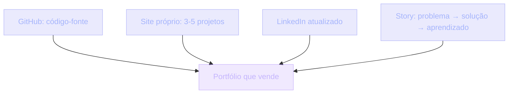

## O que é um portfólio que vende

Seu portfólio é a prova social da sua capacidade. CVs mentem. LinkedIn exagera. Portfólio não mente — porque o código está lá, acessível, julgável.

> [!NOTE]
> Quando você termina este módulo, sabe o que colocar e o que NÃO colocar no seu portfólio. E, principalmente, sabe o **porquê** de cada escolha. Decisão consciente é o que separa um portfólio que vende de um que apenas existe.

## Contexto histórico da contratação

| Era | Critério dominante | O que se avaliava |
| --- | --- | --- |
| Curriculum (1990–2010) | PDF com formação e experiências | Onde trabalhou |
| LinkedIn (2010–presente) | Networking + auto-declaração | Quem afirma você ser |
| GitHub (2015–presente) | Código observável | O que você realmente constrói |

LinkedIn adicionou networking, mas ainda é auto-declarativo: você afirma, sem prova. GitHub mudou o jogo — código é evidência, README é organização, commits são disciplina, issues são comunicação, PRs são colaboração.

> [!IMPORTANT]
> Tudo isso é observável **sem você precisar abrir a boca**. O portfólio trabalha por você silenciosamente, 24h por dia, em qualquer fuso. Por isso ele é decisivo.

## Analogia: contratar um chef

Imagine contratar um chef para seu restaurante.

**CV**: *"Cozinho há 5 anos. Trabalhei na Padaria da Lucia."*
**LinkedIn**: o mesmo + 3 recomendações de amigos.
**Portfólio**: *"Olha esses 5 pratos que cozinhei: têm foto, receita, ingredientes, fim de semana gasto nisso, e o prato final está aqui."*

> [!TIP]
> Em software é igual. CV = indicação. LinkedIn = afirmação. GitHub = evidência. A contratação segue o caminho da evidência — porque é o único que reduz risco do contratante.

## As 4 peças essenciais

### 1. GitHub

Código-fonte, espinha dorsal. Sem branches abandonados, README bom, conventional commits, história limpa.

### 2. Site próprio

Landing page com 3-5 projetos destacados. Pode ser o próprio Projeto 05 da UGP (Blog Pessoal) servindo como vitrine.

### 3. LinkedIn atualizado

Na bio: *"Fullstack. Veja meus projetos em [site]"*. Recrutador que chega pelo LinkedIn deve achar o portfólio em um clique.

### 4. Story de cada projeto

Três frases, sempre:

1. **Problema** — o que motivou o projeto.
2. **Solução** — o que você construiu e como.
3. **Aprendizado** — o que ficou de diferente depois.

> [!NOTE]
> Sem a story, o projeto é só código. Com a story, é um argumento de contratação. Recrutador não contrata código — contrata a pessoa que entende o que construiu.

## O que destacar em cada projeto

Cada projeto do portfólio deve ter:

- **Nome específico** — *"Todo List"* é genérico. *"TaskFlow — gerenciador de tarefas por contexto"* é melhor.
- **Link de produção** — app rodando online. **SEMPRE**. Sem isso, ninguém vai clonar.
- **README completo** — problema, stack, decisões, como rodar, prints.
- **Link do GitHub** — código limpo, commits claros, história coerente.

### Quantos projetos?

> [!IMPORTANT]
> **Não mais que 5.** Três excelentes vencem dez médios. Recrutador não tem tempo para dez — ele olha os três primeiros e decide.

Se seus 3 melhores são os 3 da UGP (projeto 01, 05 e 07), ótimo. Use-os.

## Project card: ruim vs bom

| Cartão ruim | Cartão bom |
| --- | --- |
| Nome: "Clone do Instagram" | Nome: "TaskFlow — tarefas por contexto" |
| Sem link de produção | URL ativa em Vercel |
| README: `npm install && npm run dev` | README: problema, stack, prints, decisões, ADR |
| Branch `master` com 1 commit | Conventional commits, história limpa |
| Sem prints, sem deploy | Prints, deploy URL, próximos passos |
| Tutorial replicado | Decisões próprias, dados diferentes |

> [!WARNING]
> O cartão ruim não vende — ele só prova que você segue tutorial. O cartão bom prova que você toma decisões. Decisão é o sinal mais barato de senioridade.

## Caso real de mercado

> [!REFERENCE]
> **Vercel, Supabase, Resend** — contratam direto via GitHub aberto. *"Show me your open source work"* é literalmente o processo seletivo em empresas modernas. Contribuição em OSS conta como experiência real.

> [!REFERENCE]
> **README-driven development** — projetos como `shadcn/ui`, `t3-oss/create-t3-app` e `biomejs/biome` viraram referência de mercado não só pelo código, mas pela qualidade da documentação. README premium é portfólio profissional.

> [!CURIOSITY]
> Muitos devs foram contratados por um único README bem escrito. Não por saber mais — por se comunicar melhor. Documentação é habilidade técnica subestimada.

## Quando o portfólio aparece

- **Aplicando a vaga**: 1ª roda = código aberto do candidato. 2ª = portfólio é avaliado em detalhe.
- **Networking**: alguém pergunta *"o que você faz?"* → link para seu site.
- **Ofertas inesperadas**: empresas encontram devs pelos projetos públicos — sem processo seletivo formal.

> [!TIP]
> Toda vaga moderna exige portfólio. Mesmo as que não explicitam. Recrutador sempre olhará o GitHub antes da entrevista técnica.

## Erros comuns

> [!WARNING]
> **1. Repositórios de tutorial.**
> Todo app React com "Clone do Instagram" de tutorial de YouTube: zero valor. Mostra que você segue instruções, não que você constrói. Sua versão do projeto da UGP é diferente — porque você toma decisões.

> [!WARNING]
> **2. README "rodando: `npm install && npm run dev`".**
> Sem problema, sem prints, sem decisões, sem aprendizado. Isso é README de código, não de portfólio. README de portfólio tem: objetivo, stack, prints, deploys, desafios. 1 página, fácil de ler.

> [!WARNING]
> **3. Projetos sem link de produção.**
> *"Roda localmente com `npm run dev`."* Ninguém roda. Recrutadores têm 30 segundos. Vercel é grátis.

> [!WARNING]
> **4. Quantidade sobre qualidade (intermediários).**
> 20 projetos medianos, todos clones de tutorial, nenhum com README, nenhum com teste. Refatore: 5 excelentes com CI, README, 1 com ADR, 1 com teste E2E.

> [!WARNING]
> **5. Projeto final sem manutenção.**
> Bootcamp: projeto final bonito. Acabou o bootcamp, abandonou. Dois anos depois, o potencial empregador olha: desatualizado. React 16 → 19 pulou, build quebra. Mantenha pelo menos 2 projetos atualizados.

> [!WARNING]
> **6. Esconder trabalho (sêniores).**
> *"Esse é código da empresa, não posso mostrar."* OK. Construa side-projects que mostrem skills. Sênior sem portfólio parece júnior mitado.

> [!WARNING]
> **7. Não ter narrativas técnicas (sêniores).**
> LinkedIn afirma *"Arquiteto de Sistemas"*. Portfólio não tem ADR, não tem diagrama. Sêniores deveriam ter isso — é o que prova senioridade.

## Boas práticas

> [!SUCCESS]
> **3-5 projetos, não mais.** Três excelentes > dez médios.

> [!SUCCESS]
> **Cada um com URL de produção ativa.** Vercel, Netlify, Cloudflare Pages — todos têm plano grátis.

> [!SUCCESS]
> **README de 80-150 linhas**: problema, stack, parte legal, prints, próxima feature.

> [!SUCCESS]
> **Último commit < 6 meses atrás.** Stale = abandonado. Mantenha pelo menos 2 projetos vivos.

> [!SUCCESS]
> **Atualize 1 versão/ano por projeto mantido.** Stale projects → marque como *"arquivado"* no GitHub (não deletar: histórico tem valor).

> [!SUCCESS]
> **Adicione métricas.** 1 projeto com Sentry, 1 com analytics (Posthog). Mostra senioridade na prática.

> [!SUCCESS]
> **Apresente arquiteturalmente.** 1 projeto com diagrama C4 e 3 ADRs no `docs/`. Isso é diferencial de sênior.

> [!SUCCESS]
> **Teste seu portfólio.** Pergunte a um amigo dev: *"Em 30 segundos, você contrataria? Por quê?"* A resposta em 30 segundos é a verdade real sobre a sua apresentação.

## Resumo

O que você aprendeu neste módulo:

- **Portfólio é evidência.** CV mente, LinkedIn exagera, código não mente — porque está acessível.
- **4 peças essenciais**: GitHub, site próprio, LinkedIn, story de cada projeto.
- **3-5 projetos, nunca mais.** Três excelentes vencem dez médios.
- **Cada projeto com**: nome específico, link de produção, README completo, GitHub limpo.
- **Decisão é o sinal barato de senioridade.** Tutorial replicado não vende; decisão própria vende.
- **Mantenha vivo.** Projeto desatualizado vence qualquer portfólio — para o lado errado.

> [!QUOTE]
> "Portfólio é código falando por você. Silenciosamente. O tempo todo. Não precisa intervir na entrevista, precisa entrevistar bem."

## Como isso aparece nos projetos da UGP

Durante a UGP, cada projeto é uma peça de portfólio em potencial. Você decide quais viram os destaques:

- Quais projetos terão README premium?
- Quais terão link de produção ativo?
- Quais terão ADR e diagrama C4?
- Quais você vai manter vivos nos próximos 12 meses?

> [!TIP]
> **Projeto 05 — Blog Pessoal MDX.** Use COMO seu site de portfólio. É vitrine e projeto ao mesmo tempo.

> [!TIP]
> **Projetos 01, 05 e 07.** Comece com estes 3 selecionados: 01 (CRUD), 05 (frontend + SEO), 07 (fullstack + auth). Eternize esses.

## Desafio

> [!IMPORTANT]
> Escolha um dos seus projetos atuais (ou um projeto da UGP em andamento) e execute:
>
> 1. **Renomeie** o projeto para algo específico, não genérico.
> 2. **Deploy** em URL pública ativa (Vercel grátis).
> 3. **Reescreva o README** em 80-150 linhas: problema, stack, parte legal, prints, próximos passos.
> 4. **Escreva a story** em 3 frases: problema, solução, aprendizado.
> 5. **Peça a um amigo dev** para olhar 30 segundos e responder: *"contrataria? por quê?"*
> 6. **Anote a resposta** e ajuste o portfólio com base no feedback.

Não precisa de tudo perfeito. O objetivo é instalar o hábito de **tratar cada projeto como argumento de contratação**, não como exercício esquecido.
