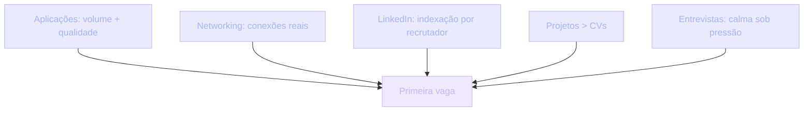
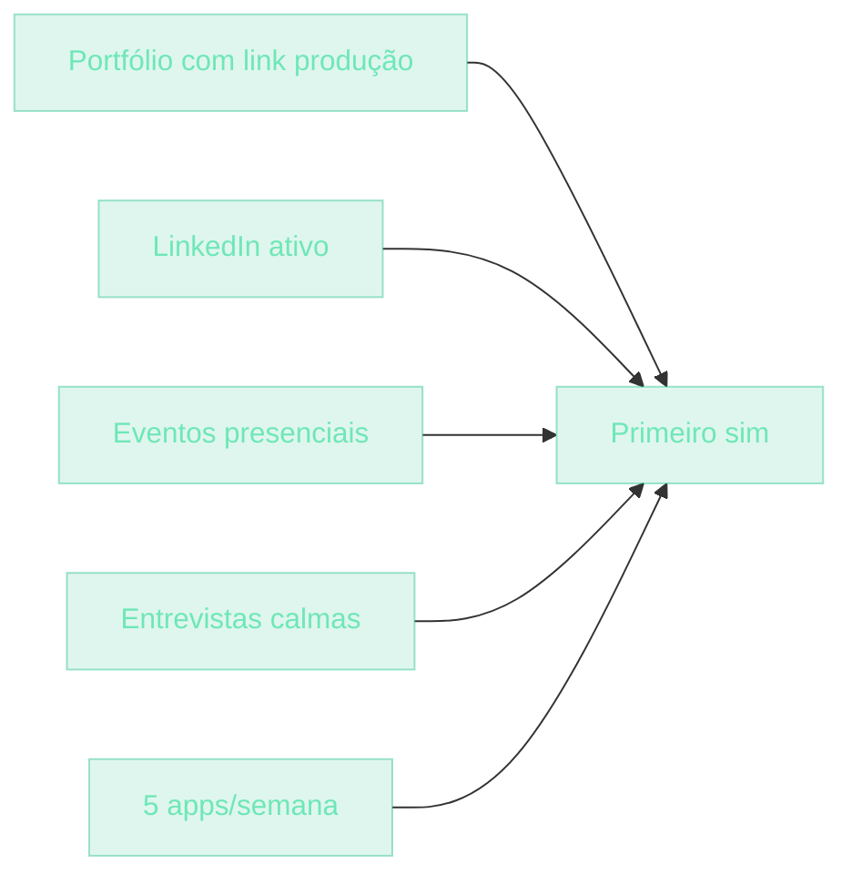

## O que é conseguir a primeira vaga

Quando você está aprendendo na UGP e progredindo, você se torna capaz tecnicamente. Mas conseguir a primeira vaga é diferente — é **um problema de mercado**, não um problema de skill.

> [!NOTE]
> Skill é necessário mas não suficiente. Há pessoas com habilidade técnica forte que não conseguem vaga. Há pessoas com habilidade mediana contratadas em três meses. A diferença não é programação — é como você **se posiciona**.

Este módulo é honesto. Vamos falar sobre o que está sob seu controle e o que não está — e o que fazer em cada caso.

## Contexto histórico do mercado júnior

| Período | Cenário | Implicação |
| --- | --- | --- |
| Até 2010 | Entrar exigia diploma, estágio, contatos | Pouca entrada lateral |
| 2010–2020 | Bootcamps: *"3-6 meses → primeira vaga"* | Cumpriu no boom 2018-2022 (oferta > procura) |
| 2023–presente | Tech contraction, mais júniores aplicando, menos vagas | Taxa de aceitação caiu — deve ser estratégico |

> [!IMPORTANT]
> Empresas recebem 500 CVs por vaga júnior. Sua vantagem não é o currículo — é o portfólio. Mais decisivo que CV em qualquer cenário pós-2023.

## Analogia: é namoro

**Aplicar a vaga** é dizer *"gostei de você"* numa festa lotada. Muito ruído. Pouca chance.

Como você consegue atenção? Não sendo o CV #501 na pilha. Sendo **a pessoa que já conhece alguém que conhece alguém**. Que já tem um projeto que alguém viu no LinkedIn. Que foi notada por contribuir em open source.

> [!TIP]
> A primeira vaga não é sobre ser o mais técnico — é sobre ser o **mais visível na rede certa**. Visibilidade se constrói antes da candidatura, não durante.

Como você consegue a segunda chance? Sendo alguém que demonstra valor rapidamente. Não com *"eu sou apaixonado por tecnologia"* — com **conversa técnica concreta**: projeto que rodou, decisão que tomou, trade-off que defendeu.

Como você consegue o "sim"? A decisão final não é só técnica. É sobre **fit cultural** e **confiança**. Recrutadores te testam para ver não apenas o que você sabe, mas como lida com o que não sabe.

## As 5 alavancas

Nenhuma alavanca sozinha fecha a vaga. As cinco juntas formam um funil — e o funil inteiro decide a velocidade.

### 1. Aplicações — volume + qualidade

5-10 aplicações por semana, mínimo. Cada uma com:

- CV único para a empresa (não o mesmo CV genérico)
- 1 frase: *"Por que você quer essa empresa?"* — específica
- Link para seu portfólio no topo

> [!IMPORTANT]
> 20% devem ser aplicações em vagas abertas. 80% devem ser **referrals** (indicações). Aplicações diretas têm ~1% de conversão. Referrals têm 10-20%. A diferença é estrutural, não esforço.

### 2. Networking — silencioso e real

Networking não é pedir vaga. É construir conexões que **têm chances de resultar** em vaga.

- **Eventos presenciais**: Meetup JS SP, Rio.js, BrasilJS, conferências. Apareça de verdade.
- **Online**: participe de Discord/Slack de empresas que admira. Não pergunte por vaga. Ajude, comente, contribua.
- **Open source**: contribua em projetos das empresas alvo. PRs pequenos. 95% dos recrutamentos da Vercel são pessoas com contribuição OSS.

> [!TIP]
> Networking de qualidade parece inútil por meses — e então vira indicação destravando três entrevistas em uma semana. Não desista antes do efeito composto aparecer.

### 3. LinkedIn — indexação

LinkedIn é um banco de dados. Recrutador busca por *"Next.js junior São Paulo"*. Se você não aparece no top 20, você não existe.

- **Headline**: *"Desenvolvedor Fullstack JS | Projetos: [link]"*
- **Sobre**: 3 parágrafos. Quem é. O que constrói. Onde quer chegar.
- **Experiência**: bootcamp / projeto próprio. Use os projetos da UGP aqui.
- **Skills**: Next.js, TypeScript, React, Node, SQL.
- **Featured**: destaque seus 3 melhores projetos.

> [!NOTE]
> Mesmo que você não usa LinkedIn socialmente, ele é obrigatório. É a porta de entrada por onde o recrutador chega até você — não a inverso.

### 4. Projetos > CVs

Em vez de aplicar com CV só, aplique **linkando projetos específicos**.

> [!SUCCESS]
> Modelo de e-mail:
> *"Olá [recrutador], vi a vaga na [empresa]. Construí um sistema que resolve problema parecido — link aqui: [produção]. Disponível para entrevista."*

Resultado > *"segue CV"* em qualquer cenário. Você entrega evidência antes da primeira pergunta.

### 5. Entrevistas

Estrutura comum do funil de entrevistas:

| Etapa | Duração | Foco |
| --- | --- | --- |
| 1. Recruiter call | 15-30 min | Básico, salário, inglês |
| 2. Technical screen | 60 min live | Live coding (HackerRank ou pair programming) |
| 3. Take-home | 24h-1 semana | Projeto longo |
| 4. Culture fit | Sem tech | Comportamental, situações |
| 5. Tech deep | Com sênior | Como você defende decisões |

> [!IMPORTANT]
> Foque sua preparação em três frentes:
> - **Live coding**: pratique 30 min/dia em Codewars/HackerRank — não para decorar, mas para ganhar **calma sob pressão**.
> - **Take-home**: escreva testes, README, ADR, deploy URL. Diferencie-se dos 90% que só entregam código.
> - **Defending decisions**: *"Por que usou Supabase?"* — tenha 3 trade-offs prontos.

## Outreach: ruim vs bom

| Outreach ruim | Outreach bom |
| --- | --- |
| Mesmo CV para 100 vagas | CV ajustado por empresa |
| *"Sou apaixonado por tecnologia"* | *"Construí [projeto] que resolve [problema parecido]"* |
| Sem link de portfólio | Link de produção no topo |
| Aplicação anônima em portal | Referral + e-mail direto ao recrutador |
| Sem preparação prévia | 3 trade-offs prontos por decisão |
| Sem follow-up | Follow-up em 7 dias se silêncio |

> [!WARNING]
> O outreach ruim não é desonesto — é genérico. Genérico compete com 500 outros genéricos. Específico compete com poucos.

## Caso real de mercado

> [!REFERENCE]
> **Brasil** — mercado amplo, júnior seeker-facing, processo lento com muita triagem. Nubank, iFood, Loft, Stone contratam júnior com plano de carreira forte.

> [!REFERENCE]
> **Portugal/Remoto EU** — empresas europeias contratando LATAM com fuso adequado. Boa porta para quem domina inglês técnico.

> [!REFERENCE]
> **EUA** — exige inglês fluente + portfólio forte. Companies americanas contratam LATAM remotamente como contractor.

> [!REFERENCE]
> **Startups Series A-B** — expectativa de mais responsabilidade no júnior. Aprendizado mais rápido, menos estrutura.

> [!REFERENCE]
> **Estúdios (StudioMate, etc.)** — projetos curtos, ritmo intenso, aprender mais rápido em ciclos.

> [!CURIOSITY]
> Empresas tradicionais (Itaú, XP, bancos) contratam júnior mas com processos trimestrais lentos. Bom alvo para quem tem paciência e estabilidade financeira.

### Quando o primeiro "sim" aparece

> [!TIP]
> **Média realista (com bootcamp completed):**
> - 6-12 meses para alguém com portfólio top 20%
> - 12-24 meses para alguém médio sem portfólio
> - <6 meses exige excepcionalidade — networking forte ou projetos virais
> - >24 meses indica problema estrutural (CV, LinkedIn, entrevistas) → rever tudo

## Erros comuns

> [!WARNING]
> **1. Aplicar a 100 vagas com mesmo CV.**
> CV único = você não está aplicando a essa empresa, está fazendo recruiter spam. Personalize pelo menos cidade e stack.

> [!WARNING]
> **2. Não ter LinkedIn atualizado.**
> Mesmo que você não usa LinkedIn socialmente, é obrigatório para recrutador te procurar. Faça.

> [!WARNING]
> **3. Não tratar o "não" como informação.**
> Recusado? OK. Peça feedback se possível. 80% não respondem. 20% respondem com algo útil. Aplique.

> [!WARNING]
> **4. Projeto exatamente igual ao tutorial (intermediários).**
> Último projeto pode ser trick — recrutador compara com 100 outros que fizeram o mesmo tutorial. Personalize: tópicos próprios, dados diferentes, features extras.

> [!WARNING]
> **5. Só projetos frontend, sem nada fullstack.**
> Apenas tarefas de vanilla React = sinal de *"tem medo de backend"*. Construa projetos fullstack para contrastar.

> [!WARNING]
> **6. Prometer demais a novos devs (sêniores mentorando).**
> *"Em 6 meses você consegue emprego"* cria frustração. Prometa realidade: *"Vai levar entre 6 e 18 meses. Trabalho diário é a única variável sob seu controle."*

## Boas práticas

> [!SUCCESS]
> **Caderno de aplicações.** Empresa, data, função, contato, próximo passo. Sem caderno, você se perde e repete erro.

> [!SUCCESS]
> **5 aplicações semanais** > 50 numa maratona isolada. Consistência vence volume.

> [!SUCCESS]
> **LinkedIn post 1x/sem.** *"Terminei projeto X. Aprendi Y. Stack: Z."* Visibilidade composta.

> [!SUCCESS]
> **Contribua open source.** PR pequeno em projeto da empresa alvo > 1000 aplicações anônimas.

> [!SUCCESS]
> **Streak de aprendizado.** 1h/dia coding, 5 dias/semana. Hábito vence motivação.

> [!SUCCESS]
> **Aplique consistentemente.** Pausas (1 mês sem aplicar) custam energia de restart. Manter ritmo é mais barato que retomar.

> [!SUCCESS]
> **6 meses sem vaga? Refatore.** CV, LinkedIn, portfólio. Renove conteúdo. Persistir no mesmo setup esperando resultado diferente é definição de insanidade.

> [!SUCCESS]
> **Diversifique o alvo.** Junior fullstack, junior frontend, junior backend — amplie o catch. Especialize só com 3 anos de experiência.

> [!SUCCESS]
> **Teste entrevista simulada.** Com amigo dev: peça para te entrevistar 30 min. Grave no Loom. Veja-se depois. Aprimore calma e profundidade de resposta.

> [!SUCCESS]
> **Documente cada entrevista real.**
> - *"Qual pergunta eu saí bem?"*
> - *"Qual eu congelei?"*
> - *"Qual eu conhecia mas não expliquei bem?"*
> Anote por 1 semana → padrão dos seus pontos cegos emerge. Estude esses.

## Resumo

O que você aprendeu neste módulo:

- **Primeira vaga é problema de mercado, não de skill.** Skill é necessário, não suficiente.
- **As 5 alavancas**: aplicações, networking, LinkedIn, projetos, entrevistas. Nenhuma fecha sozinha.
- **80% referrals, 20% aplicações abertas.** Aplicações diretas têm ~1% de conversão; referrals 10-20%.
- **Projetos > CVs.** Aplique linkando produção, não anexando PDF.
- **Entrevistas se preparam em 3 frentes**: live coding (calma), take-home (testes + ADR), defesa de decisões (trade-offs).
- **Média realista: 6-12 meses** com portfólio top 20%. Mais que 24 indica problema estrutural.
- **Consistência vence volume.** 5 apps/semana > 50 numa maratona.

> [!QUOTE]
> "Primeira vaga é jogo de paciência estratégica. Mais aplicações não vence. Melhores aplicações + networking + projetos públicos vencem. Não desista em 3 meses — desista em 18 meses sem feedback atual. Até lá, ajuste."

## Como isso aparece nos projetos da UGP

A UGP te dá material para todas as 5 alavancas. O ponto é transformar cada projeto em argumento de candidatura:

- Onde está seu portfólio com 3 projetos destacados?
- LinkedIn featured com quais projetos?
- Quais ADRs e trade-offs você já consegue defender?
- Qual é a próxima empresa alvo e qual PR open source você vai abrir?

> [!TIP]
> **Portfólio.** Obrigatório. 5 projetos máx, dos quais 3 são projetos da UGP.

> [!TIP]
> **LinkedIn.** Feature projetos finalizados. Referencie projetos por link de produção.

> [!TIP]
> **Entrevistas.** Prepare-se com **Arquitetura de Software** (trade-offs), **TDD** (*"como você testaria essa feature?"*) e **Fullstack** (defesa de stack).

> [!TIP]
> **Aplicações.** Use a estrutura da UGP como narrativa: *"Sou Júnior 2 completed UGP, buscando Pleno"* — história coerente vence CV solto.

## Desafio

> [!IMPORTANT]
> Monte seu plano de primeira vaga para os próximos 90 dias. Por escrito:
>
> 1. **Alvo**: liste 10 empresas específicas que você quer trabalhar (não "qualquer uma").
> 2. **Referrals**: para cada empresa, identifique 1 pessoa que pode te indicar (ou 1 conexão de 2º grau).
> 3. **Portfólio**: escolha os 3 projetos que vão no topo do seu portfólio — com link de produção ativo.
> 4. **LinkedIn**: reescreva headline + bio + featured nesta semana.
> 5. **Ritmo**: defina 5 slots de aplicação por semana no calendário.
> 6. **Entrevista simulada**: agende 1 com amigo dev nos próximos 14 dias. Grave no Loom.
> 7. **Caderno**: crie a planilha de aplicações hoje. Sem caderno, não há ajuste.

Não precisa do plano perfeito. O objetivo é **transformar vaga em processo**, não em esperança. Quando você rastreia, você ajusta. Quando você ajusta, você acelera.
