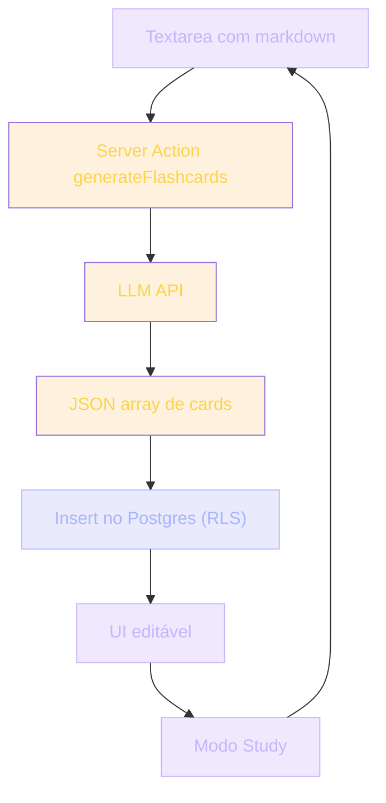

## O projeto

Você já compreendeu — em módulos anteriores — que IA bem usada é ferramenta, não mestre. Chega agora o momento de transformar essa convicção em produto. Este é seu primeiro projeto de IA aplicada: construir uma aplicação útil onde um LLM é componente crítico.

**Problema real**: estudantes precisam de flashcards para reter conhecimento. Mas criar flashcards é trabalho manual repetitivo. E se a IA gerasse os cards a partir das suas próprias notas?

**Sua missão**: construir um SaaS de flashcards que recebe markdown do usuário e gera flashcards via LLM. Multi-usuário. Com auth. Persistência. UI clara.

> [!IMPORTANT]
> Você vai integrar tudo que aprendeu até aqui: auth, integração com LLM, streaming de resposta, RLS no Postgres, testes de prompt. Não é um tutorial — é um produto de verdade.

## Analogia: Anki com IA

Pense no **Anki**, o app famoso de flashcards. Agora imagine uma camada inteligente que lê suas notas e cria os cards automaticamente.

Você importa um capítulo de livro. A IA divide em dez perguntas. Você estuda.

Simples na cabeça do usuário. Em código: integração cuidadosa.

> [!TIP]
> Toda boa feature de IA parece mágica para o usuário e parece engenharia para o desenvolvedor. Seu trabalho é fazer a mágica parecer simples — e a engenharia ser sólida.

## Contexto do projeto

### Nível alvo: Pleno 2

Por que Pleno 2? Você acabou os módulos de IA e quer algo prático. Este projeto envolve:

- **Auth** (você domina do Projeto 07)
- **Integração com LLM** (OpenAI/Anthropic API)
- **Streaming** (a resposta do LLM flui enquanto é gerada)
- **Testes** para comportamento estável de prompt
- **RLS** para não vazar cards de outros usuários

Isso é Pleno 2 de complexidade. Tudo que você aprendeu até aqui, neste projeto.

### Stack

| Camada | Tecnologia | Por quê |
| --- | --- | --- |
| Fullstack | Next.js 15 + TypeScript | App Router, Server Actions, SSR |
| Backend/Auth/DB | Supabase | Auth + Postgres + RLS num só lugar |
| IA | OpenAI ou Anthropic API | Geração dos flashcards |
| UI | Tailwind + shadcn/ui | Componentes limpos e acessíveis |
| Testes | Vitest / Playwright | Prompt + E2E |
| Deploy | Vercel | Edge-friendly, preview por PR |

> [!NOTE]
> Stack é decisão revogável. Substitua Anthropic por OpenAI sem mudar arquitetura — esse é o teste de que você isolou a camada de IA.

### Quanto tempo esperar

~2-4 semanas trabalhando 1-2h/dia. Não apresse — qualidade do projeto importa mais que velocidade.

> [!CAUTION]
> Quem termina um projeto de IA em dois dias geralmente entregou um wrapper de API sem testes, sem RLS, sem tratamento de erro. Esse não é o objetivo aqui.

## Pipeline do projeto



Cada bloco desse fluxo é uma responsabilidade separada. Se você escrever tudo num único arquivo, perdeu a arquitetura — e perdeu o projeto.

## Schema do banco

```sql
-- schemas.sql
CREATE TABLE decks (
  id UUID PRIMARY KEY DEFAULT gen_random_uuid(),
  created_by_id UUID REFERENCES auth.users(id) ON DELETE CASCADE,
  title TEXT NOT NULL,
  source_markdown TEXT NOT NULL,
  created_at TIMESTAMPTZ NOT NULL DEFAULT now()
);

CREATE TABLE flashcards (
  id UUID PRIMARY KEY DEFAULT gen_random_uuid(),
  deck_id UUID REFERENCES decks(id) ON DELETE CASCADE,
  front TEXT NOT NULL,
  back TEXT NOT NULL,
  ease FLOAT NOT NULL DEFAULT 2.5,
  interval_days INTEGER NOT NULL DEFAULT 1,
  due_date DATE NOT NULL DEFAULT CURRENT_DATE
);

ALTER TABLE decks ENABLE ROW LEVEL SECURITY;
CREATE POLICY "own_decks" ON decks
  FOR ALL USING (auth.uid() = created_by_id);

ALTER TABLE flashcards ENABLE ROW LEVEL SECURITY;
CREATE POLICY "own_flashcards" ON flashcards
  FOR ALL USING (
    EXISTS (
      SELECT 1 FROM decks
      WHERE id = flashcards.deck_id
      AND created_by_id = auth.uid()
    )
  );
```

> [!SECURITY]
> A política `own_flashcards` não protege só a tabela `flashcards` — ela verifica que o deck pai pertence ao usuário. Sem essa subquery, qualquer um com um `deck_id` válido poderia ler cards alheios.

## Fluxo de execução

1. Usuário cola markdown num textarea.
2. Clica em "Gerar Flashcards".
3. Backend (Server Action) chama o LLM.
4. LLM retorna um array de `{ front, back }`.
5. Backend salva no Postgres.
6. UI mostra cards editáveis.
7. Modo "Study" exibe cards com `due_date <= today`.

> [!TIP]
> O `ease`, `interval_days` e `due_date` no schema espelham o algoritmo de repetição espaçada do Anki (SM-2). Você não precisa implementá-lo agora — mas o schema já está pronto para quando quiser evoluir.

## Prompt do LLM (Engenharia de Prompt aplicada)

```
Você é um assistente que gera flashcards didáticos.

Recebi do usuário um markdown. Gere 10 flashcards no formato:
{ "front": "pergunta", "back": "resposta curta" }

Regras:
- Front: pergunta clara, auto-contida
- Back: resposta de 1-3 frases, sem jargão
- Card pode ser entendido isolado
- Não inclua números nas perguntas (cards serão embaralhados)

Contexto markdown:
---
{markdown aqui}
---

Responda como JSON array. Sem preâmbulo.
```

> [!NOTE]
> "Sem preâmbulo" não é enfeite. É o que separa uma resposta parseable de uma resposta que precisa de pós-processamento. Sem essa instrução, o LLM pode abrir com "Aqui estão seus flashcards:" e quebrar seu `JSON.parse`.

### Server Action

```ts
// actions/generate-cards.action.ts
'use server'
import { createClient } from '@/lib/supabase/server'
import Anthropic from '@anthropic-ai/sdk'

export async function generateFlashcards(deckId: string) {
  const supabase = await createClient()
  const { data: { user } } = await supabase.auth.getUser()
  if (!user) throw new Error('Não autenticado')

  const { data: deck } = await supabase
    .from('decks')
    .select('source_markdown')
    .eq('id', deckId)
    .eq('created_by_id', user.id)
    .single()

  if (!deck) throw new Error('Deck não encontrado')

  const anthropic = new Anthropic()
  const response = await anthropic.messages.create({
    model: 'claude-3-5-sonnet-20241022',
    max_tokens: 1500,
    messages: [{
      role: 'user',
      content: buildPrompt(deck.source_markdown)
    }]
  })

  const cards = JSON.parse(response.content[0].text)
  await supabase.from('flashcards').insert(
    cards.map((c: any) => ({ deck_id: deckId, front: c.front, back: c.back }))
  )

  return cards
}
```

> [!WARNING]
> O `JSON.parse` cru acima é frágil. Em produção, envolva em `try/catch` e valide o formato com algo como `zod`. Um LLM pode retornar markdown cercando o JSON, aspas escapadas erradas, ou até um erro em texto puro quando atinge o limite de tokens.

## Testando o prompt

```ts
// tests/prompt.test.ts
test('prompt gera JSON válido para markdown simples', async () => {
  const markdown = '# Photosynthesis\n\n Plants convertem luz...'
  const response = await callGenerateFlashcards(markdown)

  expect(Array.isArray(response)).toBe(true)
  expect(response.length).toBeGreaterThan(0)
  response.forEach(card => {
    expect(card).toHaveProperty('front')
    expect(card).toHaveProperty('back')
    expect(typeof card.front).toBe('string')
  })
})
```

> [!IMPORTANT]
> Teste de prompt é diferente de teste unitário clássico. Você não garante uma string exata — você garante **propriedades** do output: é array, tem `front`/`back`, é string, não tem números nas perguntas. Esse é o padrão de teste que escala com LLMs não-determinísticos.

## Caso real de mercado

Apps como **Anki**, **Quizlet** e **Brainscape** dominam o mercado de flashcards. É um mercado amplo — muitos startups entram todo ano.

Em open source: **Mochi** e **RemNote**. Cada um aplica IA com filosofia diferente.

> [!REFERENCE]
> **Quizlet** lançou "Q-Chat" — um tutor conversacional baseado em LLM que transforma seus flashcards em diálogos. Estratégia oposta à sua: em vez de só gerar cards, eles também os consomem em tempo real. Vale estudar.

> [!CURIOSITY]
> Anki existe desde 2006 e é open source. Sobreviveu à onda de IA justamente porque o núcleo (repetição espaçada) é algoritmo, não modelo. IA é camada adicional, não substituição.

### Quando você realmente usa

Toda vez que você precisa de cards de estudo. É a integração que torna o aprendizado mais valioso: **IA como geradora, você como revisor e usuário**.

## Erros comuns

> [!WARNING]
> **1. Aceitar resposta do LLM como JSON válido sem parse-checking.** Use `try/catch` em torno do `JSON.parse`. LLMs não determinísticos retornam formas inesperadas sob carga, contexto longo ou ruído no input.

> [!WARNING]
> **2. Resposta com preâmbulo.** "Aqui estão os cards..." quebra o parser. Sempre inclua `"Responda apenas JSON"` no prompt — e mesmo assim, valide.

> [!WARNING]
> **3. Alucinação de numeração.** Front vem com "1." prefixando a pergunta. Peça explicitamente para não incluir números — os cards serão embaralhados.

> [!WARNING]
> **4. Rate limit do LLM.** Sem retry com backoff, um único 429 derruba a UX. Implemente exponencial backoff e, se possível, fila.

> [!WARNING]
> **5. Custos descontrolados.** Cada geração custa centavos — até virar dólar. Implemente limites diários por usuário e alertas de uso.

## Boas práticas

> [!SUCCESS]
> **Logs de prompt em dev only.** Em produção, registre apenas metadados (modelo, tokens, latência). Nunca logue o conteúdo do markdown do usuário em texto puro.

> [!SUCCESS]
> **Cache por hash.** ID do deck + hash do markdown → resposta em cache. Reduz custo e latência em re-gerações idênticas.

> [!SUCCESS]
> **Chunking por tamanho.** Se o markdown tiver menos de 200 chars, peça no máximo 5 cards. Se passar de 5000, divida em chunks antes de enviar.

> [!SUCCESS]
> **Error handling defensivo.** API do LLM caiu? Fallback "tente mais tarde". Usuário sem créditos? Mensagem clara. Nunca deixe um erro 500 cru chegar na UI.

## Checklist de entregáveis

| Entregável | Critério de aceite |
| --- | --- |
| Auth funcional | Usuário cria conta, login, logout |
| Criar deck | Markdown é salvo no Postgres com RLS |
| Gerar flashcards | Server Action chama LLM e salva cards |
| UI editável | Usuário pode editar `front`/`back` dos cards |
| Modo Study | Mostra cards com `due_date <= today` |
| Teste de prompt | `prompt.test.ts` passando em CI |
| Deploy | App público na Vercel, acessível |

> [!TIP]
> Não tente entregar tudo de uma vez. Faça auth primeiro, depois deck, depois geração. Cada marco é um commit e um deploy verificável.

## Resumo

O que você construiu neste projeto:

- **Um SaaS completo de flashcards** com auth, persistência e IA na geração.
- **Integração real com LLM** via Server Action, com prompt estruturado.
- **RLS no Postgres** protegendo dados multi-usuário.
- **Teste de prompt** garantindo propriedades do output, não string exata.
- **Pipeline de produto** do textarea ao modo Study.

> [!QUOTE]
> "IA como geradora, humano como revisor. Esse é o padrão de produto que sobrevive à hype."

## Como aparece nos projetos da UGP

Este projeto é o ponto onde várias trilhas convergem:

> [!TIP]
> **Engenharia de Prompt** — aplique o template de prompt estruturado neste projeto.

> [!TIP]
> **Boas Práticas com IA** — o workflow de 7 passos vive aqui dentro.

> [!TIP]
> **Como NÃO Fazer Vibe Coding** — não faça push de UI sem testar o prompt antes.

> [!TIP]
> **Projeto 07 — SaaS de Notas** — base técnica similar: auth, RLS, Server Actions.

> [!TIP]
> **TDD** — teste o prompt, não só a UI.

> [!IMPORTANT]
> Esse projeto testa: integração IA + auth + UX multi-tenant + persistência com RLS + custo real. Você sai com um app que pode usar e mostrar — e com workflow defensável em entrevistas.

## Desafio

> [!IMPORTANT]
> Estenda o projeto com uma destas três evoluções:
>
> 1. **Repetição espaçada real** — implemente o algoritmo SM-2 usando os campos `ease`, `interval_days` e `due_date` já presentes no schema.
> 2. **Streaming de cards** — modifique o Server Action para streamar cards um a um via SSE, em vez de esperar o JSON completo.
> 3. **Cache semântico** — antes de chamar o LLM, compute o hash do markdown e busque em cache. Se existir deck similar, pergunte ao usuário se quer reusar.

Escolha uma. Implemente. Escreva um ADR explicando a decisão. Esse é o tipo de iniciativa que diferencia um projeto de portfólio de um tutorial seguido passo a passo.
