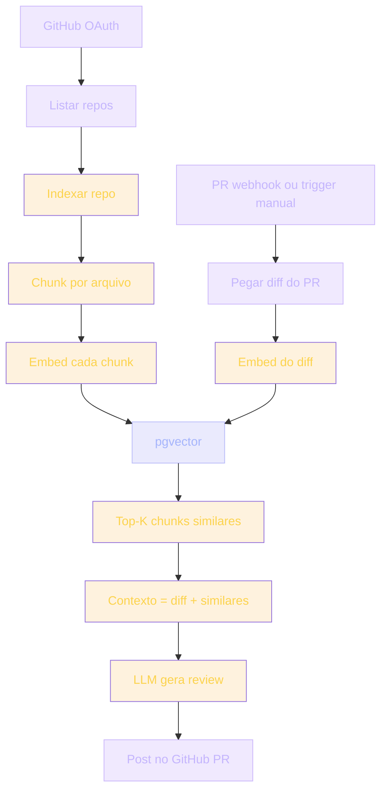

## O projeto

Segundo projeto de IA. Mais avançado. Você constrói uma ferramenta que faz **code review com IA** — mas **baseada no seu próprio código** usando RAG (*Retrieval-Augmented Generation*).

Por que este projeto? Porque é o tipo de ferramenta que empresas estão construindo hoje. **CodeRabbit**, **Cursor Composer**, **GitHub Copilot Workspace** — todos usam alguma combinação de RAG + LLM para analisar código.

> [!IMPORTANT]
> Você vai construir uma versão minimal, mas real. Quando termina, entende IA aplicada em escala — não só "chamar API".

## Analogia: revisor sênior que conhece sua codebase

Imagine um revisor sênior externo. Ele sabe revisar código genérico: nomear variáveis, evitar bugs óbvios. Mas não conhece **seus** padrões.

Agora imagine que esse revisor, antes de comentar no PR, lê 5 arquivos similares do seu próprio repositório. Ele vê como seu time implementa autenticação, como nomeia funções, quais patterns repete. Aí sim comenta.

Esse é o salto: de **review genérico** para **review contextual**.

> [!TIP]
> RAG não é "memória" — é **recuperação sob demanda**. Você só carrega contexto relevante no momento da pergunta. É o que torna o LLM útil em codebases gigantes sem estourar a janela de contexto.

## Contexto do projeto

### Nível alvo: Pleno 3 / Sênior

Projeto grande. O primeiro projeto de IA foi *user-facing*. Este é *dev-facing*: o usuário é um desenvolvedor, com expectativas técnicas altas.

### Stack

| Camada | Tecnologia | Por quê |
| --- | --- | --- |
| Fullstack | Next.js 15 + TypeScript | App Router, Server Actions, webhooks |
| Auth/DB | Supabase + Postgres (RLS) | Multi-tenant seguro |
| Embeddings | pgvector | Extensão Postgres para vetores — sem infra extra |
| IA | OpenAI ou Anthropic API | LLM + embeddings no mesmo provider |
| UI | Tailwind + shadcn/ui | Logs, dashboards, monitoramento |
| E2E | Playwright | Fluxo completo de PR → review |
| Deploy | Vercel | Webhooks + Edge |

> [!NOTE]
> pgvector elimina um serviço inteiro (Pinecone, Weaviate). Para a escala deste projeto, Postgres com extensão vetorial é a escolha mais simples e barata.

### Quanto tempo esperar

~4-8 semanas. Difícil, mas doável. Comece pela versão 1: upload de repo, review manualmente triggered. Webhook automático vem depois.

> [!CAUTION]
> Quem pula direto para webhook + GitHub App no dia 1 geralmente trava no OAuth. Construa o caminho manual primeiro; automatize quando o núcleo estiver sólido.

## Arquitetura geral



Observe os dois fluxos que se encontram em **pgvector**: a indexação (escrita) e a query (leitura). Esse desenho é o coração de qualquer sistema RAG.

## Pipeline de execução

1. **Conexão GitHub (OAuth)** → listar repos
2. **Indexação**: ler repo, chunk por arquivo
   - embed de cada chunk com OpenAI/Anthropic API
   - pgvector armazena os embeddings
3. **PR webhook (ou trigger manual)**:
   - pegar o diff do PR
   - buscar similares em pgvector
   - contexto = diff + similares
   - LLM gera a review
4. **Review postada** no PR do GitHub

> [!TIP]
> Separe a indexação da query fisicamente — funções distintas, tabelas de controle distintas. Indexação é batch e offline; query é request-time. Misturar as duas é o erro nº 1 de iniciantes em RAG.

## Schema do banco

```sql
CREATE EXTENSION IF NOT EXISTS vector;

CREATE TABLE chunks (
  id UUID PRIMARY KEY DEFAULT gen_random_uuid(),
  repo_id TEXT NOT NULL,         -- "user/repo"
  file_path TEXT NOT NULL,
  content TEXT NOT NULL,
  embedding VECTOR(1536),
  created_at TIMESTAMPTZ DEFAULT now()
);

CREATE INDEX ON chunks USING ivfflat (embedding vector_cosine_ops);

CREATE TABLE reviews (
  id UUID PRIMARY KEY DEFAULT gen_random_uuid(),
  pr_url TEXT NOT NULL,
  review_body TEXT NOT NULL,
  created_at TIMESTAMPTZ DEFAULT now()
);
```

> [!NOTE]
> `VECTOR(1536)` corresponde à dimensão do `text-embedding-3-small` da OpenAI. Se trocar de provider/modelo de embedding, a dimensão muda — e a tabela precisa ser recriada. É uma decisão acoplada: escolha o modelo de embedding antes de definir o schema.

## Indexação do repositório

```ts
// scripts/index-repo.ts
import Anthropic from '@anthropic-ai/sdk'

async function indexRepo(repoUrl: string, pat: string) {
  const files = await listRepoFiles(repoUrl, pat)

  for (const file of files) {
    const text = await readFileFromGithub(file)
    const chunks = chunkByLines(text, maxLines=50)

    for (const chunk of chunks) {
      const embedding = await anthropic.embeddings.create({
        model: 'text-embedding-3-small',
        input: chunk
      })

      await supabase.from('chunks').insert({
        repo_id: repoUrl,
        file_path: file,
        content: chunk,
        embedding: embedding.data[0].embedding
      })
    }
  }
}
```

> [!WARNING]
> Re-embeddar tudo a cada push é o caminho mais rápido para uma fatura astronômica. Indexe apenas diffs. Mantenha uma tabela `indexed_files` com hash do conteúdo para pular arquivos não modificados.

## Query RAG

```ts
async function reviewPR(diff: string, repoUrl: string) {
  // Embed diff
  const diffEmbedding = await anthropic.embeddings.create({
    model: 'text-embedding-3-small',
    input: diff
  })

  // Search similar chunks (cosine similarity via pgvector)
  const { data: similarChunks } = await supabase.rpc('match_chunks', {
    query_embedding: diffEmbedding.data[0].embedding,
    repo_url: repoUrl,
    match_count: 5
  })

  // Build prompt with retrieved context
  const prompt = `
Você é um code reviewer sênior para o repo ${repoUrl}.

PR diff:
${diff}

5 trechos similares encontrados na codebase:
${similarChunks.map(c => `// ${c.file_path}\n${c.content}`).join('\n---\n')}

Forneça review construtivo considerando o padrão da codebase.
Identifique:
- Inconsistência com padrão
- Bugs potenciais
- Sugestões específicas (evidence: referencie chunk)
`

  // LLM review
  const response = await anthropic.messages.create({
    model: 'claude-3-5-sonnet-20241022',
    max_tokens: 2000,
    messages: [{ role: 'user', content: prompt }]
  })

  await supabase.from('reviews').insert({
    pr_url: diff.prUrl,
    review_body: response.content[0].text
  })

  return response.content[0].text
}
```

> [!TIP]
> O prompt acima é template — não mágica. A qualidade da review depende 80% da qualidade da recuperação (chunks similares) e 20% do modelo. Se os chunks forem ruins, nenhum prompt salva.

## Função de match (pgvector)

```sql
CREATE OR REPLACE FUNCTION match_chunks(
  query_embedding VECTOR(1536),
  repo_url TEXT,
  match_count INT DEFAULT 5
)
RETURNS TABLE (
  id UUID,
  file_path TEXT,
  content TEXT,
  similarity FLOAT
)
LANGUAGE sql SECURITY DEFINER
AS $$
  SELECT
    id,
    file_path,
    content,
    1 - (embedding <=> query_embedding) AS similarity
  FROM chunks
  WHERE repo_id = repo_url
  ORDER BY embedding <=> query_embedding
  LIMIT match_count;
$$;
```

> [!SECURITY]
> `SECURITY DEFINER` executa a função com privilégios do dono. Para funções que cruzam RLS (como buscar chunks de qualquer repo público interno), isso é necessário — mas valide sempre os inputs. Never trust unfiltered params em `SECURITY DEFINER`.

## Caso real de mercado

**CodeRabbit** (US$ 10M+ ARR), **CodeGuru** (Amazon). **Cursor Composer** integra RAG dentro da IDE. **GitHub Copilot Workspace**.

Essa categoria de produto está ativa em 2024+. Você constrói uma versão minimal e entende o stack inteiro.

> [!REFERENCE]
> **CodeRabbit** cobra por repo/PR. Modelo de negócio validado: times pagam para reduzir fricção de review. Estude o pricing público — é a prova de que existe demanda pagante por essa categoria.

> [!REFERENCE]
> **Cursor Composer** move o RAG da revisão para a escrita. Em vez de revisar PR, ele gera código multi-arquivo usando o codebase como contexto. É a evolução natural da mesma arquitetura que você constrói aqui.

### Quando usar

- **Intra-empresa**: ajudar desenvolvedores com revisão pesada (codebase grande + muitos PRs).
- **Open source**: revisor automático em PRs de newcomers.
- **Plano solo**: review "sanity check" no seu próprio código (sem outro dev disponível).

### Quando limita

> [!CAUTION]
> **Codebases pequenos (< 5000 LOC)** não justificam a infra de RAG. O overhead de indexação supera o ganho.

> [!CAUTION]
> **Linguagens obscuras** (Haskell, Erlang): embedding pobre. Modelos são treinados em código mainstream (JS, Python, Go, Java, TS).

> [!CAUTION]
> **Compliance pesada**: precisa de human approval de qualquer forma. RAG acelera, não substitui auditoria.

## Erros comuns

> [!WARNING]
> **1. Re-indexação frequente.** Cada push → re-embed de tudo. Caro. Indexe só diffs. Mantenha cache de hash por arquivo.

> [!WARNING]
> **2. Chunking ruim.** Chunks de 1000 linhas — embedding fica médio demais. 50-100 linhas é o sweet spot para código.

> [!WARNING]
> **3. Alucinação de LLM.** Review cita arquivo que não existe. SEMPRE inclua `file_path` explícito no output esperado e valide a existência.

> [!WARNING]
> **4. Custo descontrolado.** Embedding de cada arquivo é caro. Cache com hash para pular re-embeds. Monitore fatura semanalmente.

> [!WARNING]
> **5. Webhook inseguro.** GitHub publica ranges de IP. Valide assinatura com HMAC antes de processar qualquer payload. Sem isso, qualquer um forja um PR webhook.

## Boas práticas

> [!SUCCESS]
> **Streaming da resposta (SSE)** para mostrar a review sendo gerada. UX dramaticamente melhor — o usuário vê progresso em vez de spinner congelado.

> [!SUCCESS]
> **UI admin de custo.** Monitore custo de API. Cada geração visível em dashboard com repo, tokens e dólares.

> [!SUCCESS]
> **Testes por snapshot.** Snapshot da review num PR de teste, comparar divergência entre execuções. Detecta regressão de qualidade do prompt.

> [!SUCCESS]
> **Logs de auditoria.** Registre queries input/output em Postgres para audit. Fundamental para debug e para compliance.

> [!SUCCESS]
> **Rate limiting.** Free tier = 5 reviews/dia. Paid = unlimited. Sem isso, abuso derruba a conta e a fatura.

## Checklist de entregáveis

| Entregável | Critério de aceite |
| --- | --- |
| OAuth GitHub | Usuário conecta repo e vê lista de seus repos |
| Indexação manual | Script `index-repo.ts` popula `chunks` com embeddings |
| Busca semântica | `match_chunks` retorna top-K similares para qualquer diff |
| Review via UI | Form com diff → review textual na tela |
| Persistência | Reviews salvas em `reviews` com `pr_url` |
| Webhook (opcional v1.5) | PR aberto no GitHub → review postada automaticamente |
| Dashboard de custo | Tokens e custo por review visíveis |
| E2E | Playwright cobre fluxo completo |

> [!TIP]
> A versão 1 não precisa de webhook. Faça trigger manual via botão. Webhook é incremento, não núcleo.

## Resumo

O que você construiu neste projeto:

- **Um code reviewer com RAG** que usa seu próprio codebase como contexto.
- **Pipeline completo de IA com retrieval** — indexação, embedding, busca semântica, geração.
- **pgvector** como vector store nativo do Postgres, sem serviço extra.
- **Integração com GitHub** via OAuth e webhook.
- **Controle de custo e auditoria** — peças que separam brinquedo de produto.

> [!QUOTE]
> "LLM puro responde. RAG responde com contexto. Contexto é o que diferencia assistente de ferramenta."

## Como aparece nos projetos da UGP

> [!TIP]
> **Engenharia de Prompt** — exija contexto estruturado + retrieval. Sem contexto, prompt é opinião.

> [!TIP]
> **Boas Práticas com IA** — o workflow de 7 passos vive aqui dentro, com complexidade maior.

> [!TIP]
> **Projeto 09 — LMS** — multi-tenant + tests em escala.

> [!TIP]
> **Projeto 10 — Clone do Supabase** — server-side vector embutido: sua infra de RAG vira feature de produto.

> [!TIP]
> **TDD** — behavioral test de prompts + reviews. Snapshot + divergência.

> [!IMPORTANT]
> O Projeto IA 1 ensina você a usar LLM básico. O Projeto IA 2 ensina você a fazer o que é **difícil para 95% da comunidade dev**: IA com retrieval, custo controlado, infraestrutura. Quando você termina — você está pronto para pleno-em-IA.

## Desafio

> [!IMPORTANT]
> Estenda o projeto com uma destas três evoluções:
>
> 1. **Re-ranking de chunks** — após o pgvector retornar top-20, use um segundo modelo menor para re-ranquear os 5 mais relevantes. Medita o ganho de qualidade.
> 2. **Multi-repo context** — permita que a review de um PR use padrões de outros repos do mesmo org. Decide: ajuda ou confunde?
> 3. **Feedback loop** — allow devs marcar reviews como "útil" / "inútil". Armazene e use esse sinal para ajustar threshold de similaridade. É o primeiro passo para um sistema que aprende com uso.

Escolha uma. Implemente. Documente a decisão num ADR. Esse é o tipo de evolução que transforma um projeto de portfólio em prova de engenharia.
