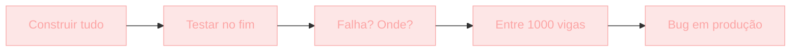
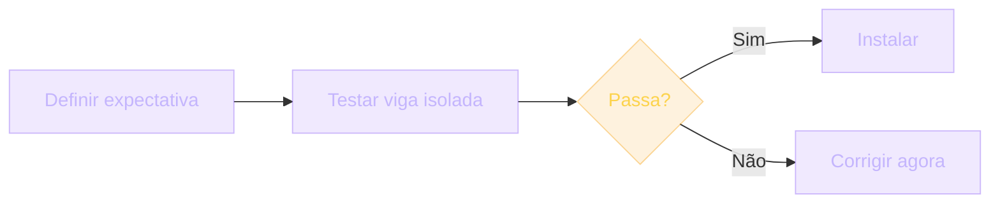
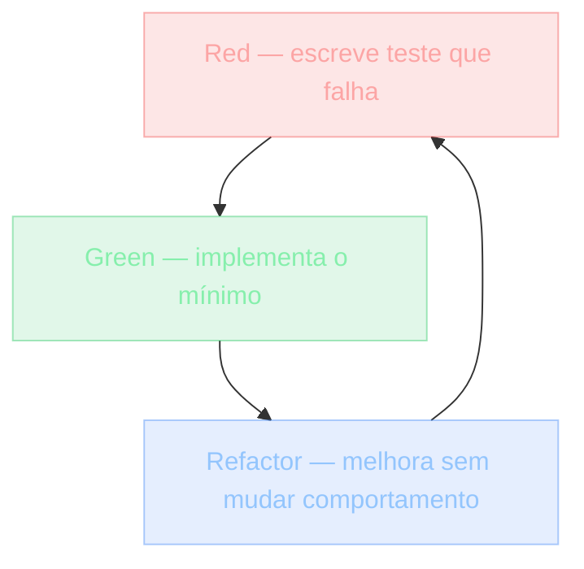
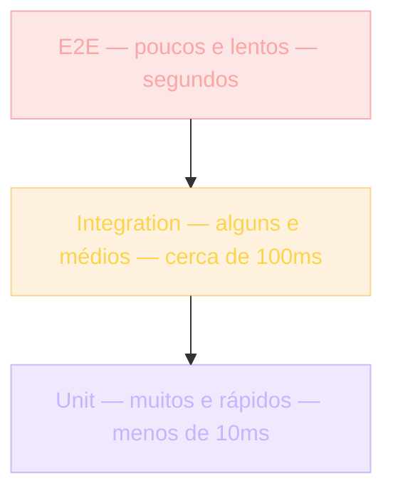

## O que é Test-Driven Development

Imagine que você precisa construir uma ponte.

Você pode soldar mil vigas primeiro e, só no fim, passar um caminhão de 40 toneladas para testar. Se a ponte cai, agora você precisa descobrir **entre mil vigas** qual falhou.

Ou pode, antes de soldar cada viga, definir: "esta viga precisa aguentar 40 toneladas sem deformar mais de 2 cm". Testa a viga isolada. Passou? Instala. Não passou? Você sabe exatamente onde está o problema.

Em software, é a mesma coisa.

> [!NOTE]
> TDD é frequentemente apresentado como "escreva testes antes do código". Isso é a técnica. A filosofia vai mais fundo: **TDD descreve o comportamento desejado antes de implementá-lo**.

A sequência é simples: **Red** → **Green** → **Refactor**. Vermelho (o teste falha), Verde (o teste passa), Refatora (melhora o código sem mudar o comportamento).

Mas por que isso importa? Por que escrever testes *antes* é melhor do que depois? E quando TDD é **perda de tempo**?

> [!IMPORTANT]
> Até o fim deste módulo, você vai entender o ciclo Red/Green/Refactor, saber quando aplicar TDD e — igualmente importante — saber quando **não** aplicar.

## Analogia: a ponte testada viga a viga

A analogia da ponte não é por acaso. Ela espelha exatamente a diferença entre testar depois e testar antes.





Em software, isso se traduz assim:

| Sem TDD | Com TDD |
| --- | --- |
| Escreve função complexa | Escreve teste que define comportamento |
| Bug aparece em produção | Teste falha antes do código existir |
| "Onde está o erro? Entre 50 linhas." | "95 passaram, 1 falhou — é a funcionalidade Y." |
| Teste depois valida o que foi escrito | Teste antes valida o que **deveria** existir |

> [!TIP]
> Quem testa depois valida a implementação. Quem testa antes valida o **comportamento esperado** — e descobre o problema quando ele ainda é barato de corrigir.

## Contexto histórico: como chegamos aqui

TDD não caiu do céu. Ele é o ponto atual de uma evolução.

### Testes manuais — antes de 1950

Engenheiros calculavam fórmulas à mão. "Vejamos se 2+2=4". Verificavam algumas entradas. Em código, a mesma coisa: rodar o programa, inserir dados, observar a saída.

### Testes automatizados — 1950 a 2000

Computadores começaram a testar computadores. Ferramentas como JUnit (Java, 2000) popularizaram testes unitários.

Mas os testes eram adicionados **após** o código. Devs escreviam a feature, depois escreviam testes para cobri-la.

> [!WARNING]
> Testes escritos depois validam **o que foi escrito** — não o que **deveria** ter sido escrito. Eles confirmam o status quo, não a intenção.

### TDD e Kent Beck — ~2000

Kent Beck, engenheiro americano, formalizou o TDD no livro *Test-Driven Development: By Example* (2002). A regra é simples: escreva o teste primeiro. Ele define o comportamento. Aí você implementa.

Os resultados que Beck observou:

- **Design testável** — para testar X, X precisa ser isolado. Isso empurra modularidade.
- **Confiança** — você sabe que X funciona porque tem um teste que prova.
- **Refatoração segura** — com testes, você muda a implementação e os testes garantem que o comportamento não mudou.

### Pirâmide de testes — Mike Cohn, 2009

Mike Cohn propôs a "Test Pyramid": muitos unit tests na base, menos integration tests no meio, poucos end-to-end tests no topo.

> [!INFO]
> Unit tests são rápidos e específicos. E2E testam tudo, mas são lentos e frágeis. A pirâmide equilibra custo, velocidade e confiança.

### Behavior-Driven Development (BDD) — ~2006

Dan North propôs BDD: testes escritos como comportamento ("Given/When/Then"), não como estrutura técnica. Ferramentas como Cucumber e Jest BDD.

BDD não substitui TDD — é TDD com vocabulário de negócio, para que analistas não-técnicos consigam entender.

## O ciclo Red / Green / Refactor

Este é o coração do TDD. Tudo o que você vai ver daqui pra frente é variação deste ciclo.



### Red — escreva um teste que falha

```ts
// calculadora.test.ts
import { somar } from './calculadora'

test('somar 2 + 3 retorna 5', () => {
  expect(somar(2, 3)).toBe(5)
})
```

`somar` ainda não existe (ou retorna `null`). O teste falha: *"somar is not defined"* ou *"expected 5, received null"*.

> [!IMPORTANT]
> A falha é **boa**. Ela confirma três coisas: o teste roda (não tem erro de sintaxe); você está testando a coisa certa; o caminho está pronto para implementar.

### Green — implemente o mínimo

```ts
// calculadora.ts
export function somar(a: number, b: number) {
  return a + b
}
```

O teste passa. **Pare**. Não adicione `subtrair`, não adicione `multiplicar`. YAGNI — *You Aren't Gonna Need It*.

> [!TIP]
> A tentação de "já que estou aqui, vou implementar logo os outros métodos" é o que quebra o ciclo. O ciclo só funciona se você e o teste estiverem focados no próximo comportamento, não no próximo módulo.

### Refactor — melhore sem mudar comportamento

```ts
// Opção: mais idiomático
export const somar = (a: number, b: number): number => a + b
```

O teste ainda passa. O refactor é seguro porque o comportamento está protegido.

## Níveis de teste e a pirâmide

Nem todo teste serve para a mesma coisa. A pirâmide do Mike Cohn organiza isso.



### Unitário

Testa una função isolada. Rápido (menos de 10 ms). Centenas deles.

```ts
test('desconto de 10% em R$100 retorna R$90', () => {
  expect(aplicarDesconto(100, 10)).toBe(90)
})
```

### Integration

Testa componentes juntos. Mais lento (cerca de 100 ms). Dezenas.

```ts
test('carrinho com 2 produtos e cupom de 10%', async () => {
  const carrinho = novoCarrinho()
  await carrinho.add(produto1, 2)
  await carrinho.add(produto2, 1)
  await carrinho.aplicaCupom('UGP10')
  expect(carrinho.total()).toBe(180) // R$ 200 - R$ 20
})
```

### End-to-end (E2E)

Testa fluxo completo pela UI. Lento (segundos). Poucos — dezenas no máximo.

```ts
test('usuário faz checkout com sucesso', async ({ page }) => {
  await page.goto('/')
  await page.fill('[data-testid=email]', 'user@test.com')
  await page.click('button Checkout')
  await expect(page.locator('text=Pedido confirmado')).toBeVisible()
})
```

> [!IMPORTANT]
> Regra de proporção: **70% unit / 20% integration / 10% E2E**. Inverter a pirâmide é caro (lento) e frágil (quebra à toa).

### Mock e Stub

- **Mock**: substitui uma função por uma que apenas retorna um valor fixo (ex: `mockFn.mockReturnValue(42)`).
- **Stub**: vai além — também asserciona que foi chamado com certos argumentos.

Uso: testar uma unidade que depende de outra (DB, e-mail, API externa). O mock evita chamar a dependência real.

```ts
// Em vez de chamar o gateway de pagamento real:
const mockPagamento = jest.fn().mockResolvedValue({ status: 'paid' })
checkoutPagamento(userId, mockPagamento)
expect(mockPagamento).toHaveBeenCalledWith(...)
```

## Exemplos: TDD na prática

### Exemplo 1 — implementando um carrinho com TDD

Os testes guiam o desenvolvimento, um comportamento de cada vez:

```ts
// carrinho.test.ts
test('carrinho novo tem total 0', () => {
  const c = new Carrinho()
  expect(c.total()).toBe(0)
})

test('adicionar produto R$50 aumenta total para R$50', () => {
  const c = new Carrinho()
  c.adicionar({ nome: 'Caneca', preco: 50 })
  expect(c.total()).toBe(50)
})

test('adicionar 2 produtos diferentes gera soma', () => {
  const c = new Carrinho()
  c.adicionar({ nome: 'Caneca', preco: 50 })
  c.adicionar({ nome: 'Camisa', preco: 30 })
  expect(c.total()).toBe(80)
})

test('cupom UGP10 aplica 10% de desconto', () => {
  const c = new Carrinho()
  c.adicionar({ nome: 'Caneca', preco: 100 })
  c.aplicarCupom('UGP10')
  expect(c.total()).toBe(90)
})

test('cupom inválido não aplica desconto', () => {
  const c = new Carrinho()
  c.adicionar({ nome: 'Caneca', preco: 100 })
  expect(() => c.aplicarCupom('INVALIDO')).toThrow('Cupom inválido')
})
```

A implementação cresce incrementalmente, guiada pelos testes:

```ts
class Carrinho {
  private itens: { nome: string; preco: number }[] = []
  private desconto = 0

  adicionar(item: { nome: string; preco: number }) {
    this.itens.push(item)
  }

  total() {
    const soma = this.itens.reduce((a, b) => a + b.preco, 0)
    return soma * (1 - this.desconto)
  }

  aplicarCupom(codigo: string) {
    if (codigo === 'UGP10') this.desconto = 0.1
    else throw new Error('Cupom inválido')
  }
}
```

> [!SUCCESS]
> Cinco comportamentos, cinco testes, zero partes não cobertas. Agora você pode refatorar com confiança — trocar array por Map, extrair `CalculadoraDeDesconto`, whatever. Os testes protegem o comportamento.

### Exemplo 2 — TDD em UI com hook custom

Testar hook custom React com `renderHook`:

```ts
// use-counter.test.ts
import { renderHook, act } from '@testing-library/react'
import { useCounter } from './use-counter'

test('counter inicia em 0', () => {
  const { result } = renderHook(() => useCounter())
  expect(result.current.count).toBe(0)
})

test('increment muda para 1', () => {
  const { result } = renderHook(() => useCounter())
  act(() => result.current.increment())
  expect(result.current.count).toBe(1)
})
```

## Caso real de mercado

TDD não é uma prática de laboratório. Times de produto do mundo todo dependem dela.

> [!REFERENCE]
> **Kent Beck** — formalizou o TDD em 2002 enquanto trabalhava em sistemas financeiros. A motivação original não era "qualidade abstrata": era conseguir mudar código crítico sem medo de quebrar silenciosamente.

> [!REFERENCE]
> **GitHub** — aplica TDD em mudanças no core do Ruby on Rails. Cada bugfix começa com um teste que reproduz o bug — só depois vem o fix.

> [!REFERENCE]
> **Nubank** — cultiva uma cultura forte de testes, incluindo *consumer-driven contracts* entre microsserviços. Cada serviço publica o que promete; os testes garantem que a promessa foi cumprida.

> [!REFERENCE]
> **Stripe** — exige cobertura obrigatória em mudanças críticas (pagamentos, billing). Sem teste passando, o PR não merge.

## Erros comuns

> [!WARNING]
> **1. Testar depois, não antes.**
> Teste escrito depois valida o que foi escrito — não o que deveria ser. Vira confirmação do status quo, não prova de comportamento.

> [!WARNING]
> **2. Testar implementação, não comportamento.**
> "Vou testar a função `calcular`" — e você testa detalhes internos. Mudou a ordem do `select` na implementação e 5 testes quebram sem o comportamento ter mudado. Teste **saídas**, não a forma interna.

> [!WARNING]
> **3. Buscar 100% de cobertura a qualquer custo.**
> Cobertura mede linhas executadas, não valor. 100% te empurra a testar getters/setters triviais. **80% com testes significativos > 100% com testes vazios.**

> [!WARNING]
> **4. Criar testes difíceis de entender.**
> 100 linhas de setup com mocks anônimos. Se o teste quebra, ninguém entende por quê. Código de teste é código — qualidade também conta.

> [!WARNING]
> **5. Não ter E2E "porque o unit cobre tudo".**
> Unit não valida que as peças se falam. E2E pega autenticação no meio, integração de coisa que nunca foi unit-testada, erro de wiring.

> [!WARNING]
> **6. Não refatorar os testes.**
> Teste é código. Teste de 5 anos com `setup()` de 300 linhas é dívida técnica. Refatore também.

## Boas práticas

> [!SUCCESS]
> **AAA — Arrange, Act, Assert.** Setup, ação, validação. Mantenha cada seção limpa e visível. Se você não consegue ver o `expect` sem rolar a tela, o teste está grande demais.

> [!SUCCESS]
> **Um conceito por teste.** Cada teste valida uma coisa. Se quebra, você sabe o quê.

> [!SUCCESS]
> **Fast.** Testes unit devem rodar em menos de 5 segundos (centenas). Se demoram mais, seus mocks estão mal feitos — provavelmente chamando DB ou rede em cada caso.

> [!SUCCESS]
> **CI obrigatório.** PR sem teste passando não merge. Sem isso, testes viram sugestão.

> [!SUCCESS]
> **Test data factories.** Gere dados de teste com factories, não hardcoded. Mudou schema? Muda em 1 lugar.

> [!SUCCESS]
> **Snapshots com cautela.** Snapshot de componente é rápido, mas ninguém revisa. Use em UI estrutural apenas — nunca em lógica.

> [!SUCCESS]
> **Teste como documentação.** Lendo os testes, um dev novo entende o comportamento esperado. Se os testes não explicam nada, estão mal escritos.

## Resumo

O que você aprendeu neste módulo:

- **TDD descreve o comportamento antes de implementá-lo.** Red, Green, Refactor — nessa ordem, sempre.
- **A falha inicial é boa.** Confirma que o teste roda e valida a coisa certa.
- **A pirâmide equilibra custo.** Muitos unit, alguns integration, poucos E2E — proporção 70/20/10.
- **Teste comportamento, não implementação.** Mudou a forma interna e o teste quebrou sem razão? O teste está mal feito.
- **Cobertura é métrica, não objetivo.** 80% com testes significativos vence 100% com testes ocos.
- **TDD tem limites.** UI experimental, spikes e exploração de API alheia não justificam o custo.

> [!QUOTE]
> "TDD não é religião. É disciplina. Você pode ser um bom dev sem TDD; com TDD, você é um bom dev **e confiante** — confiante de que suas mudanças não quebram o comportamento esperado. Isso é engenharia."

## Como isso aparece nos projetos da UGP

Durante a Universidade Gratuita do Programador, o TDD volta em cada projeto onde comportamento importa:

> [!TIP]
> **Projeto 03 — Dashboard.** Adicione testes para cálculos de KPIs. Cada fórmula (média móvel, variação percentual) tem teste unitário que define o esperado.

> [!TIP]
> **Projeto 07 — SaaS de Notas.** Testes de RLS: usuário não vê notas de outro. Aqui o TDD vira teste de segurança — se a regra quebra, o teste falha antes do deploy.

> [!TIP]
> **Projeto 09 — LMS.** Cobertura exigida maior ou igual a 80%. CI no GitHub Actions bloqueia merge se os testes falharem. É o primeiro projeto onde o teste vira portão, não sugestão.

> [!TIP]
> **Projeto 10 — Clone do Supabase.** Testes de contrato entre serviços. Cada microsserviço publica o que promete e o teste garante que a promessa foi cumprida.

## Desafio

> [!IMPORTANT]
> Pegue uma função que você escreveu recentemente (no trabalho, em projeto pessoal, em algum curso) e pratique o ciclo completo:
>
> 1. **Apague a implementação.** Mantenha só a assinatura.
> 2. **Escreva o primeiro teste** que define o comportamento mais básico (entrada típica → saída esperada). Rode. Veja falhar.
> 3. **Implemente o mínimo** para passar. Pare. Não antecipe.
> 4. **Escreva o segundo teste**, para um caso de borda (entrada vazia, valor negativo, string gigante). Veja falhar. Implemente. Pare.
> 5. **Refatore.** Renomeie variáveis, extraia constants, simplifique.
> 6. **Anote:** quanto tempo levou cada etapa? Comparado a "escrever direto e testar no fim", você sentiu mais ou menos confiança?

O objetivo não é velocidade — é confiança. Quem termina o desafio percebe: TDD não adiciona trabalho, ele **reposiciona** o trabalho. O tempo que você gastaria debugando em produção vira tempo desenhando comportamento antes do café esfriar.