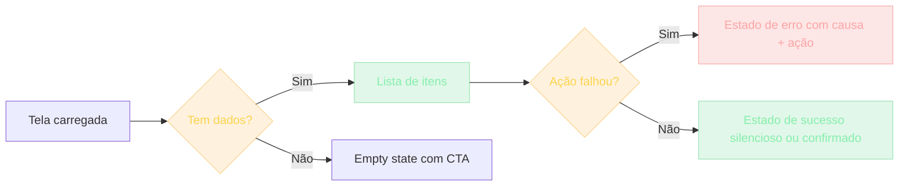

## O que é UX para devs

UX (User Experience) costuma ser tratado como "coisa de designer". Devs codam o que o designer desenhou. Mas software moderno quebra essa divisão.

Você está implementando uma feature. Tem 3 botões com labels semelhantes. O designer não está disponível. Você precisa decidir — agora.

Ou: você está debugando. Por que os usuários não convertem no checkout? Você descobre que ninguém entende que "Continuar como convidado" é o botão certo. Eles vão embora pelo caminho mais confuso.

Ou: você escreve uma mensagem de erro ("algo deu errado") — e o usuário não sabe nem o que fazer a seguir.

> [!NOTE]
> Dev sem UX é dev incompleto. Não precisa ser designer — mas precisa entender os princípios básicos de como humanos interpretam interfaces. Quem escreve o código decide, no fim das contas, como mil pessoas vão enxergar o sistema.

Quando você termina este módulo, vê interfaces com um novo olhar. E o código que você escreve serve melhor a quem o usa.

## Contexto histórico: da HCI ao Figma

UX não nasceu com a web. É o ponto atual de uma evolução.

### UI ergonômica — 1980 a 2000

Apple e Xerox PARC inventaram as interfaces gráficas. HCI (Human-Computer Interaction) era pesquisada como academia. Regras surgiram: mnemônica, affordance, mapping.

### Web — 1995 a 2010

UI design mais livre. Muitas abominações natives da web: cada botão tinha seu próprio reread de estilos, e a preocupação real era compatibilidade entre browsers, não consistência visual.

### Mobile — 2007 até hoje

O iPhone tocou tudo. UX passou a exigir relevância mobile-first: polegares, telas pequenas, interação gestual.

### Moderno — 2015 até hoje

Figma democratizou o design. Material Design e Human Interface Guidelines tornaram-se referência. Devs passaram a mexer em Figma — e designers passaram a mexer em código.

> [!INFO]
> Hoje a linha entre dev e designer é mais fina do que nunca. Component libraries (shadcn/ui, Radix) foram escritas *para devs*, não para designers. Quem implementa UI é quem aplica os princípios de UX.

## Analogia: a cozinha que só a cozinheira entende

Imagine uma cozinheira experiente. Ela abriu um novo restaurante. Dispôs louças, talheres, gadgets de uma forma que faz sentido para ela — afinal, a cozinha é dela, ela sabe onde está cada coisa.

Mas o cliente sabe onde fica o menu? Os talheres estão onde o garçom espera? A organização dela é excelente **para ela** — e confusa para todos os outros.

> [!TIP]
> UX é a tradução dessa organização para quem usa — não para quem criou. Em software, devs facilmente colocam o botão no lugar "fácil para a implementação". Resultado: criar usuários que testam isso — muitas vezes eles sempre esperam o botão noutro lugar. Você precisa ouvir isso.

## Os 5 princípios fundamentais de UX

Estes cinco princípios sobrevivem a qualquer framework e qualquer moda de design.

### 1. Affordance

Affordance é o que o objeto **sugere** que faz.

- Botão: apertável.
- Link: clicável.
- Slider: arrastável.
- Botão azul com texto "Enviar": apertável + envia.

Se um botão parece texto, ninguém clica. Se algo não é botão mas parece, ninguém acerta.

> [!TIP]
> Use estilos consistentes para elementos clicáveis. Texto azul em hover = clicável. Botão com border = ação primária. Consistência ensina o usuário sem texto explicativo.

### 2. Feedback

Cada ação do usuário precisa de resposta imediata.

- Click em "Salvar" → estado loading aparece.
- Dados carregando → skeleton, não o texto "Carregando...".
- Erro → toast ou mensagem inline próxima ao erro.
- Sucesso → confirmação visual (nada cai silenciosamente).

> [!IMPORTANT]
> Todo botão deve ter estado `disabled` para loading. Toda carga acima de 300 ms mostra skeleton. Silent success é tão ruim quanto silent error — o usuário fica sem saber se funcionou.

### 3. Hierarquia visual

O olho humano lê em ordem. Clareza visual é trilha.

- Título = maior, bold.
- Subtítulo = médio, semi-bold.
- Corpo = normal, lighter.

Se tudo é do mesmo tamanho, nada é lido.

> [!TIP]
> Máximo de 3 níveis de fonte por página. Contraste entre níveis deve ser óbvio — não "só um pouquinho maior".

### 4. Consistência

Se você usa borda vermelha para erro numa tela, use em todas. Se "Salvar" fica no canto direito, esteja em todos os forms.

> [!SUCCESS]
> Design system centralizado: botões, inputs, colors, spacings. Espelhe os mesmos padrões em todo o produto. Consistência é o que permite um usuário aprender uma tela e aplicar o que aprendeu em todas as outras.

### 5. Visibilidade do estado do sistema

O usuário precisa saber o que está acontecendo.

- "Você está logado como X."
- "3 resultados filtrados de 47."
- "Última gravação há 3 minutos."

Invisibilidade gera desconforto. Visibilidade gera confiança.

> [!TIP]
> Breadcrumb sempre que há hierarquia. Status icons. Counters. Se o usuário precisa perguntar "será que salvou?", o sistema falhou em comunicar.

| Princípio | Pergunta que responde |
| --- | --- |
| Affordance | "Isso parece fazer o que eu espero?" |
| Feedback | "O sistema respondeu à minha ação?" |
| Hierarquia | "Por onde eu leio primeiro?" |
| Consistência | "Já vi isso antes?" |
| Visibilidade | "O que está acontecendo agora?" |

## Estados que toda UI deve ter

Para cada elemento de UI, existem estados que precisam existir. A maioria não é opcional.

| Estado | Quando aparece |
| --- | --- |
| Default | Estado normal, em repouso |
| Hover | Mouse over |
| Focus | Teclado chegou ao elemento |
| Active | Sendo clicado |
| Disabled | Indisponível no momento |
| Loading | Esperando dados |
| Empty | Sem dados |
| Error | Algo falhou |
| Success | Ação concluída |

> [!CAUTION]
> 90% dos devs implementam apenas Default e Error. Mas usuários que encontram os outros estados deixam de existir para o seu aplicativo — porque desistem antes de chegar ao erro.

## O caso especial do empty state

Lista sem itens — você mostra o quê? Tela em branco? "Sem dados"? Um tutorial?

- **Excelente**: "Você ainda não criou nenhum projeto. [Botão: Criar projeto]"
- **Pobre**: `""` — silent empty state. Usuário perdido.

> [!IMPORTANT]
> Empty state é a primeira impressão da sua feature para todo novo usuário. Trate como onboarding, não como ausência. Call-to-action, não silêncio.



## Exemplos: antes e depois

### Exemplo 1 — Form de cadastro

**Pobre:**

```
 nome: ____
 email: ____
        [Cadastrar]
```

Sem labels visíveis (a label flutua só quando focado), sem feedback, sem hints de erro.

**Bom:**

```
 Nome completo
 [Nome]

 Seu email
 [email@exemplo.com]
 Pode haver typos no email — confira o domínio

 Senha (mínimo 8 caracteres)
 [senha]
 Fraca | Média | Forte  → barra de força atualiza conforme digita

 [Cadastrar]  → desabilitado até tudo preenchido
```

Diferenças: labels acima dos inputs, pistas ativas inline, progress feedback.

### Exemplo 2 — Lista com loading

**Pobre:**

```
[Mostra 5 skeletons genéricos "Shape"]
.. loading 200ms → resultado atualiza (sem transição)
```

**Bom:**

```
[Mostra skeletons com tamanho similar aos itens reais]
.. loading 200ms → fade-out skeletons, fade-in real items (300ms transition)
```

> [!TIP]
> Skeleton tem que ter a *forma* do conteúdo real. Skeleton genérico de "caixinha" engana o olho e gera layout shift quando o conteúdo chega.

### Exemplo 3 — Mensagem de erro

**Pobre:**

```
Algo deu errado.
```

**Bom:**

```
Não foi possível salvar.

Detalhe: Você atingiu o limite de notas privadas (50).
[Upgrade] [Tentar novamente]
```

Diferença: causa + alternativa. Erro sem caminho é beco sem saída.

| Mensagem | Causa? | Ação? |
| --- | --- | --- |
| "Algo deu errado." | Não | Não |
| "Falha ao salvar." | Não | Não |
| "Limite de 50 notas atingido. [Upgrade] [Tentar novamente]" | Sim | Sim |

## Caso real de mercado

UX não é decoração. É diferencial competitivo — principalmente em empresas product-led.

> [!REFERENCE]
> **Stripe** — famoso pelo "developer UX". Documentação incrível, API consistente, erros claros. Devs escolhem Stripe sem experimentar outras opções. UX é o motivo do lock-in.

> [!REFERENCE]
> **Linear** — construiu reputação de "rápido, fluido, sem fricção" puro sobre princípios de UX. Atalhos, feedback instantâneo, empty states que guiam. Nada decorativo — tudo princípio aplicado.

> [!REFERENCE]
> **Apple** — décadas refinando affordance, hierarquia e consistência. O Human Interface Guidelines virou referência copiada por todo app mobile.

> [!REFERENCE]
> **Notion** — criou um novo modelo de produto combinando UX de documento com UX de banco de dados. Cada_empty state ensina; cada bloco sugere o próximo.

> [!CURIOSITY]
> Em todas essas empresas, a função do designer não é "desenhar bonito". É **remover fricção**. Quanto menos o usuário percebe a interface, melhor a UX — porque ela some atrás da tarefa.

## Erros comuns

> [!WARNING]
> **1. Erro genérico "algo deu errado".**
> Quase sempre há mais informação. Não use genérico por preguiça. Mostre ao menos: o que falhou (login? salvar? delete?) + a próxima ação possível.

> [!WARNING]
> **2. Botões sem estado loading.**
> "Impaciente? Eu já cliquei 5 vezes!" Múltiplos submits geram registros duplicados. Use `disabled={loading}` e spinner no botão.

> [!WARNING]
> **3. Sem empty state.**
> Lista de "suas notas" sem notas: espaço em branco. Guie: "Você ainda não tem notas. [Criar uma]".

> [!WARNING]
> **4. Confundir responsividade com UI adaptativa.**
> "Responsivo" = reduz/reesconde painéis ao encolher a janela. "Adaptativo" = oferece features diferentes em larguras diferentes (ex: atalho de long-press no mobile). Adaptar comportamento ao contexto é mais profundo do que encolher visualmente.

> [!WARNING]
> **5. Escolher cores sem contraste.**
> Texto cinza claro em fundo cinza escuro — bonito? Talvez. Legível? Nem sempre. WCAG existe por razão de acessibilidade real. Mínimo AA: contraste 4.5:1 (checker em webaim.org/resources/contrastchecker).

> [!WARNING]
> **6. Esquecer edge cases de experiência.**
> Implementam o fluxo principal lindo. E se o usuário do plano free clica em "Upgrade"? Behavior esperado? Sem escape hatches, a UX vira beco.

> [!WARNING]
> **7. Encher tudo de tooltip.**
> Tooltips são máscaras de design para falta de clareza. Se você precisou de tooltip, provavelmente o label deveria ser reescrito.

## Boas práticas

> [!SUCCESS]
> **Design system, mesmo mínimo.** Botão primário, secundário, erro, warning. Consistência nasce de um lugar central, não de copy-paste entre arquivos.

> [!SUCCESS]
> **Skeletons para loading acima de 300 ms.** Abaixo disso, transição instantânea; acima, skeleton com a forma do conteúdo real.

> [!SUCCESS]
> **Toast para erros transient; inline para erros de form.** Erro de form perto do campo; erro global no canto. Nunca o contrário.

> [!SUCCESS]
> **Empty state com call-to-action.** Nunca em branco. O primeiro contato do usuário com a feature é o empty state.

> [!SUCCESS]
> **Auditoria UX a cada release.** Você mesmo segue um fluxo crítico. Anote pontos de fricção. Não espere o usuário reclamar.

> [!SUCCESS]
> **Ferramentas de observabilidade de UX.** Lighthouse faz audit de UX básica. Sentry Replay mostra gravações reais de sessões. Hotjar/Posthog mostram onde clicam e onde scrollam.

> [!SUCCESS]
> **Teste com 5 usuários reais.** Cinco pessoas navegando por 10 minutos revelam mais do que 50 suposições de quem construiu. Onde param, fazem pausas observáveis e têm respostas — não suposições de quem construiu.

> [!SUCCESS]
> **State inventário em markdown.** Liste todos os estados de cada componente. Design tokens em JSON sincronizado entre Figma e CSS variables.

## Resumo

O que você aprendeu neste módulo:

- **Dev precisa de UX.** Não precisa ser designer — precisa entender como humanos interpretam interfaces.
- **5 princípios importam.** Affordance, feedback, hierarquia, consistência, visibilidade do estado.
- **Estados não são opcionais.** Default, hover, focus, active, disabled, loading, empty, error, success. 90% dos devs só fazem dois.
- **Empty state é onboarding.** Sem CTA, o usuário desiste antes de começar.
- **Erro precisa de causa + ação.** "Algo deu errado" não é mensagem — é desistência.
- **UX é diferencial competitivo.** Stripe, Linear, Apple, Notion vencem por fricção baixa — não por estética.

> [!QUOTE]
> "UX para dev é disciplina, não arte plástica. Princípios sobre affordance, feedback e estados podem ser aplicados por qualquer um. O que parece design diferenciado é, na verdade, execução — e execução prática é o que você vai fazer."

## Como isso aparece nos projetos da UGP

Durante a Universidade Gratuita do Programador, a UX volta em cada projeto onde alguém vai usar o que você construiu:

> [!TIP]
> **Projeto 01 — To-Do.** Implemente todos os estados: empty (sem itens), 1 item, 50 itens, completed. Cada um com visual próprio.

> [!TIP]
> **Projeto 03 — Dashboard.** Handles de carregamento dos charts com skeletons. Nada de "Carregando..." — skeleton com a forma do gráfico.

> [!TIP]
> **Projeto 07 — SaaS de Notas.** Empty states com CTA ("Você ainda não tem notas. [Criar uma]"). Erros inline no form de auth, com causa próxima ao campo.

> [!TIP]
> **Projeto 09 — LMS.** Estado de progresso visível para o usuário ("Você está em 3 de 10 aulas"). Visibilidade do estado do sistema na prática.

## Desafio

> [!IMPORTANT]
> Escolha um app que você usa todo dia (Linear, Notion, Spotify, iFood) e audite a UX em 5 minutos:
>
> 1. **Affordance.** Existe algum elemento que parece clicável mas não é? Algum botão que parece texto?
> 2. **Feedback.** Click em algum botão demora a responder? Você fica sem saber se a ação foi registrada?
> 3. **Hierarquia.** Qual é o título da tela? Dá pra distinguir de um subtítulo em 1 segundo?
> 4. **Empty state.** Vá para uma lista vazia (limpe notificações, zere uma label). O que aparece? Há CTA?
> 5. **Mensagens de erro.** Force um erro (senha errada, request off-line). A mensagem tem causa e ação?
>
> Anote 3 coisas que o app acerta e 3 que você faria diferente. O objetivo não é criticar — é desenvolver o olhar de UX. Quem enxerga fricção consegue removê-la no próprio código.